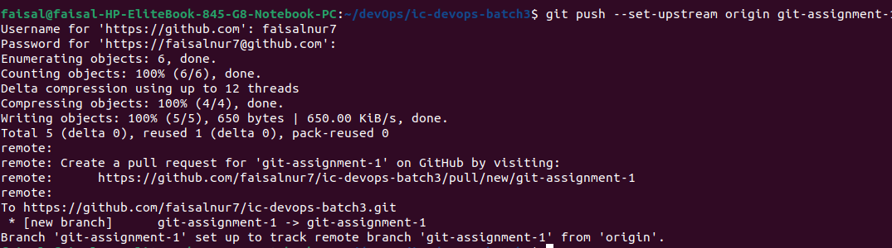
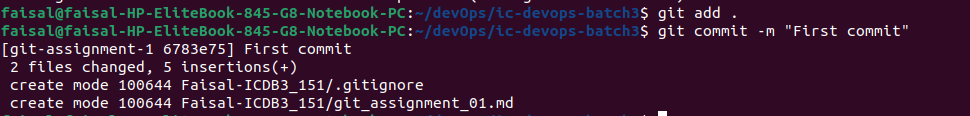
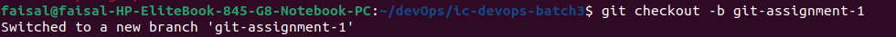
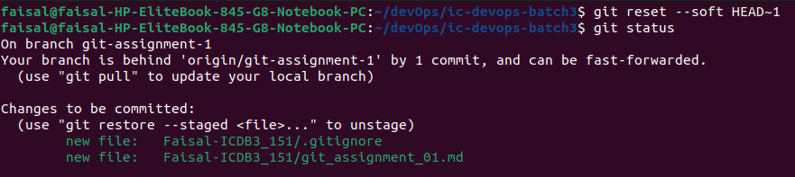
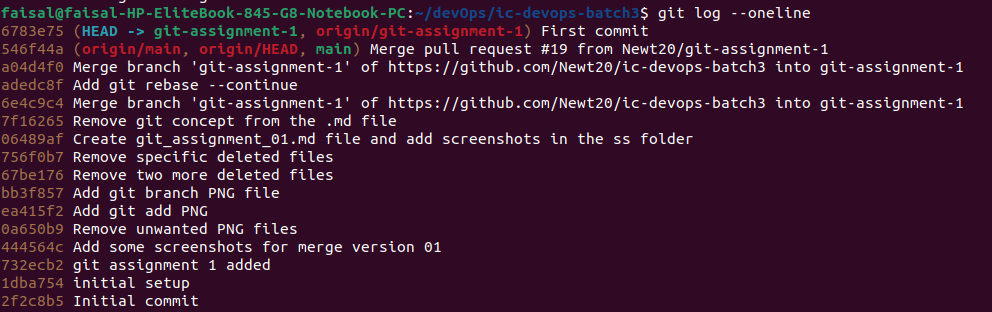

                            Git - A VCS (Version Control System)

## What is Git?

Git is a tool to keep the tracking of changes to project files where one or multiple people collaborating togather. It allows to jump on different versions of the file, so that we can go back to earlier versions.


## To set git username and email:
```
git config --global user.email "faisalnur7"
git config --global user.name "md.faisalnur55@gmail.com"
```

## Git commands
### Command line to create a repository use below 6 commands
```
git init
Git add .
git commit -m "first commit"
git branch -M main
git remote add origin git@github.com:<github_username>/l<repo_name>.git
git push -u origin main
```



### After adding some files or changing any file use below three commands to push the latest codes on the respective branch
```
Git add .
git commit -m "Some changes are done"
git push
```



### checking history with git log
```
git log
```


### Checking present status like in which which branch I am on and about the changed files use git status
```
git status
```


### Checking in which branch I am on, use git branch
```
git branch
```
### creating new branch use git branch
```
git checkout -b <branch_name>
example:
git checkout -b git-assignment-1
```



### switch any git branch
```
git checkout <branch_name>
example:
git checkout git-assignment-1
```

### Fetch latest code in local machine
```
git pull
```

### Undo the last commit but keep the changes
```
git reset --soft HEAD~1
```



### Undo the last commit and discard changes (hard reset)
```
git reset --hard HEAD~1
```


### Undo the any commit but keep the changes
```
git reset <hash_id>
```

### Undo the last commit and discard changes (hard reset)
```
git reset --hard <hash_id>
```
### git quick overview of recent changes
```
git log –oneline
```

### suppose you have already pushed in git what have to do

```
git log
git reset --hard <hash_id>
git push -f
```
### Git merge
It helps to merger a branch with another branch.

#### Step-by-Step Guide:
##### Create a New Branch and Switch to It:
```
git checkout -b branch-1
```
##### Make Changes and Commit Them: 
```
git add .
git commit -m "New feature implementation"
```
##### Switch Back to main Branch:
```
git checkout main
```

##### Ensure main is Up to Date: 
```
git pull origin main
```
##### Merge branch-1 into main:
```
git merge branch-1
```
##### Resolve Any Merge Conflicts (If Necessary): 
```
git add <resolved-file-location>
```
Once all conflicts are resolved, complete the merge:
```
git commit
git push origin main
```

### Git rebase
Assume you have a branch-1 that is behind main. So this command will rebase branch-1 onto main or any other branch to update it.

#### Step-by-Step Guide:
##### Checkout the Branch You Want to Rebase:
```
git checkout branch-1
```
##### Rebase Onto main:
```
git rebase main
```

##### Resolve Any Rebase Conflicts: 
```
git add <resolved-file>
```

##### continue rebase 
```
git rebase --continue
```

###### If you want to stop the rebase and go back to how things were before the rebase started:
```
git rebase --abort
```
##### Finish and Update the Remote Branch:
```
git push origin branch-1 --force
```


### Edit last commit using rebase
```
git rebase -i
git rebase --continue
```


### suppose you have hard reset and delete all chanages
#### Accidently you have used this command
```
git reset --hard <hash-id>
```
#### Undo again the reset changes files and codes using two commands 
```
git reflog
git reset --hard <commit-id>
```
##### How will you get this commit id?
when use git reflog you will get your deleted commit in this reflog history, for example my commit like `adds reset commands in git cheatsheet`
in this line you will get the hash id.

### Git ammend
#### edit last commit
```
git commit --amend
```
#### if you want to changes something and want to add this changes with last commit
```
git add file-you-forgot.txt
git commit --amend
```


### Edit an older commit
#### 0. Get logs which you want to edit
```
git log
git log --oneline
```


