Sure, let's create a detailed README file for your Git assignment. Here’s what it could look like:

---

# Git Assignment 1

## Scribe Sheet for Git Commands

### 1. **git clone**
   - **Description**: Clones a repository into a newly created directory.
   - **Example**:
     ```bash
     git clone https://github.com/user/repo.git
     ```
     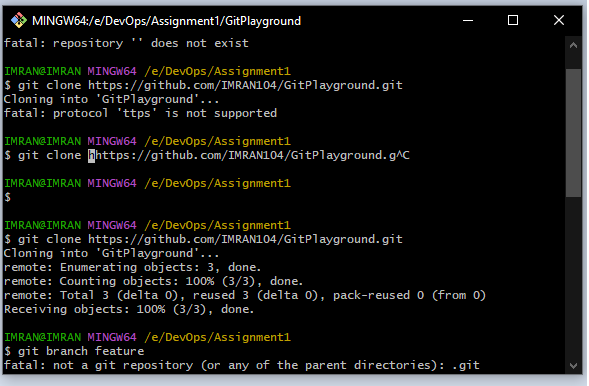

### 2. **git branch**
   - **Description**: Lists, creates, or deletes branches.
   - **Example**:
     ```bash
     git branch -a
     ```
     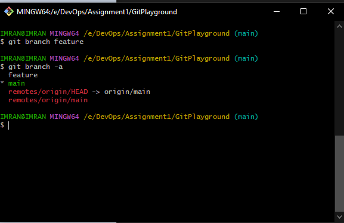

### 3. **git checkout**
   - **Description**: Switches branches or restores working tree files.
   - **Example**:
     ```bash
     git checkout -b new-branch
     ```
     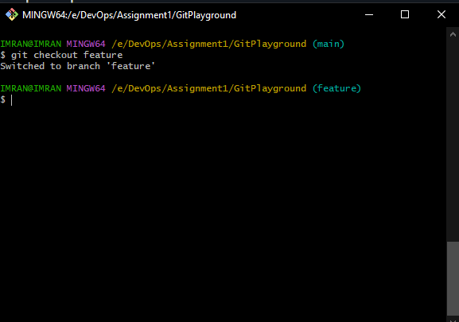

### 4. **git commit**
   - **Description**: Records changes to the repository.
   - **Example**:
     ```bash
     git commit -m "Initial commit"
     ```
     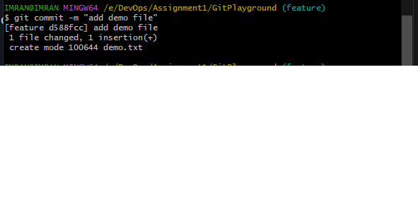

### 5. **git pull**
   - **Description**: Fetches from and integrates with another repository or a local branch.
   - **Example**:
     ```bash
     git pull origin master
     ```
     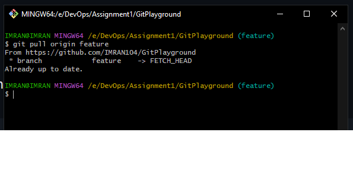

### 6. **git push**
   - **Description**: Updates remote refs along with associated objects.
   - **Example**:
     ```bash
     git push origin new-branch
     ```
     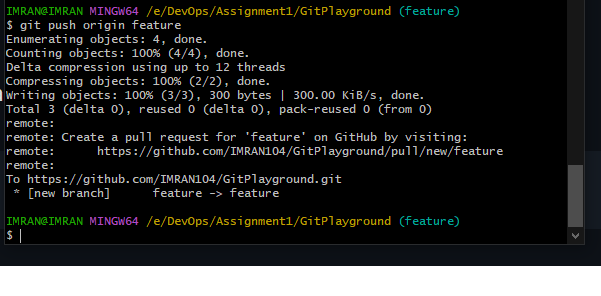

### 7. **git merge**
   - **Description**: Joins two or more development histories together.
   - **Example**:
     ```bash
     git merge feature-branch
     ```
     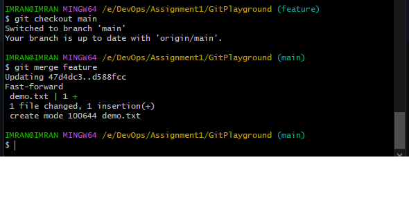

### 8. **git status**
   - **Description**: Shows the working tree status.
   - **Example**:
     ```bash
     git status
     ```
     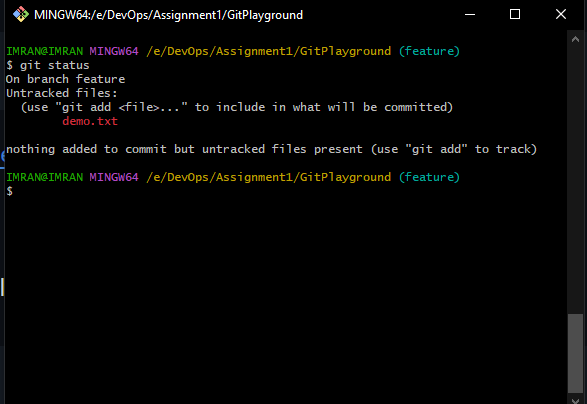

### 9. **git add**
   - **Description**: Adds file contents to the index (staging area).
   - **Example**:
     ```bash
     git add .
     ```
     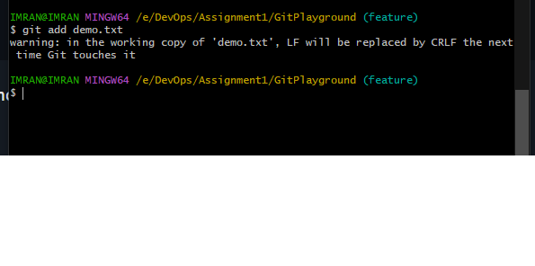

### 10. **git log**
    - **Description**: Shows the commit logs.
    - **Example**:
      ```bash
      git log
      ```
      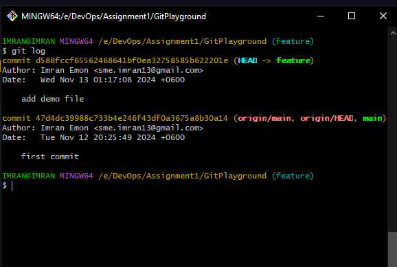

### 11. **git clone**
   - **Description**: Clones a repository into a newly created directory.
   - **Example**:
     ```bash
     git clone https://github.com/user/repo.git
     ```
     

### 18. **git rebase**
   - **Description**: Reapplies commits on top of another base tip.
   - **Example**:
     ```bash
     git rebase main
     ```
     

### 19. **git stash**
   - **Description**: Stashes changes in a dirty working directory away.
   - **Example**:
     ```bash
     git stash
     ```
     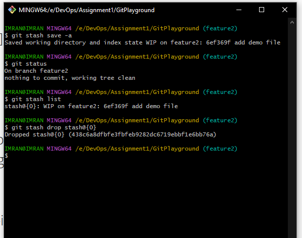

### 20. **git cherry-pick**
    - **Description**: Apply the changes introduced by some existing commits.
    - **Example**:
      ```bash
      git cherry-pick <commit-hash>
      ```
      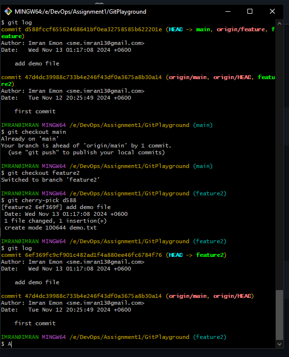

### 21. **git reflog**
    - **Description**: Show reference logs of all references.
    - **Example**:
      ```bash
      git reflog
      ```
      


### 4. **git reset**
   - **Description**: Resets changes to the specified commit or if not specified, to the last commit.
   - **Example**:
     ```bash
     git reset --hard HEAD 
     ```
     
