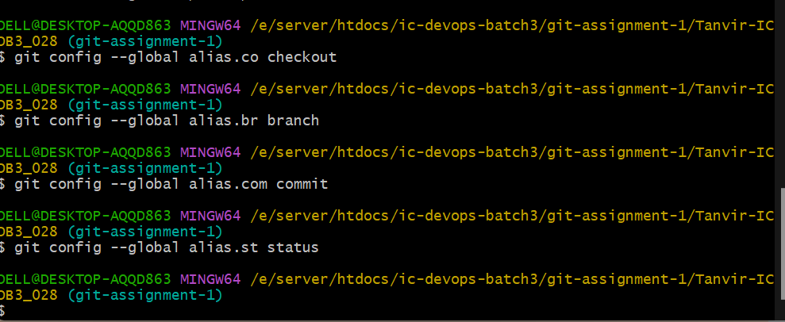
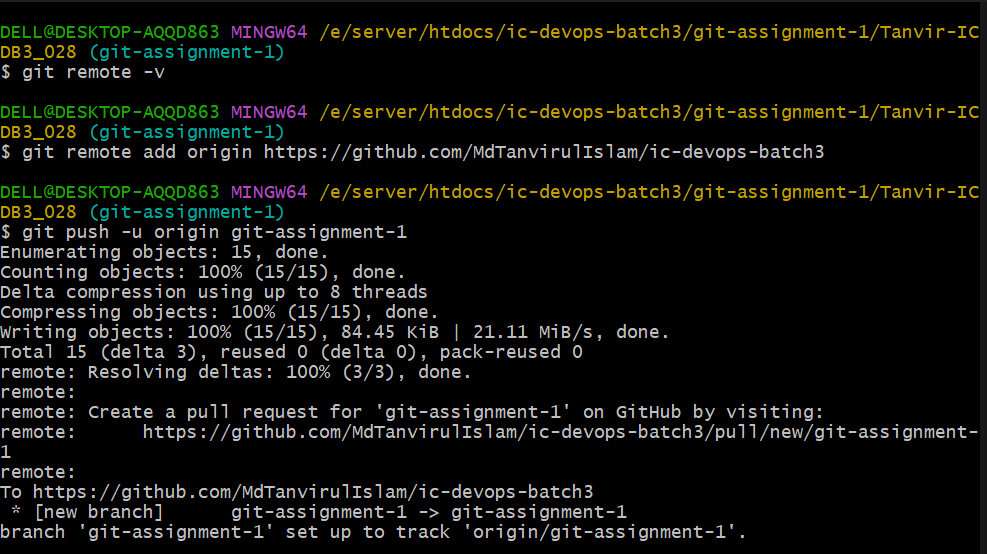
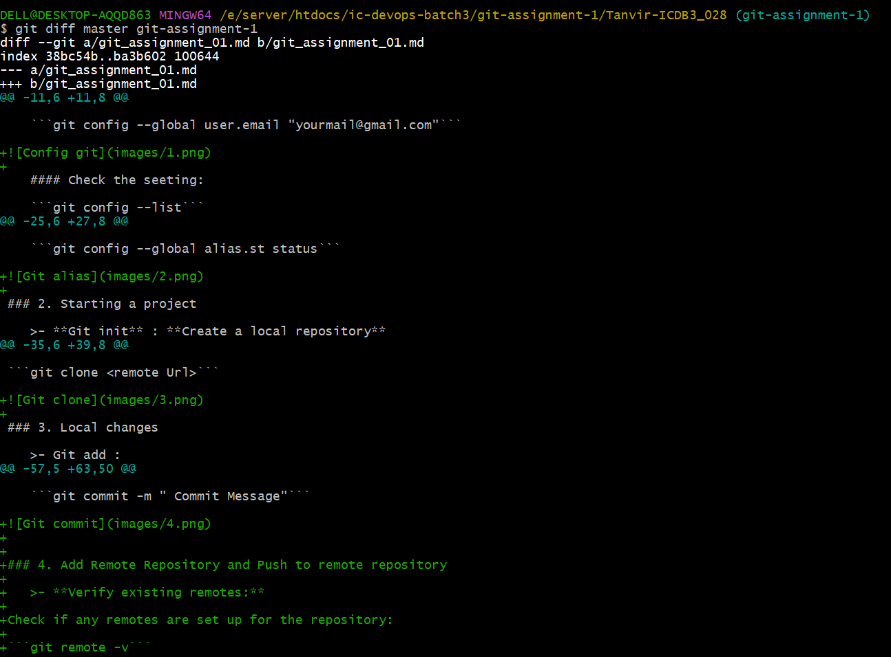
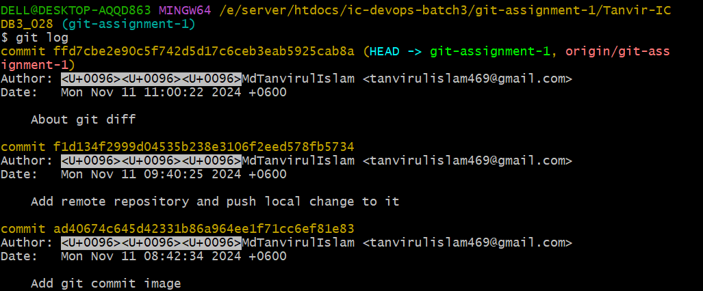
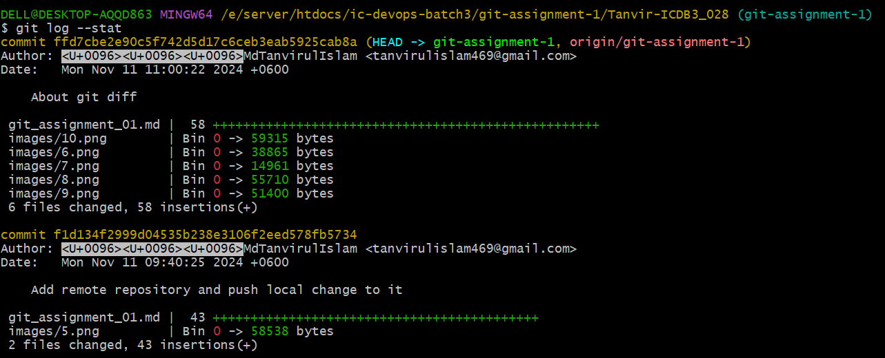
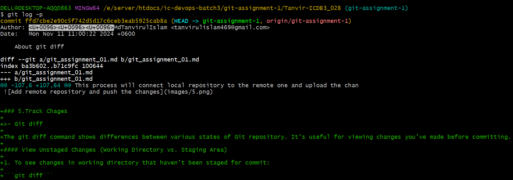
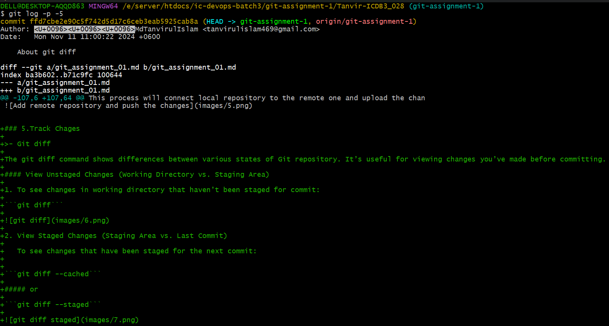
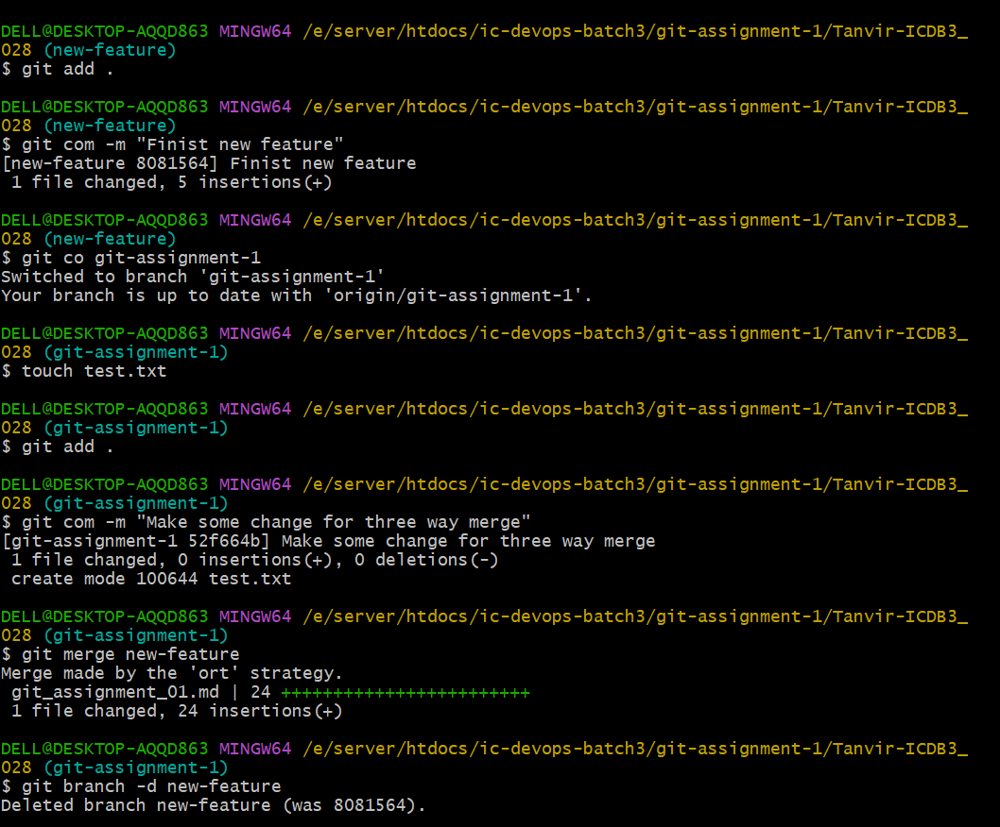
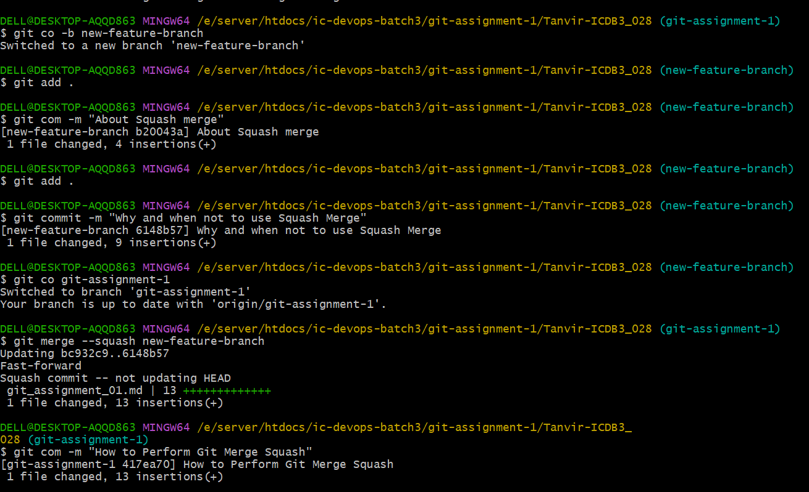

### Git Cheat Sheet

#### 1. Git configuration
   >- Git config :
   Get and set configuration variables that control all facets of how Git looks and operates.
   #### Set the name:

   ```git config --global user.name "User name"```

   #### Set the email : 

   ```git config --global user.email "yourmail@gmail.com"```


   #### Check the seeting:

   ```git config --list```

   >- Git alias :**Set up an alias** for each command:

   ```git config --global alias.co checkout```

   ```git config --global alias.br branch```

   ```git config --global alias.com commit```

   ```git config --global alias.st status```



### 2. Starting a project

   >- **Git init** : **Create a local repository**
   
   ```git init```
   
   >- **Git clone** : **Make a local copy** of the server repository.
   
```git clone <remote Url>```


### 3. Local changes
   
   >- Git add : 
   
   **Add a file** to staging (Index) area
   
   ```git add FileName```

   **Add all files** of a repo to staging (Index) area

```git add .```

   ##### or
   
   ```git add*```

 >- Git Commit

   **Record or snapshots** the file permanently in the version history **with a message**

   ```git commit -m " Commit Message"```


### 4. Add Remote Repository and Push to remote repository

   >- **Verify existing remotes:**

Check if any remotes are set up for the repository:

```git remote -v```

>- **Add the remote if it’s missing:**

If no remotes are listed, you can add origin by running:

```git remote add origin <repository-url>```

Replace <repository-url> with the URL of your remote repository.

>- **Push to the correct branch:**

```git push -u origin <branch-name>```

Replace <branch-name> with your current branch name (e.g., git-assignment-1).

>- **Push to the Remote Repository**

Push your local commits to the remote repository. Use -u to set the upstream branch so you don’t have to specify it each time:

```git push -u main```

Replace main with your branch name if it’s different (e.g., master or git-assignment-1).

>- **Future Pushes**

Once the upstream branch is set, you can push future changes simply by running:

```git push```

This process will connect local repository to the remote one and upload the changes




### 5.Track Chages

>- Git diff

The git diff command shows differences between various states of Git repository. It’s useful for viewing changes you’ve made before committing.

#### View Unstaged Changes (Working Directory vs. Staging Area)

1. To see changes in working directory that haven’t been staged for commit:

```git diff```


2. View Staged Changes (Staging Area vs. Last Commit)

   To see changes that have been staged for the next commit:


```git diff --cached```

##### or

```git diff --staged```


3. View Changes Between Commits

To see the differences between two commits

```git diff <commit1> <commit2>```

Replace <commit1> and <commit2> with the commit hashes or references (e.g., HEAD~1)


4. Compare a Branch with Another Branch

To view differences between two branches

```git diff <branch1> <branch2>```


Replace <branch1> and <branch2> with the branch names (e.g., main and git-assignment-1).



5. View Changes for a Specific Commit

To see the changes introduced by a specific commit

```git diff <commit-id>^ <commit-id>```

Replace <commit-id> with the commit hash.


### 5. Commit History

The git log command is one of the most powerful and commonly used commands in Git. It allows to view the history of commits in a Git repository, including detailed information about each commit.

>- Git Log

Display the most recent commits and the status of the head:

```git log```

This command displays a list of commits in reverse chronological order (newest to oldest), showing details for each commit such as:
   >- Commit Hash: A unique identifier for each commit (e.g., abcd1234...).
   >- Author: The person who made the commit.
   >- Date: When the commit was made.
   >- Commit Message: A description of the changes.
   


#### Commonly Used Options for git log

1. Display One-Line Summary Per Commit

   To view the commit history in a more concise format, you can use:
   
   ```git log --oneline```
   
   

   This displays the shortened commit hash and the commit message in a single line for each commit.

2. Displays the files that have been modified

   The **git log --stat** command adds a summary of file changes to the commit history output. It shows how many lines were added or removed in each file per commit, without displaying the full code diff. This is useful for a high-level view of what files were modified in each commit and the scale of changes.

      ```git log --stat```

   
3. Display the modified files with location:

   ```git log -p```

   
4. Display the last 5 commits with diffs
   
   ```git log -p -5```

   
5. Git blame -Display the modification on each line of a file

   The git blame command is used to show who last modified each line of a file. This is useful for tracking down when and by whom specific lines were changed, which can help with debugging, understanding the history of a file, or identifying the author of certain parts of the code

   ```git blame <file-path>```

   


### 6.Branching

>- Git branch

The git branch command in Git is used to manage branches within a repository. Branches are pointers to snapshots of your changes and allow you to work on different features, bug fixes, or experimental ideas independently of the main codebase.

#### Basic Concepts of Branching in Git

A branch in Git is simply a lightweight movable pointer to a commit. The default branch in most repositories is usually called main or master. When you create a new branch, it points to the current commit, and as you make new commits, only the active branch pointer moves forward.

##### Common git branch Commands

   1. ###### List All Branches
      To list all branches in your repository:
         ```git branch```
      >- By default, it shows only local branches.
      >- The currently active branch will be highlighted with an asterisk (*)

      To list both local and remote branches, use:
         ```git branch -a```
   2. ##### Create a New Branch
      To create a new branch without switching to it:

         ```git branch <branch-name>```

      For example, to create a branch named **test-branch**:
 
      ```git branch test-branch```
   3. ##### Create and Switch to a New Branch

      To create a new branch and immediately switch to it, use:
      
      ```git checkout -b <branch-name>```
   4. ##### Switch Between Branches
      To switch (or "check out") to an existing branch:
    
        ```git checkout <branch-name>```
   5. Rename a Branch
      
        ```git branch -m <new-branch-name>```
      Or, to rename a branch you're not currently on:

      ```git branch -m <old-branch-name> <new-branch-name>```
   6. ##### Delete a Branch

      To delete a local branch that you no longer need:

      ```git branch -d <branch-name>```
    
        >- The -d option will delete the branch only if it has been merged with another branch.
        >- To force-delete a branch (even if it hasn’t been merged), use:
        
            git branch -D <branch-name>
   7. Delete a Remote Branch
      
        To delete a branch on a remote repository (e.g., origin):
      
        ```git push <remote-name> --delete <branch-name>```

        


### 7.Merging

Merging in Git is the process of integrating changes from one branch into another. This is a key feature of Git that allows multiple branches to be developed in parallel and then combined when ready.

#### Types of Git Merging

###### 1. Fast-Forward Merge

>- This occurs when the target branch has not moved forward since the branch you're merging was created.
>- Git simply moves the target branch pointer forward to the latest commit in the source branch, creating a "linear" history.


        git checkout -b new-feature
        git add .
        git commit -m "Start a new feature"
        git add .
        git commit -m "Finish a feature"
        git checkout main
        git merge new-feature
        git branch -d new-feature


###### 2. Three-Way Merge

>- If there have been new commits on the target branch since the source branch was created, Git creates a new "merge commit" that combines changes from both branches.
>- This merge commit has two parent commits, keeping track of the branch history.

The next example is very similar as first one, but requires a 3-way merge because main progresses while the feature is in-progress. This is a common scenario for large features or when several developers are working on a project simultaneously.

            # Start a new feature
                git checkout -b new-feature
            # Edit some files
                git add .
                git commit -m "Start a feature"
            # Edit some files
                git add .
                git commit -m "Finish a feature"
            # Develop the git-assignment-1 branch
                git checkout git-assignment-1
            # Edit some files
                git add .
                git commit -m "Make some super-stable changes to git-assignment-1"
            # Merge in the new-feature branch
                git merge new-feature
                git branch -d new-feature           





###### 3. Git Merge Squash

Squash and merge is a Git technique that combines multiple commits into a single commit before merging them into another branch. 

>- Here are the steps to perform a squash merge:

 1. **Checkout to the Base Branch:** Make sure you are on the branch you want to merge into.
    
        git checkout git-assignment-1
 2. **Perform the Squash Merge:** Use the git merge --squash command followed by the feature branch name.

        git merge --squash feature-branch
 3. **Commit the Changes:** Finally, commit the changes.
   
         git commit -m "Squashed commit from feature-branch"

This is particularly useful when you have a series of small commits on a feature branch and want to present a clean, concise history when merging into the main branch.

###### Why Squash and Merge?
**Cleaner History:** It helps to keep the project history clean and easy to follow.

**Better Code Review:** A single commit is easier to review than multiple smaller commits.

**Reduced Noise:** It can reduce the noise in the commit history, especially for smaller features or bug fixes.

###### When to Avoid Squash and Merge:

**Debugging:** If you need to trace a bug back to a specific commit, a squash merge can make it harder.

**Complex Features:** For large, complex features, it might be better to keep the individual commits for better traceability.




###### 4. Git Rebasing Merge 

Git rebasing is a technique used to restructure a series of commits. It's often employed to create a cleaner, more linear project history, especially when working on feature branches.

>- How to Rebase:

 1. Checkout the Feature Branch:
    
        git checkout new-feature
 2. Rebase Onto the Main Branch:

        git rebase git-assignment-1

This command replays the commits from the feature-branch onto the main branch, creating a new commit history.

###### Why Rebase?

**Cleaner History:** Rebase can create a linear project history, making it easier to understand the development timeline.

**Avoid Merge Conflicts:** By rebasing early and often, you can minimize the chances of merge conflicts.

###### When to Avoid Rebase:

**Public Branches:** Avoid rebasing on public branches, as it can rewrite history and cause confusion for other developers.

**Already Pushed Branches:** If you've already pushed your feature branch to a remote repository, rebasing can lead to conflicts and confusion.


### 8.Pushing Updates

Transfer the commits from your local repository to a remote server.

>- Push data to remote server:
    
        git push origin git-assignment-1
>- Force push data:

        git push <remote> <branch> -f

>- Delete a remote branch by push command:

        git push origin -delete <branch>

### 9. Pulling updates

>- Pull the data from the server:

        git pull origin master
>- Pull a remote branch:
    
        git pull <remote branch URL>

### 10. Git Fetch

Downloads branches and tags from one or more repositories.

>- Fetch the remote repository:
        
        git fetch< repository Url>

>- Fetch a specific branch:

        git fetch <remote-name> <branch-name>

>- <remote-name>: The name of the remote repository (usually origin)
>- <branch-name>: The name of the branch you want to fetch.

>- Fetch all the branches simultaneously:

        git fetch –all
>- Synchronize the local repository:

        git fetch origin

### 11. Undo changes

>- Git revert

The git revert command in Git is used to undo changes by creating a new commit that reverses the effects of a previous commit. This differs from git reset, which removes commits from history. git revert is safer for shared repositories because it preserves the commit history while effectively "undoing" specific changes.

###### When to Use git revert

>- Undo a specific commit in a shared branch.
>- Revert changes without losing history, making it safe for collaboration.
>- Rollback a series of commits without rewriting history.

###### Basic Usage

>- The general syntax for git revert is:

        git revert <commit-hash>

>- *<commit-hash>* is the hash of the commit you want to undo. You can get the commit hash from git log.


>- Git reset 

The git reset command in Git is used to undo changes by moving the HEAD pointer and, optionally, the staging area or working directory, depending on the reset mode. It’s more powerful than git revert because it can completely remove commits, modify the staging area, or even alter files in your working directory.

###### Common Uses of git reset

>- Undo commits: Remove unwanted commits from your branch.
>- Unstage changes: Move changes from the staging area back to the working directory.
>- Discard changes: Permanently delete changes in your working directory.

###### Three Main Modes of git reset

1. --soft: Moves the HEAD pointer to a specific commit but keeps changes in the staging area.
2. --mixed (default): Moves HEAD and unstages changes, moving them to the working directory.
3. --hard: Moves HEAD, unstages changes, and deletes changes from the working directory, effectively "erasing" the specified commits.

###### Syntax for git reset

            git reset [--soft | --mixed | --hard] <commit-hash>

### 12. Removing files

The git rm command is used to remove files from both the Git repository and, by default, from the working directory (local file system). Here’s how to use it with different options

###### Basic Syntax

            git rm <file_name>

This will remove <file_name> from the staging area (Git’s index) and delete it from your local file system.

###### Common Options for git rm

1. Remove and Stage Deletion:
        
            git rm <file_name>
This command stages the deletion of <file_name> and removes it from the working directory.

2. Remove Without Deleting Locally (--cached):

            git rm --cached <file_name>

Use this if you want Git to stop tracking the file but want to keep it in your local working directory. This is often used when you accidentally added a file that should be in .gitignore

3. Recursive Removal of Directories (-r):

            git rm -r <directory_name>

Use this to remove a directory and all of its contents.

4. Force Removal (-f):

            git rm -f <file_name>

If a file has local modifications that haven't been staged, Git will prevent deletion to avoid data loss. Adding -f forces Git to remove it.


### 13.Restore file

Use git checkout with the commit hash to restore the deleted file:

            git checkout <commit_id> -- <file_name>

This will bring the file back to your working directory without affecting other files.


**End of the sheet**

