### Practicing Git Command 

`git init - Initialied git in working directory` 

`git add . - Add all files in working directory`

`git commit -m "" - Add commit massage`

`git commit --amend - Modify very recent commit massage`

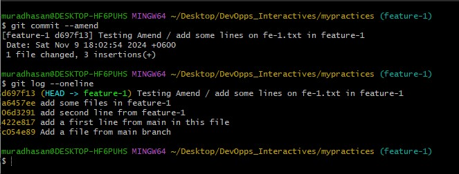

`git branch -D featre-1 - Delete the Branch`

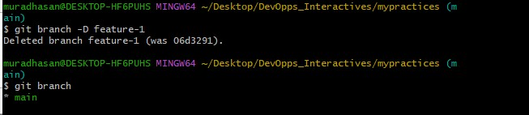

`git log --oneine - All of commits ID are showing in 7 character hash `

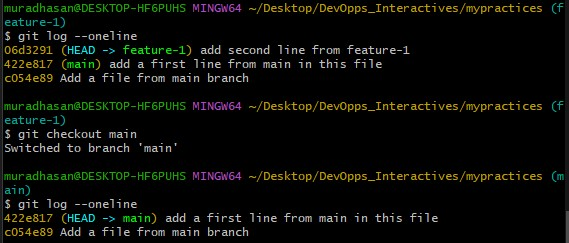

`git branch -m feature-1 new-branch - Rename on existing branch`

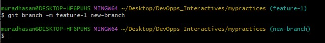

`git rebase -i HEAD~1 - Drop commit and Restore Commit`

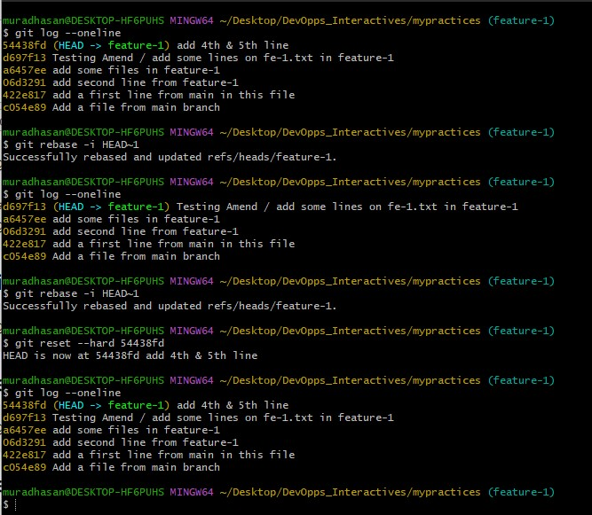

`git rebase -i HEAD~1 - Edit commit and Continue`

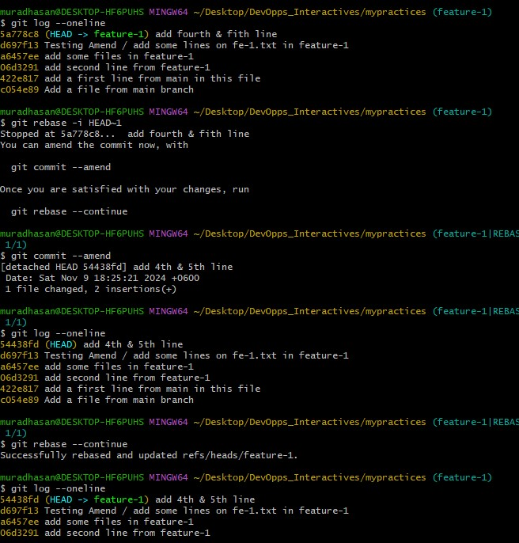

`git rebase -i HEAD~2 - Last two commit are fixup`

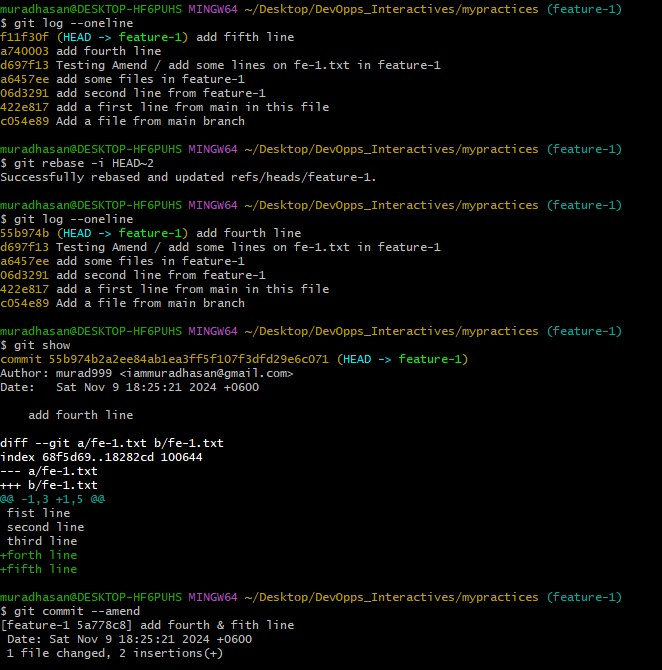

`git rebase -i HEAD~1 - Reword to commit massage`

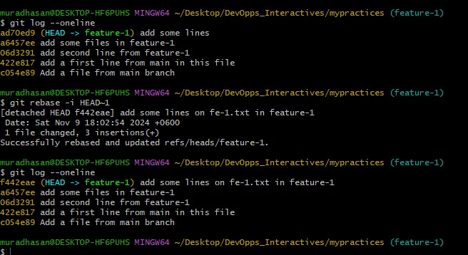

`git checkout <commit ID> then git checkout -b <preious branch name> - Restore deleted branch`

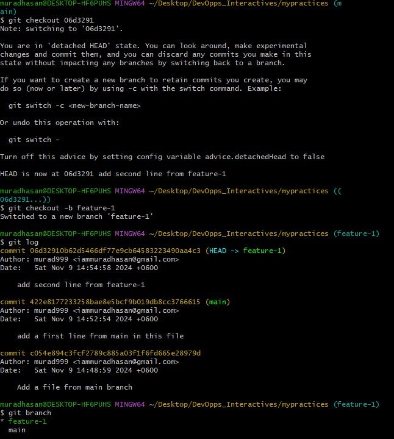

`Restore branch with using git reflog cmd`

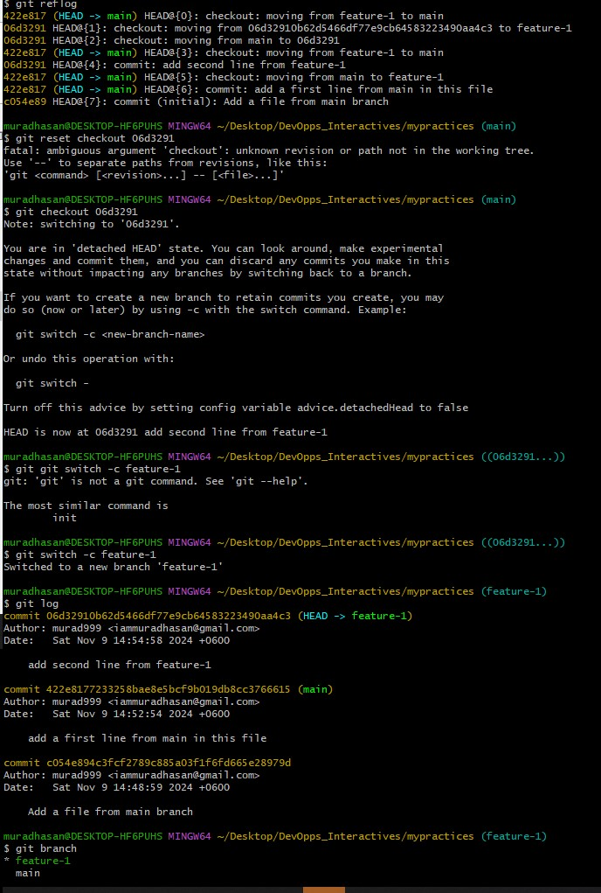

`git rebase -i HEAD~3 - Squash to commit massage`

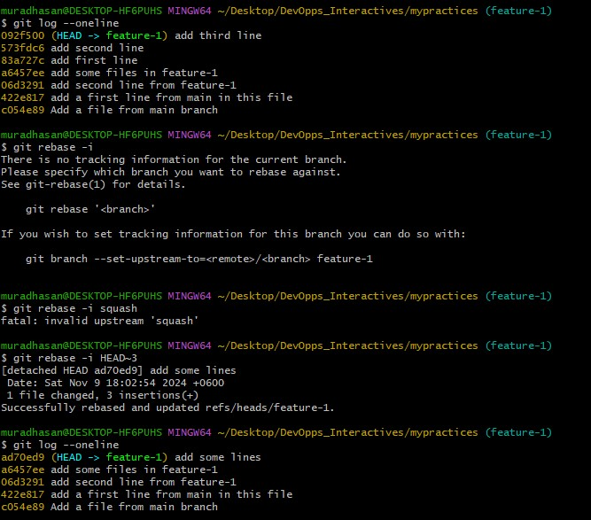

