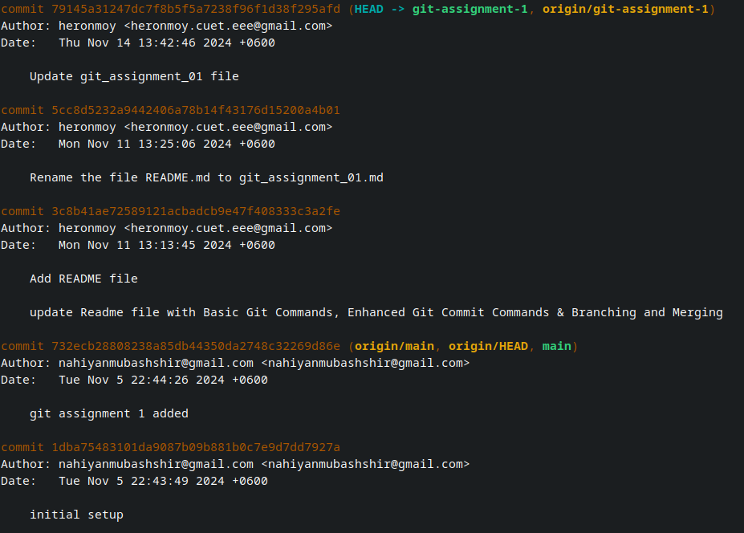
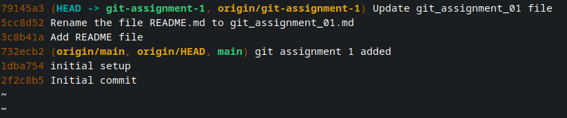
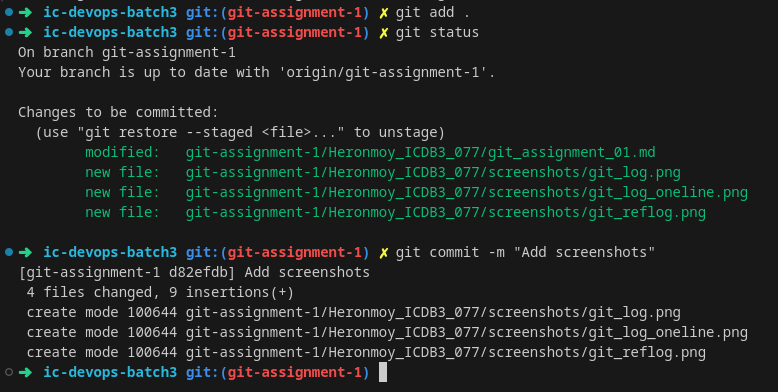
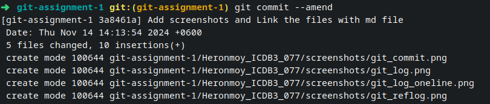
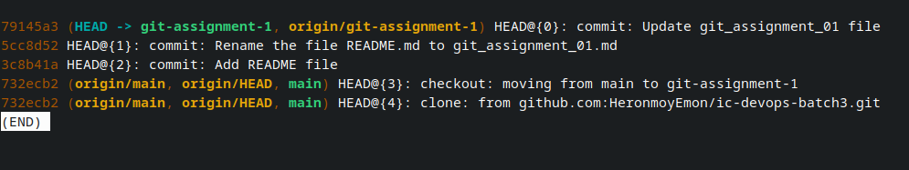

# Comprehensive Git Commands Guide

This document is an in-depth guide to essential and advanced Git commands, concepts, and best practices for efficient version control and collaboration.

---

### Key Git Concepts

- **Version Control System**: Git is a powerful version control system for tracking code changes in projects, particularly in collaborative environments.
- **Open Source**: Git is open-source and widely supported by the developer community.
- **Importance for Open Source Contribution**: Proficiency in Git is necessary for contributing to open-source projects, where effective version control is crucial.
- **Best Practices**: Follow best practices in Git workflows to maintain a clean project history, even if they are complex.
- **HEAD**: Points to the current commit in the checked-out branch.
- **Commit Message**: Write commit messages in present tense (e.g., "Fix bug" rather than "Fixed bug") for consistency.
- **Commit Hash**: A unique identifier for each commit, which is useful for tracking specific changes.
- **Tracking Changes**: Git tracks changes by comparing each commit to its predecessor.
- **Deployment and Versioning**: Using commit hashes for versioning in deployment ensures accurate tracking of code versions.
- **Empty Commits**: Create empty commits using `git commit --allow-empty` for tagging or marking points in history.

---

### Basic Git Commands

#### Initialize a Repository

Creates a new Git repository in the current directory.

```sh
git init
```

#### Clone a Repository

Copies a remote repository to your local machine.

```sh
git clone <repository-url>
```

#### Add Files to Staging

Stages changes for the next commit.

```sh
git add <file-name>  # Stage a specific file
git add .            # Stage all changes in the current directory

```

#### Commit Changes

Commits staged changes to the repository with a message.

```sh
git commit -m "commit message"
```

#### View Commit Log

Displays the commit history

```sh
git log             # displays commits with description
```



```sh
git log --oneline   # displays commits in single line
```



### Enhanced Git Commit Commands

#### Add Commit Message with Description

Adds a commit with a short message and an extended description.

```sh
git commit -m "commit message" -m "description"
```


#### Update Last Commit

Amends the most recent commit with new changes or a modified message.

```sh
git commit --amend
```


#### Delete Last Commit but Keep Changes Unstaged

Removes the latest commit and leaves changes in the working directory.

```sh
git reset HEAD~1
```

#### Delete Last N Commits and Keep Changes Unstaged

Removes the last N commits and leaves changes unstaged.

```sh
git reset --mixed HEAD~N
```

#### Delete Commits but Keep Changes Staged

Removes the last N commits, keeping changes staged.

```sh
git reset --soft HEAD~N
```

#### Permanently Remove Commits and Changes

Deletes commits and their changes from the working directory.

```sh
git reset --hard HEAD~N
```

#### Interactive Rebase for Commit Manipulation

Edit, reorder, or squash previous commits interactively.

```sh
git rebase -i HEAD~N
```

### Branching and Merging

#### Create a New Branch

Creates a branch for working on a specific feature

```sh
git branch <branch-name>

```

#### Switch to a branch

Switches to the specified branch.

```sh
git checkout <branch-name>
```

#### Merge Branches

Merges changes from one branch into the current branch

```sh
git merge <branch-name>
```

#### Delete a Branch

Deletes a local branch that is no longer needed.

```sh
git branch -d <branch-name>
```

#### Rebase Branch

Applies commits from one branch onto another

```sh
git rebase <branch-name>
```

### Stash and Restore Changes

#### Stash Changes

Temporarily saves uncommitted changes.

```sh
git stash
```

#### View Stash List

Show all stashed changes.

```sh
git stash list
```

#### Apply Stashed Changes

Restores stashed changes to the working directory.

```sh
git stash apply
```

#### Drop Stash

Deletes a specific stash entry.

```sh
git stash drop <stash-id>
```

### Tracking Actions and Undoing Changes

#### Track All Actions (Reflog)

Reflog records all actions, allowing you to undo steps if necessary.

```sh
git reflog
```



#### Undo Any Git Action

Resets to a specific state in reflog history.

```sh
git reset HEAD@{N}
```

#### Forking a Repository

Creates a copy of a repository for your own use.

```sh
git remote -v
git remote add <name> <repo-url>
git fetch <remote-name>
git checkout <branch-name>
git rebase <remote-branch>
```

### Difference Between `reset` and `revert`

- `Reset`: Deletes commits and potentially their changes from history.
- `Revert`: Creates a new commit that undoes changes from a previous commit.

```sh
git revert HEAD~N
```

### Additional Useful Git Commands

#### View Differences Between Commits

Shows differences between commits or branches.

```sh
git diff <commit1> <commit2>
```

#### Cherry-Pick Commits

Applies a specific commit from one branch to another.

```sh
git cherry-pick <commit-hash>
```

#### Squash Commits

Combines multiple commits into a single commit.

```sh
git rebase -i HEAD~N  # Then mark commits as "squash" or "fixup"
```

#### Git Tagging

Tags a specific commit for easy reference.

```sh
git tag -a <tag-name> -m "tag message"
```

#### Push a Tag to Remote

Sends a tag to the remote repository.

```sh
git push origin <tag-name>
```

#### Delete a Remote Branch

Removes a branch from the remote repository.

```sh
git push origin --delete <branch-name>
```

#### Fetch Remote Changes

Updates local references to remote branches without merging.

```sh
git fetch
```

#### Pull Remote Changes

Fetches and merges changes from a remote branch into the current branch.

```sh
git pull
```

#### View Git Configuration

Shows your Git configuration settings.

```sh
git config --list

```

#### Set Upstream for a Branch

Sets a default remote branch for push/pull.

```sh
git push --set-upstream origin <branch-name>
```
