# Basic Git Commands Assignment

> Submitted by: Kamrul Huda Sattari Saad - ICDB3_135

## Table of Contents

- [Introduction](#introduction)
- [Install and Configure Git](#install-and-configure-git)
- [Basic Git Commands](#basic-git-commands)
- [Git Branching](#git-branching)
- [Connect to a Remote Repository](#connect-to-a-remote-repository)
- [Reset and Revert Changes](#reset-and-revert-changes)
- [Rebasing and Reflog](#rebasing-and-reflog)
- [Conclusion](#conclusion)

---

## Introduction

Git is a distributed version control system that is used to track changes in the source code during the software development process. It is designed to coordinate work among programmers, but it can be used to track changes in any set of files. Its goals include speed, data integrity, and support for distributed, non-linear workflows.

In this assignment, I will demonstrate the basic git commands that are used to manage the source code in a git repository.

---

## Install and Configure Git

To install Git on your system, you can download the installer from the official Git website. The installer is available for Windows, macOS, and Linux operating systems. You can download the installer from the following link: [Git Downloads](https://git-scm.com/downloads).

After installing Git on your system, you need to configure your name and email address in Git. You can configure your name and email address using the following commands:

```bash
git config --global user.name "Your Name"
git config --global user.email "
```

You can verify the configuration by using the following command:

```bash
git config --list
```

The output of the `git config --list` command will display the configuration settings for Git.

> We can also configure many more things in Git.
> For example, we can configure the default init branch name by using the following command:
>
> ```bash
> git config --global init.defaultBranch main
> ```
>
> This command will set the default branch name to `main` for all new git repositories.
> We can also configure aliases for git commands by using the following command:
>
> ```bash
> git config --global alias.co checkout
> ```
>
> This command will create an alias `co` for the `checkout` command. We can use the `co` alias instead of the `checkout` command.

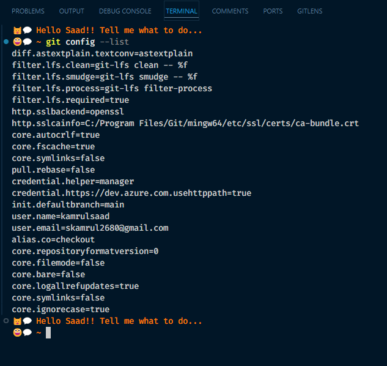

---

## Basic Git Commands

1. `git init`: This command is used to initialize a new git repository in the current directory.

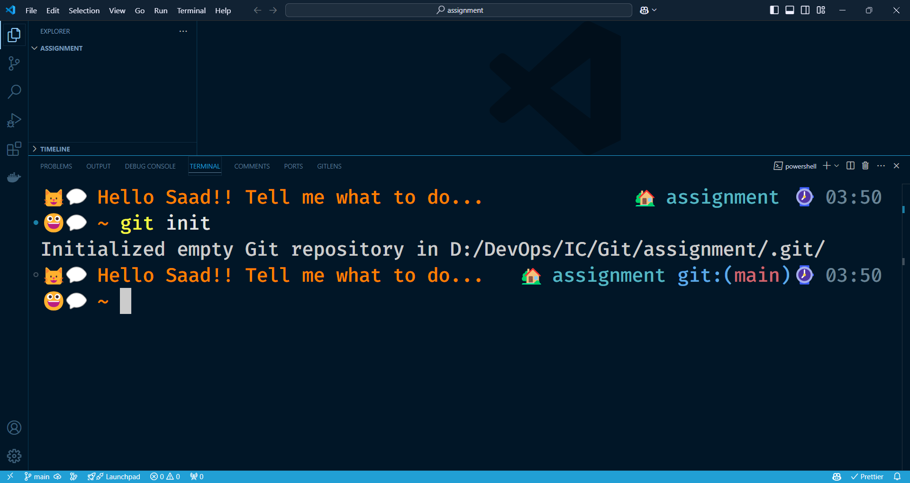

2. `git status`: This command is used to display the status of the working directory and the staging area.

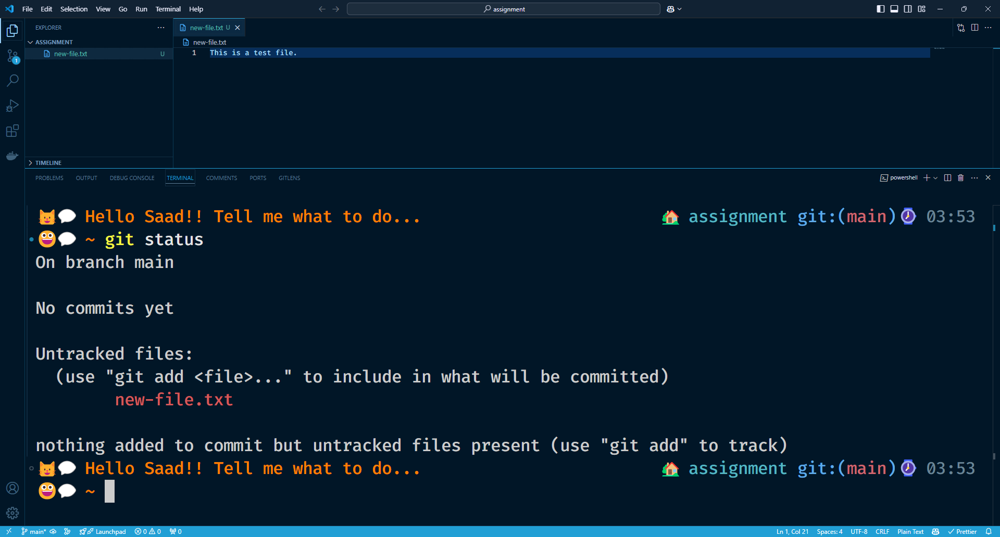

As you can see I added a new file named `new-file.txt` in the working directory. The file is not yet staged for commit. This is being shown in the output of the `git status` command.

3. `git add`: This command is used to add changes in the working directory to the staging area.

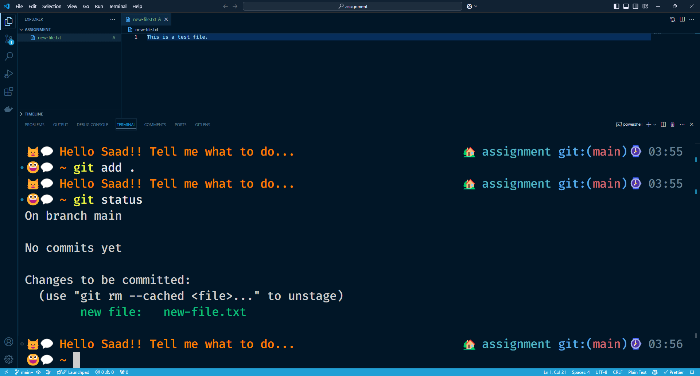

We need to specify the file name or directory name to add the changes to the staging area. In this case, I added all the changes in the working directory to the staging area by using the `.` symbol. The `.` symbol represents the current directory.

We can also add individual files to the staging area by specifying the file name. For example, `git add new-file.txt`.

4. `git commit`: This command is used to commit the changes in the staging area to the git repository.

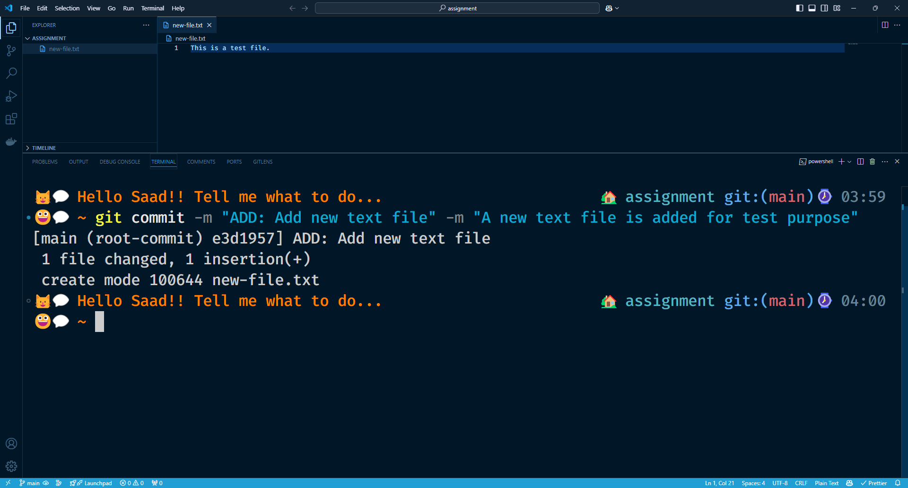

We need to provide a commit message while committing the changes. The commit message should be descriptive and should explain the changes that are being committed. In this case I followed the following pattern:

```bash
git commit -m "<type>(<scope>): <short description>" -m "<commit details>" -m "<footer note>"
```

We can always just keep one `-m` flag and write the whole commit message in one line. But it is a good practice to write the commit message in a structured way. The commit message should have the following components:

- Type: The type of the commit (e.g., feat, fix, docs, style, refactor, test, chore).
- Scope: The scope of the commit (e.g., module name, file name).
- Short Description: A short description of the changes.
- Commit Details: Detailed description of the changes.
- Footer Note: Additional information about the commit.

5. `git log`: This command is used to display the commit history of the git repository.

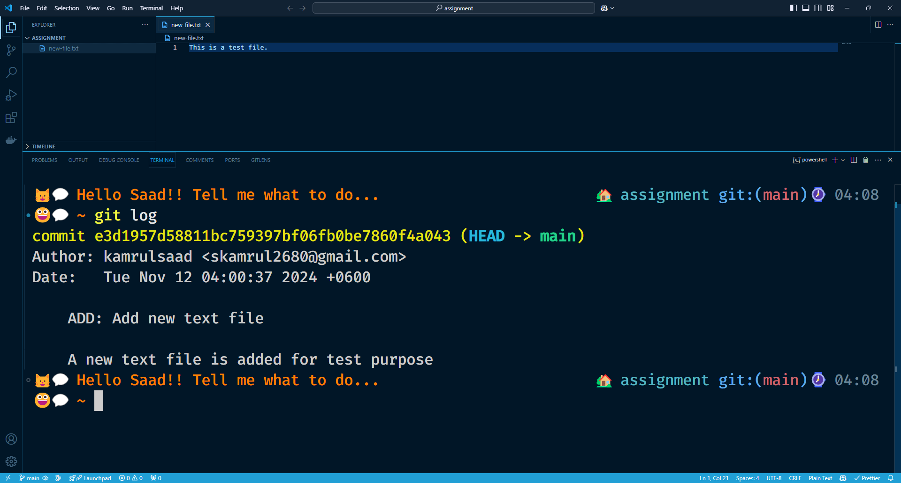

The `git log` command displays the commit history in reverse chronological order. It shows the commit hash, author, date, and commit message and description for each commit.

---

## Git Branching

Git branching is a powerful feature that allows developers to work on different features or bug fixes in parallel without affecting the main codebase. Branches are lightweight and can be created, switched, and merged easily. In this section, I will demonstrate the basic git commands for branching.

1. `git branch`: This command is used to list, create, or delete branches in the git repository.

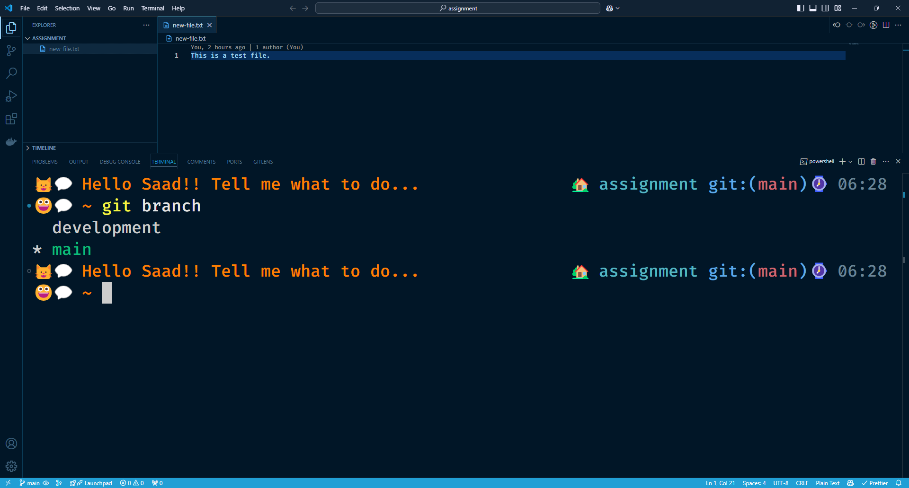

The `git branch` command lists all the branches in the git repository. The current branch, `main` is highlighted with an asterisk `*`.

2. `git checkout`: This command is used to switch between branches in the git repository.

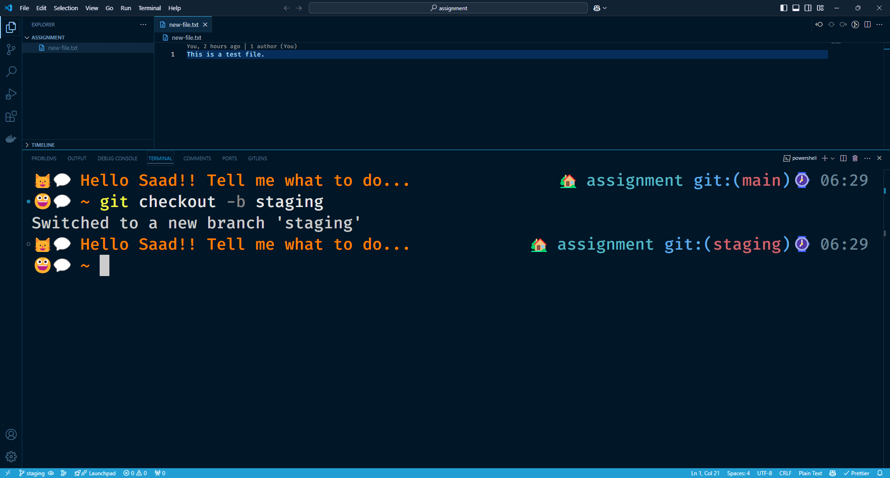

The `git checkout` command is used to switch between branches. In this case, I switched from the `main` branch to the new `staging` branch. the `-b` flag is used to create a new branch if it does not exist. If the branch already exists, the `-b` flag is not required.

3. `git merge`: This command is used to merge changes from one branch to another branch.

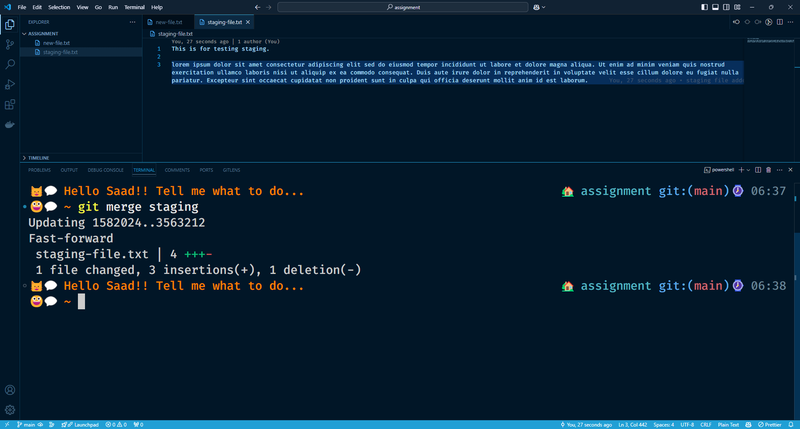

The `git merge` command is used to merge changes from one branch to another branch. In this case, I merged the changes from the `staging` branch to the `main` branch. The `main` branch is the target branch, and the `staging` branch is the source branch.

---

## Connect to a Remote Repository

Before connecting to a remote repository, we need to create a new repository on a remote server. We can use GitHub, GitLab, Bitbucket, or any other git hosting service to create a new repository. In this section, I will demonstrate how to connect to a remote repository.

We need to have an account on GitHub to create a new repository. Then we need to configure our local SSH-Agent to connect to the remote repository using SSH. We need to generate an SSH key pair and add the public key to our GitHub account. We can generate an SSH key pair using the following command:

```bash
ssh-keygen -t ed2559 -C "your-email@example.com"
```

We can add our SSH key to the SSH-Agent by using the following command:

```bash
ssh-add ~/.ssh/id_ed2559
```

Then we need to add the public key generated in our local machine to our GitHub account. We can copy the public key to the clipboard using the following command:

```bash
pbcopy < ~/.ssh/id_ed2559.pub
```

Then we can paste the public key to our GitHub account by going to the `Settings` -> `SSH and GPG keys` -> `New SSH key`.

After configuring the SSH key, we can connect to the remote repository using the following commands:

1. `git remote`: This command is used to manage the remote repositories.

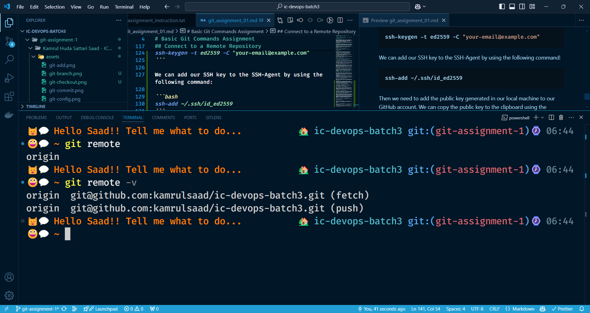

The `git remote` command lists the remote repositories that are connected to the local git repository. In this case, there is only origin remote repository connected to the local git repository.

The `-v` flag is used to display the URL of the remote repository. The URL is used to push and pull changes from the remote repository.

We can add a new remote repository using the following command:

```bash
git remote add <name> <url>
```

The `<name>` is the name of the remote repository, and the `<url>` is the URL of the remote repository.

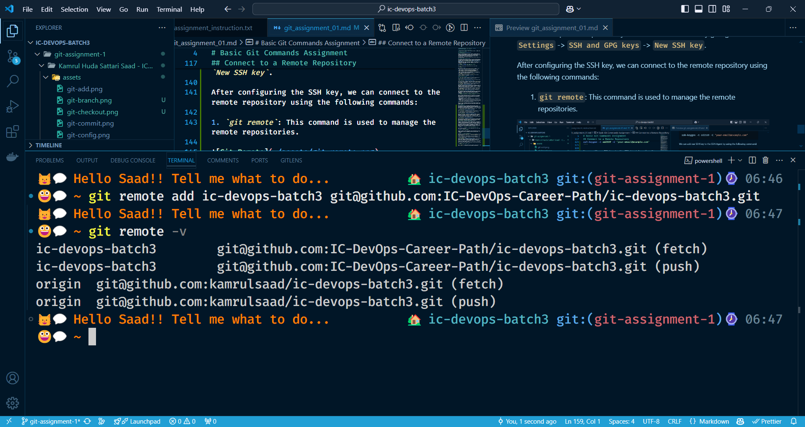

2. `git push`: This command is used to push changes from the local repository to the remote repository.

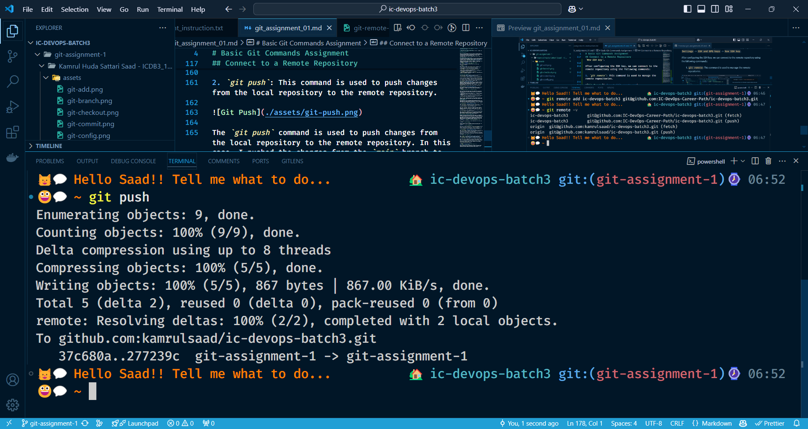

The `git push` command is used to push changes from the local repository to the remote repository. In this case, I pushed the changes from the `main` branch to the `origin` remote repository.

We need to specify the remote repository and the branch name while pushing the changes. For example, `git push origin main`.

We can set the default remote repository and branch using the following command:

```bash
git push --set-upstream origin main # or
git push -u origin main
```

This command sets the default remote repository and branch for the local repository. After setting the default remote repository and branch, we can push changes using the `git push` command without specifying the remote repository and branch.

> We can only push the commits to the remote repository if we have the write access to the remote repository. If we do not have the write access, we need to fork the repository and create a pull request to merge the changes to the main repository.

3. `git pull`: This command is used to pull changes from the remote repository to the local repository.

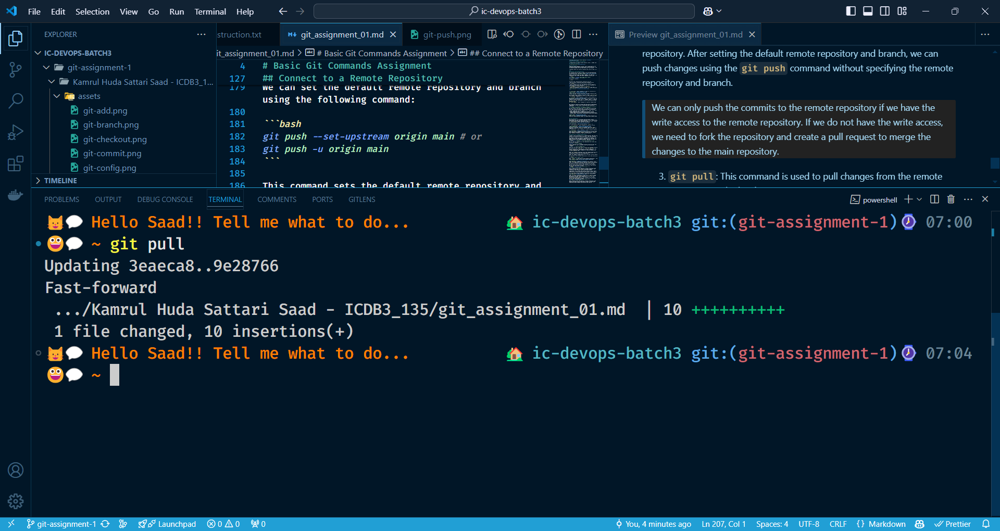

The `git pull` command is used to pull changes from the remote repository to the local repository. In this case, I pulled the changes from the `origin` remote repository to the `main` branch.

We need to specify the remote repository and the branch name while pulling the changes. For example, `git pull origin main`.

We can set the default remote repository and branch using the following command:

```bash
git pull --set-upstream origin main # or
git pull -u origin main
```

This command sets the default remote repository and branch for the local repository. After setting the default remote repository and branch, we can pull changes using the `git pull` command without specifying the remote repository and branch.

When we set the default remote repository and branch using the `--set-upstream` or `-u` flag, we can use the `git push` and `git pull` commands without specifying the remote repository and branch. Therefore, once we set the default remote repository and branch, we do not need to specify the remote repository and branch while pushing and pulling changes from same remote repository and branch.

---

## Reset and Revert Changes

Sometimes we need to reset or revert the changes in the git repository. **The process of resetting or reverting changes is the main power of a version control system like Git.** In this section, I will demonstrate how to reset and revert changes in the git repository.

1. `git reset`: This command is used to reset the changes in the working directory and the staging area. There are three modes of `git reset` command: `--soft`, `--mixed`, and `--hard`. The default mode is `--mixed`.

> The `HEAD~1` is used to refer to the previous commit. We can also use the commit hash to refer to a specific commit. For example, `git reset --soft <commit-hash>`. We can use the number of commits to refer to the previous commits. For example, `git reset --soft HEAD~2`. The `HEAD~2` refers to the commit before the previous commit. So the number specified after the `~` symbol refers to the number of commits before the current commit.

    1. `--soft`: This mode resets the changes in the working directory and the staging area but keeps the changes in the working directory.

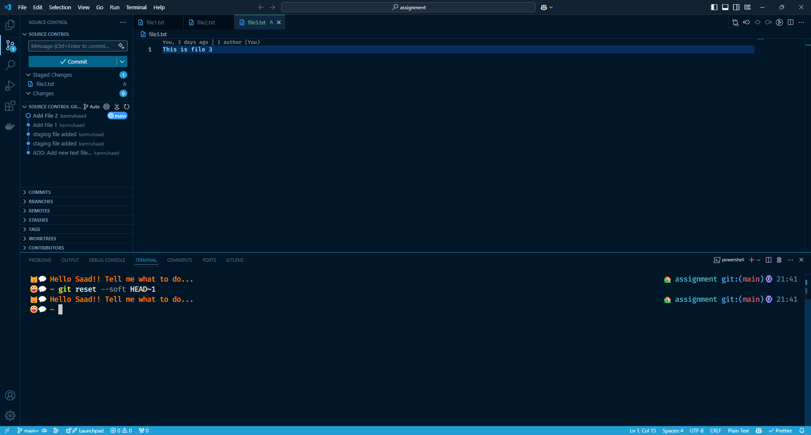

    As you can see at the top-left corner of this picture, after the soft reset the changes are still in the working directory. The changes are also kept in the staging area.

    2. `--mixed`: This mode resets the changes in the staging area but keeps the changes in the working directory. This is also the default mode of the `git reset` command.


    As you can see at the top-left corner of this picture, after the mixed reset the changes are still in the working directory. But the changes are removed from the staging area. So the main difference from soft reset is the changes are removed from the staging area too which in case of the soft reset, the changes are still in the staging area. So we need to add the changes to the staging area again to commit the changes.

    In most cases, the `--mixed` mode or the default mode is used to reset the changes in the staging area. This mode is useful when we want to unstage the changes that are added to the staging area.

    3. `--hard`: This mode resets the changes in the working directory and the staging area. This reset is very dangerous because it will remove all the changes in the working directory and the staging area. Therefore, it is recommended to use this mode with caution.

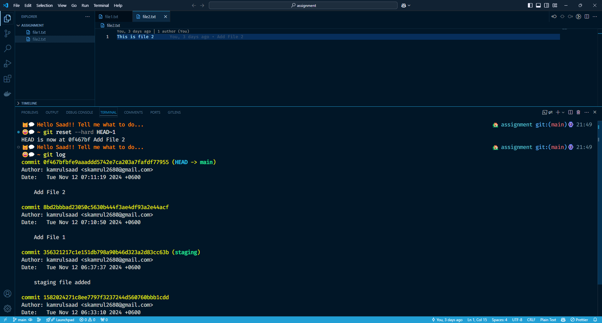

    As you can see at the top-left corner of this picture, after the hard reset the changes i.e. `file3.txt`  are removed from the working directory. The changes are also removed from the staging area. So the changes are completely removed from the git repository.  

    We need to be very careful while using the `--hard` mode of the `git reset` command because it will remove all the changes in the working directory and the staging area.

2. `git revert`: This command is used to revert the changes in the git repository. The `git revert` command creates a new commit that reverts the changes in the specified commit.

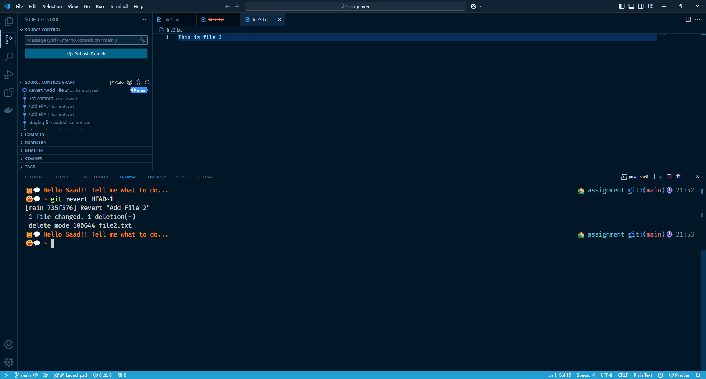

The `git revert` command creates a new commit that reverts the changes in the specified commit. In this case, I reverted the changes in the previous commit using the `HEAD~1` reference. The `HEAD~1` reference refers to the previous commit. Therefore the changes in the previous commit are reverted in the new commit and created a new commit that reverts the changes.

The `git revert` command is useful when we want to revert the changes in the git repository without losing the commit history. The `git revert` command creates a new commit that reverts the changes in the specified commit. Therefore, the commit history is preserved, and the changes are reverted in the new commit.

## Rebasing and Reflog

1. `git reflog`: This command is used to display the reference log of the git repository.

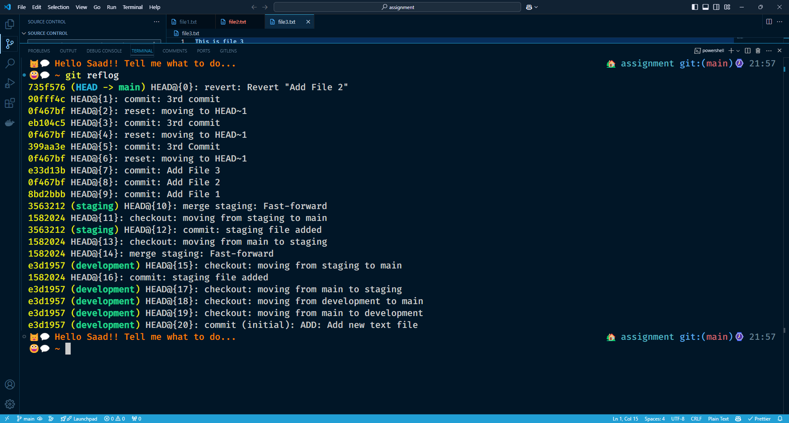

The `git reflog` command displays the reference log of the git repository. The reference log contains the history of the git repository, including the commit hash, and commit message. The reference log is useful to track the changes in the git repository and to recover the lost commits.

Let us suppose we mistakenly did the revert and we want to revert the revert. We can use the `git reflog` command to find the commit hash or the `HEAD@{<number>}` of the commit before the revert. Then we can use the `git reset --hard <commit-hash>` or `git reset --hard HEAD@{<number>}` to reset the changes to the commit before the revert.

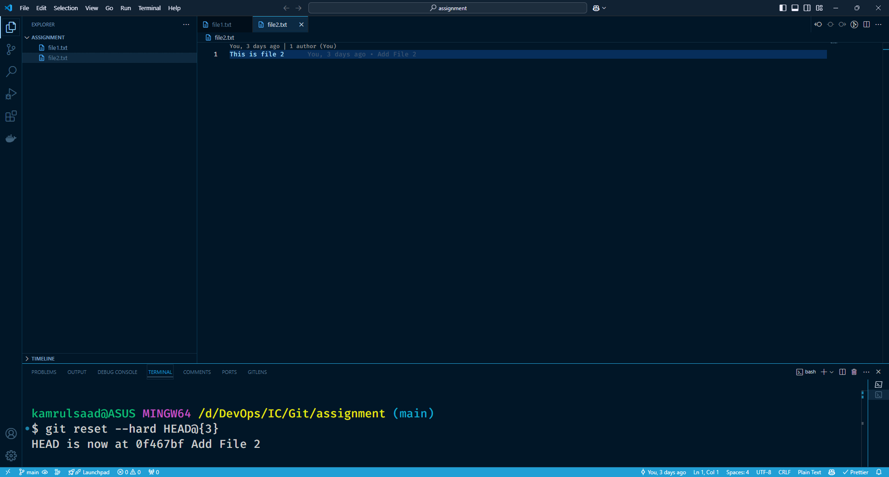

As you can see after I used the `git reset --hard HEAD@{3}` command, the changes are reverted to the commit before the revert. The changes in the previous commit are restored, and the changes in the revert commit are removed.

2. `git rebase`: This command is used to rebase the commits in the git repository. The `git rebase` command is used to edit our commits made previously without having to lose the commit history.

Command: `git rebase -i HEAD~<number>`

The `-i` flag is used to open the interactive rebase mode. The `HEAD~<number>` is used to refer to the previous commits.

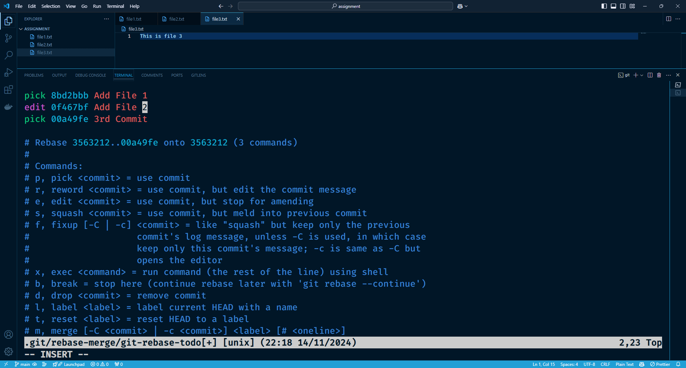

The `git rebase -i HEAD~3` command opens the interactive rebase mode for the last three commits. The interactive rebase mode allows us to edit the commits, squash the commits, or reorder the commits. In this case I chose to edit the second commit. So the my current `HEAD` is at the second commit. 

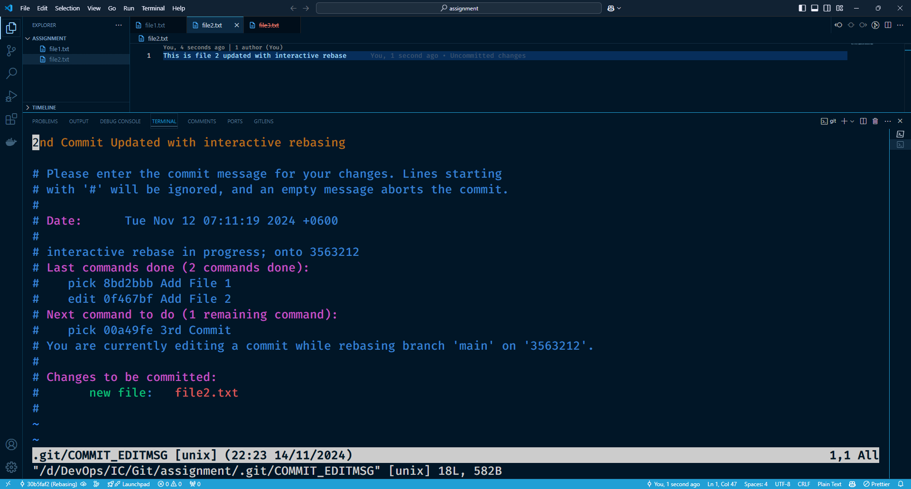

After I made the changes to the commit, I used `git add .` to add the changes to the staging area and then used `git commit --amend` to amend the commit. The `git commit --amend` command is used to amend the last commit with the changes in the staging area.

Now to complete the rebasing process, I used `git rebase --continue` command. This command will continue the rebase process and apply the changes to the commits.

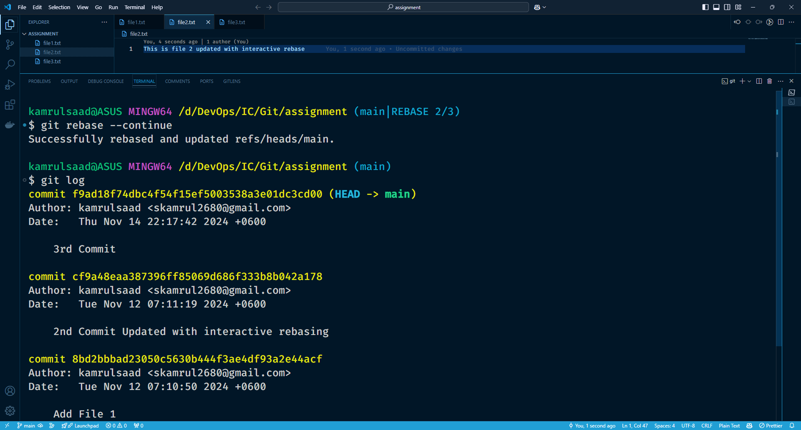

The `git rebase --continue` command continues the rebase process and applies the changes to the commits. The changes in the commit are amended, and the commit history is preserved. As you can see, after I used the `git rebase --continue` command, the changes are applied to the 2nd commit and it is updated to the changes I made. You can see the change in the above mentioned screenshot where I use `git log` command.

---

## Conclusion

In this assignment, I demonstrated the basic git commands that are used to manage the source code in a git repository. I also demonstrated how to connect to a remote repository, reset and revert changes, and rebase the commits in the git repository. Git is a powerful version control system that is used to track changes in the source code during the software development process. By using the basic git commands, developers can manage the source code efficiently and collaborate with other developers effectively.

