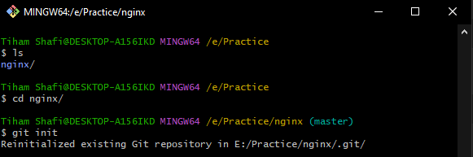
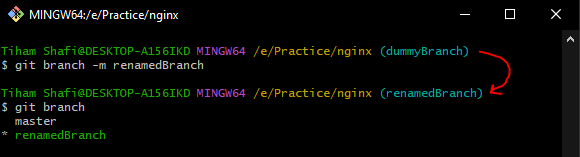
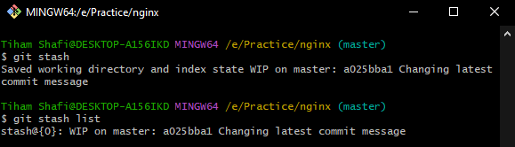

 

    <h2>  GIT Guide & Cheat Sheet </h2>
    <b>Git is a version control system, that helps us to track changes in code, making collaboration and version management  easy and efficient.</b>  Git made our life easier by allowing multiple people to work on the same project simultaneously, and also lets you save different versions of your work, making it easy to manage and revert versions whenever you need.   Anyway, let's get started!  
    &nbsp;   

 

<h2>📜 Guidance</h2>

👉 &nbsp;This is a handy Git cheat sheet that will guide to improve your workflow. 
👉 &nbsp;Save time when you can’t remember a command or prefer not to use `git help`. 
👉 &nbsp;Key Git commands are listed here with example screenshots for easy reference. 
👉 &nbsp;The guide covers most commonly used commands that you will encounter frequently. 
👉 &nbsp;Mainly designed to make using Git easier and more efficient. 

👉 &nbsp;But if you want to directly see the list of git commands, [Click here](#git-commands)

### Hope you guys will like it, and Good Luck! &nbsp;

   

<!-- INSTALLATION -->

  <h2>🔧 Installation</h2>
  <ul>
    <li>If you are in Windows, Download Git from this <a href="https://git-scm.com/download/win">link</a>.</li>
    <li>If you are in Mac OS, run the following command in your terminal:
      <pre><code>brew install git</code></pre>
    </li>
    <li>If you are in Linux, run the following command in your terminal:
      <pre><code>sudo apt-get install git</code></pre>
    </li>
  </ul>

 
  
To ensure if the installation is successful (On any platform),

  <pre><code>git --version</code></pre>
  
Like in here, in my operating system (Windows), to see if the installation is successful,

  
    
  

### Great! Now you have Git installed in your OS. 🎉🎉🎉

&nbsp;

  

 

  <h3>After installing Git,</h3> kindly create an account in any remote repositories like <b>GitHub</b> and <b>GitLab</b>, if you haven't. 
  Links are right below 👇   

Here, I am going to use <b>Github</b> as my remote repository system.
 

  

<!-- SETTING UP GIT CREDS -->

  <h2>⚙ Setting up Git Credentials</h2>

If you are working in a team on a single repo, it is important for others to know who made certain
changes to the code. So, Git allows you to set user credentials for tracking your changes. 

   

### 1️⃣ &nbsp;Basic Credentials Settings:

  <ul>
    <li>If you want to configure your mail,
      <pre><code>git config user.email "my_email@example.com"</code></pre>
    </li>
    <li>If you want to configure your username,
      <pre><code>git config user.name "your name goes here"</code></pre>
    </li>
  </ul>
  <b>*** Kindly make sure the mail and username should be similar as your remote repository's account. Thank you.</b>
    

### 2️⃣ &nbsp;Scope-wise Credentials Settings:

  <ul>
    <li>For a single project repo, if you want to configure your mail (This is the default tag),
      <pre><code>git config --local user.email "my_email@example.com"</code></pre>
    </li>
    <li>If you want all git repo under the current user mail (Globally set),
      <pre><code>git config --global user.email "my_email@example.com"</code></pre>
    </li>
  </ul>
  
  Similarly use the `--local` and `--global` for setting the user's username. 

   
  

    <h3>I would suggest to set it globally,</h3> otherwise you have to set it everytime whenever you are starting to work on a new project. 
    Don't worry, if you set it locally, instead of globally. Just run the below command. 
  

    

  <li>
    To configure your credentials globally in your OS,
    <pre><code>git config --global credential.helper store</code></pre>
  </li>

 

  

    <b style="font-size: 15px;">Well done! Now you can use Git commands freely in your OS terminal.</b> 
     
  

  

<!-- Git Basics -->

  <h2 id="git-commands">Git Commands</h2>
  

    <h3> If you guys are using Vscode,  you can directly use it's terminal after opening a folder where you wish to code</h3>
    <b>(Hotkey: Shift + Left Ctrl + ~)</b>  
        
  
 

### 🔗 Creating a Local Repository

  <ul>
    <li>
      Clone a repository from remote hosts (like GitHub, GitLab),
      <pre><code>git clone https://remote_repo_url</code></pre>  
      

        <b>Question :</b> WHERE WILL I GET THE LINK?! 😢 
        <b>Answer   :</b> 👇   
          
        Here, we used <b>HTTPS link</b>. There are 2 more options, <b>SSH link</b> and <b>Github Cli</b>.  
        While SSH cloning is generally considered a bit more secure
        because you have to use an SSH key for authentication,  HTTPS cloning is
        much simpler and the recommended cloning option by GitHub. 
        <h3>👌 I would prefer to use HTTPS link for the simplicity,</h3> 
      

      HTTPS cloning :
      <pre><code>git clone https://github.com/your_username/repo_name.git</code></pre>
      SSH cloning :
      <pre><code> git clone git@github.com:user_name/repo_name.git</code></pre> 
      
        
    </li>
    <li>
      Initialize git for tracking inside the current directory locally,
      <pre><code>git init</code></pre>
      
<b>👉 Here, make sure you are in the repository's folder.</b> In the screenshot, as I cloned the "nginx" repository, firstly I ensured that I am in the "nginx" folder.
      
 
      
        
      <b>👉 When you clone a repository, by default it initializes git.</b> 
      Like in the screenshot below, when I went to the repository folder <b>(nginx)</b>, 
      it showed the tag <b>(master)</b> in the git bash because, git has been initialized already.
       
        
      <b>👉 You can see the similar tag in the vscode,</b> if you open the repository folder directly, 
        
    </li>
    

      <h3>* Creating a new connection from the repository url is called "Remote".</h3>
      It comes to handly, when you are <b>FORKING</b> a repository.  
      (default remote name after cloning <b>"origin"</b>)  
      <b>Question :</b> NOW WHAT IS <b>FORKING</b>?! 
        
      <b>Answer   :</b> Forking creates a personal copy of someone else's repository,  allowing independent development without affecting the original project. 👌   
        
      Just click the <b>"fork"</b> button,  that will create a similar repository in your repository collection.
    
  
    <li>
      To check all the remote connections with details,
      <pre><code>git remote -v</code></pre>
    </li>
    <li>
      To add and naming a remote connection, (you can name anything to the remote_name, just make sure it's unique and meaningful)
      <pre><code>git remote add remote_name https://remote_repo_url</code></pre>
    </li>
      
    <li>
      To remove a remote connection,
      <pre><code>git remote rm remote_name</code></pre>
    </li>
      
    <li>
      You can also rename a remote connection,
      <pre><code>git remote rename old_name new_name</code></pre>
    </li>
      
  </ul>
    
  

    
      
    <b> Be patient 😅 Forking is just like simplified cloning, but more efficient and safer, 
    because you are working on your own remote repository, instead of the main repository.</b> 
    Trust me, you just need some hands-on practices 😌
  

    

### 🌿 Branching Repository

   
  

    Branching is really crucial because,  
    it allows multiple developers to work on different features or fixes simultaneously, <b>without affecting the main codebase</b> 
    As you are not affecting the main branch, it is much safer. ✅  
     
  
  

  <ul>
    <li>
      To see all the local branches,
      <pre><code>git branch</code></pre>
    </li>
    <li>
      To see all the remote branches,
      <pre><code>git branch -a</code></pre>
    </li>
    <li>
      Create a new local branch and switch into it,
      <pre><code>git checkout -b new_branch_name</code></pre>
    </li>
     
    Here you can see a star on the left side of dummyBranch in the screenshot.<b> It indicates, which branch you are currently in.</b>  
    <b>Similarly, you can check it in the vscode,</b> 
      
    <li>
      Switch into an existing branch,
      <pre><code>git checkout branch_name</code></pre>
    </li>
      
    <li>
      Checking out (switching to) older commits, (here, 1 is the latest commit. And "n" is any positive number)
      <pre><code>git checkout HEAD~n</code></pre>
    </li>
    <li>
      Also you can checkout (switching to) older commits using the commit ID,
      <pre><code>git checkout commit_id</code></pre>
    </li>
    <li>
      Renaming the current branch,
      <pre><code>git branch -m new_name</code></pre>
    </li>
      
    <li>
      Safe delete a local branch (prevents deleting unmerged changes. <b>Also make sure you are not in the same branch which you are going to delete</b>),
      <pre><code>git branch -d branch_name</code></pre>
    </li>
      
    <li>
      Force delete a local branch (whether merged or unmerged. <b>Also make sure you are not in the same branch which you are going to delete</b>),
      <pre><code>git branch -D branch_name</code></pre>
    </li>
      
    <li>
      Delete a remote branch,
      <pre><code>git push remote_name --delete branch_name</code></pre>
    </li> 
  </ul>
    

### 📁 Working With Files

   
  

    Suppose you worked on few files in the local repository folder. 
    Even though, the <b>changes are made locally,</b> now you have to <b>update the changes remotely.</b> Right? 
    So that your friends can also get the latest version, and work on it.   
    
  

    
  

    <h3>📌 Some key concepts:</h3>
    <ul>
      <li><b> .gitignore file:</b> A file that lists other files you want git not to track </li>
      <li><b> Staging area:</b> a cache that holds changes you want to commit next </li>
      <li><b> Stash:</b> another type of cache that holds untracked changes, that you may want to later </li>
      <li><b> Forking:</b> It creates a personal copy of someone else's repository, allowing independent development without affecting the original project. </li>
      <li><b> Commit ID or hash:</b> a unique identifier for each commit, used for switching to different save points </li>
      <li><b> HEAD (always capitalized letters):</b> a reference name for the latest commit, to save you having to type Commit IDs. </li>
    </ul>
  

    
  <ul>
    <h3>1️⃣ Add and Commit:</h3>
    <li>
      See changes in the local repository (<b>Mainly to see if the changes are tracked or untracked by git</b>),
      <pre><code>git status</code></pre>
    </li>
    <li>
      To add all the changes to the staging area (including all untracked and tracked files), 
      <pre><code>git add .</code></pre>
    </li>
     
    Here, in the first part, as the code wasn't tracked by git, the text was in red color. It is the <b>unstaged area</b>. 
    Then after the add command, the code was tracked by git. And the text was in green color. It is the <b>staging area</b>.
      
    <li>
      Saving a snapshot of the staged changes with a custom message,
      <pre><code> git commit -m "Commit_message"</code></pre>
      <b>or,</b>
      <pre><code> git commit </code></pre>
      <b>This will take you to a text editor (by default vim) to write the custom message</b>
    </li>  
     
    Here, the yellowish code beside the master <b>(9e85eaf6)</b>, it is the commit ID or hash. 
    And as I created a dummyText.txt file, it is showing as change within the local repository.
      
    <li>
      Editing the message of the latest commit,
      <pre><code> git commit --amend -m "Commit_message" </code></pre>
      <b>or,</b>
      <pre><code> git commit --amend</code></pre>
    </li>
      
     
    Here, you can see, even though we changed the same commit message, <b>the commit ID already changed.</b> 
    So, even if we changed the history of the latest commit message, the ID can atleast differentiate it.
      
    <li>
      Take the file from staging area to untracked stage,
      <pre><code>git rm --cached file_name</code></pre>
    </li>
      
    <h3>2️⃣ Stashing: </h3>
    <li>
      Saving staged and unstaged changes to a temporaray storage for a later use,
      <pre><code>git stash</code></pre>
    </li>
    <li>
      Shows the list of stashed files,
      <pre><code>git stash list</code></pre>
    </li>
    
     
    Showing the stashed file with it's commit ID.
      
    <li>
      Reapply previously stashed changes (more like pasting all the changes from the temporaray storage),
      <pre><code>git stash pop</code></pre>
    </li>
      
    <li>
      Dropping stashed changes,
      <pre><code>git stash clear</code></pre>
    </li>
      
    <h3>3️⃣ Fetching: </h3>
    <li>
      Download all commits and branches to the local repository,
      <pre><code>git fetch</code></pre>
    </li>
      
    <li>
      Only download the specified branch from the remote,
      <pre><code> git fetch remote_name branch_name</code></pre>
    </li>
      
    <h3>4️⃣ Logs and History: </h3>
    <li>
      List all commits with their author, commit ID, date and message,
      <pre><code>git log</code></pre>
    </li>
      
    <li>
      List one commit per line (n defines the number of commit lines to show),
      <pre><code> git log --oneline [-n]</code></pre>
    </li>
      
    <li>
      List all commits with all the commands of the local repository,
      <pre><code>git reflog</code></pre>
    </li>
    
      
    <h3>5️⃣ Push and Pull: </h3>
    <li>
      To push all the tracked changes and giving a pull request (PR) for merging,
      <pre><code>git push remote_name branch_name</code></pre>
    </li>
      
    <li>
      To push all the tracked changes and giving a pull request (PR) for merging <b>by forcing</b>,
      <pre><code>git push remote_name branch_name -f</code></pre>
      * Mainly used after <b>'git commit --amend -m "message"'</b>
    </li>
      
    <li>
      To retrieve and stay up to date (aggressive merging),
      <pre><code>git pull remote_name branch_name</code></pre>
    </li>
     
    As it is already up to date, the pull command didn't change anything.
      
    

      <h3>A full overview of what actually happens after each command,</h3>
        
      
         
      <b>Question :</b> THERE IS A <b>"BUT"</b> ABOUT THIS TOPIC. BECAUSE, 
      
        
      <b>Answer   :</b> Everyone faces that, but not to worry.  
      Mostly it happens, when your local repository is not up to date. 
      In the next section we will be learning about <b>rebase</b> and <b>reset</b> commands, to avoid such conflicts. 
      Yeah, there are few more topics to cover 😅............ 
          
         
      <h3>Anyway...</h3>
    

      
    <h3>6️⃣ Reset and Rebase: </h3>
      
    

      <b>Git's reset command</b> is a powerful tool in Git for undoing changes. 
      It’s mainly used to move the current HEAD to a specific state in your commit history, 
      allowing you to modify or remove changes from your project. 
      <h3>📍 So, use it wisely, </h3> or else, you might remove your stored data.  
      
        
    

    <h3> Mainly there are 3 types of reset commands. They are,</h3>
    <ol>
      <li>
        <b>Mixed Reset (default):</b> Deletes the last commit, but doesn't delete the code. Takes it to the unstaged mode. So you have to add and commit again,
        <pre><code>git reset HEAD~1</code></pre>
      </li>
       
      <li>
        <b>Soft Reset:</b> Similar like the default one. But it takes to the staged mode. So you have to commit only,
        <pre><code>git reset --soft HEAD~1</code></pre>
      </li>
       
      <li>
        <b>Hard Reset:</b> Deletes the last commited file without any traces,
        <pre><code>git reset --hard HEAD~1</code></pre>
      </li>
       
       
      <h3>Summary of Reset Modes:</h3>
      <table>
        <tr>
          <th>Mode</th>
          <th>Staging Area</th>
          <th>Working Directory</th>
          <th>Use Case</th>
        </tr>
        <tr>
          <td><code>--soft</code></td>
          <td>Keep</td>
          <td>Keep</td>
          <td>Modify the last commit</td>
        </tr>
        <tr>
          <td><code>--mixed</code></td>
          <td>Unstage</td>
          <td>Keep</td>
          <td>Unstage changes for a new commit</td>
        </tr>
        <tr>
          <td><code>--hard</code></td>
          <td>Discard</td>
          <td>Discard</td>
          <td>Permanently delete recent changes</td>
        </tr>
      </table>
    </ol>
        
    

      <b>Git rebase</b> command mainly integrate changes from one branch into another.   
      Instead of creating a merge commit, rebase rewrites the commit history to create a linear progression of commits. 
      Most of the time, you will find merge conflicts, during the rebase.  
      
    
  
    <li>
      Take all the commits from the current branch, and reapply them on top of the rebased branch,
      <pre><code>git rebase branch_name</code></pre>
    </li>
     
    <li>
      Abort the rebase,
      <pre><code>git rebase --abort</code></pre>
    </li>
    <li>
      Continue rebase after resolving conflicts,
      <pre><code>git rebase --continue</code></pre>
    </li>
      
    

      For <b>merging</b>, I would suggest to use the Vscode's interface instead of the merge command.   
      <h3>If any merge conflicts occur while rebasing or after pulling,  go to the <code>Source Control</code> to work in the merge editor.</h3>  
       
      <b>Here you can also see all the modified files, highlighting the changes. From here you can also commit, but it isn't recommended.</b>
        
      <b>If you see any conflicts, you will see a similar UI like this, 👇</b>  
        
      <b>There you can see the upcoming changes and the present codes.  
      Modify them accordingly by pressing <code>Resolve in Merge Editor</code>, 
      and after that, press <code>Complete Merge</code> button.</b>  
       
       
    

      
    <li>
      If you want to revert or abort the merge,,
      <pre><code> git merge --abort</code></pre>
    </li>
  </ul>
     
  

    <h3> For now, these are the essential  commands you should be familiar with.  You'll frequently encounter these situations and use these commands in your daily workflow.  
    For hands-on practice and simulation training, 👉<a href="https://learngitbranching.js.org/">Click Here</a>👈. It's a good website to learn git basics. 
    And I hope you find them helpful and handy. Keep practicing!  Thank you for your support, and happy coding!</h3> 
    
  

