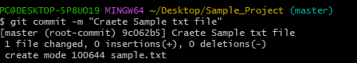

# Git Command Cheat Sheet ✌✌✌

Welcome to the Git Command Cheat Sheet! This document provides a quick reference to commonly used Git commands with explanations and examples.

## Table of Contents
- [Getting Started](#getting-started)
- [Basic Commands](#basic-commands)
- [Branching](#branching)
- [Merging](#merging)
- [Remote Repositories](#remote-repositories)
- [Stashing Changes](#stashing-changes)
- [Viewing History](#viewing-history)
- [Help](#help)

## Getting Started
To begin using Git, you need to install it on your machine. You can download Git from [git-scm.com](https://git-scm.com/).

## How to Set Up Git

Follow these steps to set up Git with your username and email, and configure SSH keys for secure authentication with GitHub.

### Step 1: Configure Git Username and Email

Set your global Git username and email address:

```bash
$ git config --global user.name "git-username"
$ git config --global user.email "git-email"


```


### Step 2: Generate SSH Key

```bash

$ ssh-keygen
```

Follow the prompts to create the key pair (usually accepting the default location and leaving the passphrase empty for simplicity).


### Step 3: Add SSH Key to Your GitHub Account

Copy the SSH public key:
```bash

$ cat ~/.ssh/id_rsa.pub

```
2.Go to your GitHub account settings and navigate to SSH and GPG keys.

3.Click New SSH key, give it a title, and paste your public key into the key field.


### Step 4: Add SSH Key to Your GitHub Account

Test that your SSH setup works by running:
```bash

$ ssh -T git@github.com
```


If successful, you should see a message saying "Hi username! You've successfully authenticated...".

### Initialize a Repository
To create a new Git repository, navigate to your project folder and run:
```bash
git init
```


## Basic Commands

### Check the Status
To see the status of your files in the working directory:
```bash
git status
```

### Add Changes
To stage changes for commit:
```bash
git add <file>   # Add a specific file
git add .        # Add all changes
```


### Commit Changes
To commit staged changes:
```bash
git commit -m "Your commit message here"
```


## Branching

### Create a New Branch
To create a new branch:
```bash
git branch <branch-name>
```


### Switch to a Branch

To switch to another branch:
```bash
git checkout <branch-name>
```

### Create and Switch to a New Branch

To create a new branch and switch to it in one command:
```bash
git checkout -b <branch-name>
```

## Merging

### Merge a Branch
To merge a branch into the current branch:
```bash
git merge <branch-name>
```


## Remote Repositories


### Add a Remote Repository
To add a remote repository:
```bash
git remote add <name> <url>
```


### Push Changes
To push changes to a remote repository:
```bash
git push <remote> <branch>
```


### Pull Changes
To fetch and merge changes from a remote repository:
```bash
git pull <remote> <branch>
```


## Stashing Changes

### Stash Changes
To save your changes temporarily:
```bash
git stash
```

### Apply Stashed Changes
To apply the stashed changes:
```bash
git stash apply
```

## Viewing History

### View Commit History
To view the commit history:
```bash
git log
```

## Help
If you need help with any Git command, you can use:
```bash
git help <command>
```


---


Feel free to contribute and expand this cheat sheet as needed!
                     

