# Git Commands

Version control systems are essential tools in modern software development, and Git stands at the forefront as the most widely used distributed version control system. Git's robust features enable developers to track changes, collaborate effectively, and maintain a complete history of their project's development.

1.
```bash
git config --global user.name "Your Name"
```
**Description:** Sets your username for Git globally, which will be associated with all your commits across all repositories on your system.

**Screenshot:**

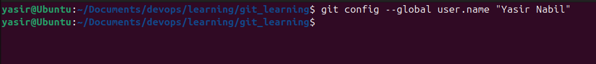

2.
```bash
git config --global user.email "your.email@provider.com"
```
**Description:**: Sets your email address for Git globally, which will be attached to all your commits for identification.

**Screenshot:**

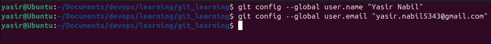

3.
```bash
git init
```
**Description:** Initializes a new Git repository in your current directory, creating a new .git folder to track changes.

**Screenshot:**

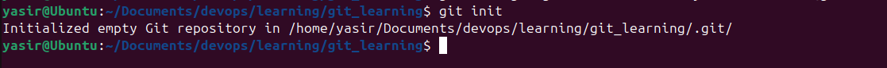

4.
```bash
git status
```
**Description:** Shows the current state of your working directory, including tracked, untracked, and modified files.

**Screenshot:**
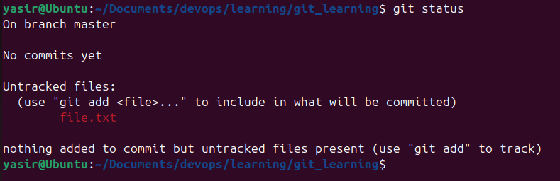

5.
```bash
git add .
or
git add file_name
```
**Description:** First command adds all files in the current directory to the staging area, preparing them for commit. Second commit add a particular file. One can add multiple file by putting file names comma seperated.

**Screenshot:**

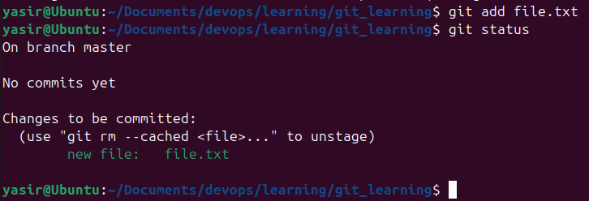

6.
```bash
git commit -m "message"
```
**Description:** Creates a new commit with all staged changes, including a descriptive message of what changed.

**Screenshot:**

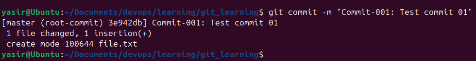

7.
```bash
git branch
```
**Description:** Lists all local branches in your repository, showing which branch you're currently on (with a star on left).

**Screenshot:**

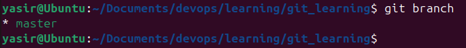

8.
```bash
git checkout -b branch-name
```
**Description:** Creates a new branch and switches to it immediately.

**Screenshot:**

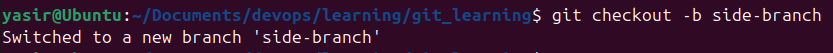

9.
```bash
git remote add origin repositoory_url
```
**Description:** Connects your local repository to a remote repository, where 'origin' is the conventional name given to the remote repository.

**Screenshot:**

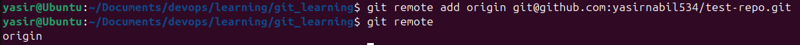

10.
```bash
git push origin branch-name
```
**Description:** Pushes your local commits to the remote repository on the specified branch.

**Screenshot:**

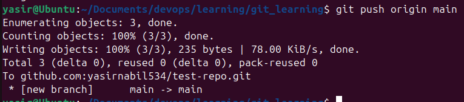

11.
```bash
git pull origin branch-name
```
**Description:** Fetches changes from the remote repository and merges them into your current branch.

**Screenshot:**

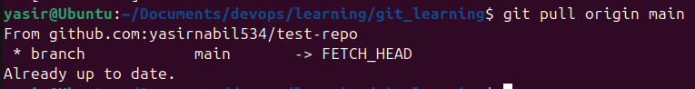

12.
```bash
git remote
```
**Description:** Shows a list of all remote repositories that your local repository is connected to, displaying their shorthand name

**Screenshot:**

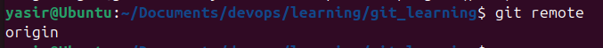

13.
```bash
git remote -v
```
**Description:** Displays detailed information about remote repositories, showing both fetch and push URL's for each remote. That -v stands for verbose output.

**Screenshot:**

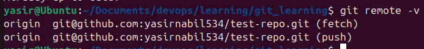