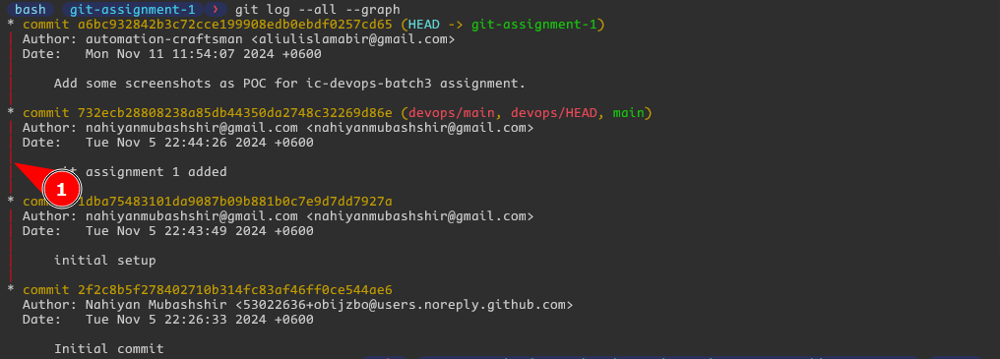
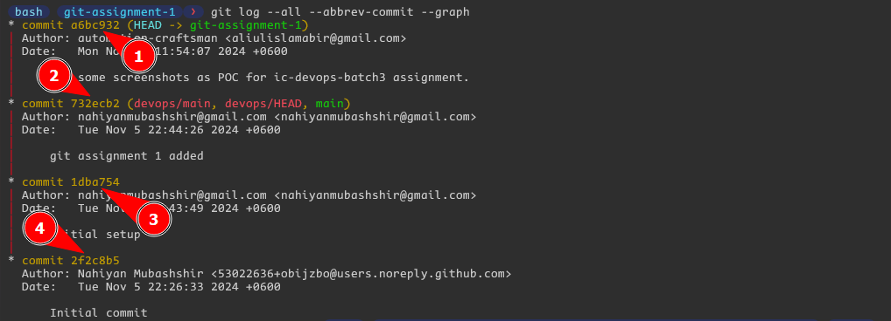
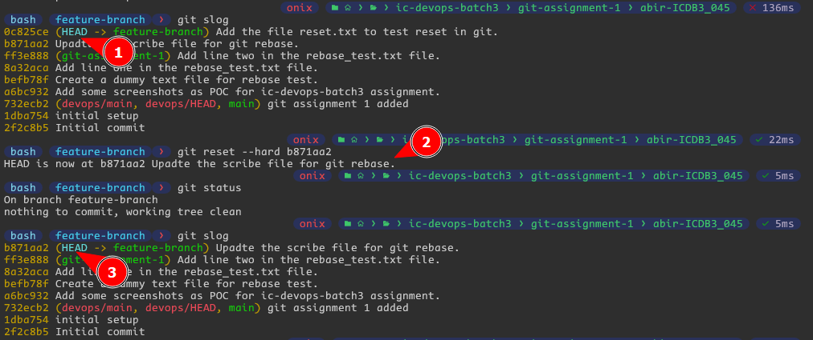

# Git Command Scribe Sheet

1. **`git init`**
   - **Description**: Initializes a new Git repository in the current directory, creating a hidden `.git` folder to store metadata for tracking changes. This command is essential to start using Git in a new project folder.
   - **Example**: 
     ```bash
     git init
     ```
        

2. **`git clone <repository-url>`**
   - **Description**: Downloads a remote repository and creates a local copy, including all branches and files. Ideal for getting a project from GitHub or any other remote repository.
   - **Example**: 
     ```bash
     git clone https://github.com/username/repository.git
     ```
        

3. **`git add <file-or-directory>`**
   - **Description**: Stages changes to specified files or directories. Staging allows you to select what to include in your next commit.
   - **Example**: 
     ```bash
     git add icdb3.txt
     git add .
     ```
        

4. **`git commit -m "message"`**
   - **Description**: Commits staged changes to the repository with a descriptive message, making a snapshot of your project at that point.
   - **Example**: 
     ```bash
     git commit -m "Add batch-03 students names in the icdb3.txt file."
     ```
        
5. **`git status`**
   - **Description**: Shows the current status of the working directory, including staged, unstaged, and untracked files.
   - **Example**: 
     ```bash
     git status
     ```
        

6. **`git log`**
   - **Description**: Displays commit history with details like author, date, and message. Useful for reviewing previous changes.
   - **Example**: 
     ```bash
     git log
     git log --oneline
     git log --all --graph
     git log --all --abbrev-commit --graph
     ```
        
        
        
        
7. **`git branch`**
   - **Description**: Lists, creates, renames, or deletes branches in your repository. Branches are separate workspaces for different features or versions of the project.
   - **Example**: 
     ```bash
     git branch
     ```
        

8. **`git checkout <branch-name>`**
   - **Description**: Switches to the specified branch, updating the working directory to match. Allows you to work on different branches without merging.
   - **Example**: 
     ```bash
     git checkout main
     ```
        

9. **`git merge <branch-name>`**
   - **Description**: Combines changes from the specified branch into the current branch, integrating updates or features.
   - **Example**: 
     ```bash
     git merge feature-branch
     ```

10. **`git push <remote> <branch>`**
    - **Description**: Uploads commits to a branch on a remote repository, like GitHub, enabling team collaboration.
    - **Example**: 
      ```bash
      git push origin main
      ```

11. **`git pull`**
    - **Description**: Downloads and merges changes from a remote repository, keeping your branch up-to-date.
    - **Example**: 
      ```bash
      git pull
      ```

12. **`git stash`**
    - **Description**: Temporarily saves uncommitted changes, allowing you to work on other tasks without committing.
    - **Example**: 
      ```bash
      git stash
      ```

13. **`git stash apply`**
    - **Description**: Restores the most recent or specified stash of changes, retrieving your saved modifications.
    - **Example**: 
      ```bash
      git stash apply
      ```

14. **`git remote -v`**
    - **Description**: Lists all remote repositories linked to your project, showing their URLs.
    - **Example**: 
      ```bash
      git remote -v
      ```
        

15. **`git diff`**
    - **Description**: Shows line-by-line differences between files in the working directory and the last commit.
    - **Example**: 
      ```bash
      git diff
      git diff icdb3.txt
      ```
        

16. **`git reset <file>`**
    - **Description**: Unstages the specified file, removing it from the staging area without deleting changes.
    - **Example**: 
      ```bash
      git reset icdb3.txt
      ```
        

17. **`git rm <file>`**
    - **Description**: Deletes a file from the working directory and stages the deletion.
    - **Example**: 
      ```bash
      git rm icdb3.txt
      ```
        

18. **`git fetch <remote-name>`**
    - **Description**: Downloads changes from the remote repository without merging them.
    - **Example**: 
      ```bash
      git fetch origin
      ```

19. **`git mv <old-filename> <new-filename>`**
    - **Description**: Renames or moves a file and stages the change.
    - **Example**: 
      ```bash
      git mv old_name.txt new_name.txt
      ```
        

20. **`git rebase <branch-name>`**
    - **Description**: Moves or integrates commits from one branch onto another, making a cleaner, linear history.
    - **Example**: 
      ```bash
      git rebase main
      ```
        

21. **`git cherry-pick <commit-hash>`**
    - **Description**: Applies a specific commit from one branch to the current branch.
    - **Example**: 
      ```bash
      git cherry-pick a1b2c3d4
      ```

22. **`git reflog`**
    - **Description**: Shows a log of reference updates, useful for recovering lost commits.
    - **Example**: 
      ```bash
      git reflog
      ```
        

23. **`git clean -f`**
    - **Description**: Removes untracked files from the working directory.
    - **Example**: 
      ```bash
      git clean -f
      ```

24. **`git blame <file>`**
    - **Description**: Shows who last modified each line in a file.
    - **Example**: 
      ```bash
      git blame main.py
      ```

25. **`git show <commit-hash>`**
    - **Description**: Displays information and changes for a specific commit.
    - **Example**: 
      ```bash
      git show a1b2c3d4
      ```

26. **`git shortlog`**
    - **Description**: Summarizes commit history by author.
    - **Example**: 
      ```bash
      git shortlog
      ```
        

27. **`git archive <branch> --output=<file.zip>`**
    - **Description**: Creates a zip or tar archive of the project at a specific commit or branch.
    - **Example**: 
      ```bash
      git archive main --output=source.zip
      ```

28. **`git config --list`**
    - **Description**: Lists all Git configuration settings.
    - **Example**: 
      ```bash
      git config --list
      git config --global --list
      git config --local --list
      ```
        
        
        

29. **`git grep <pattern>`**
    - **Description**: Searches for a pattern in tracked files.
    - **Example**: 
      ```bash
      git grep "function"
      ```
        

30. **`git reset --hard <commit-hash>`**
    - **Description**: Resets the repository to a specific commit, discarding all changes afterward.
    - **Example**: 
      ```bash
      git reset --hard b871aa2
      ```
        

31. **`git config --global user.name "Your Name"` and `git config --global user.email "you@example.com"`**
    - **Description**: Sets global user name and email for commits.
    - **Example**: 
      ```bash
      git config --global user.name "automation-craftsman"
      git config --global user.email "example@gmail.com.com"
      ```
