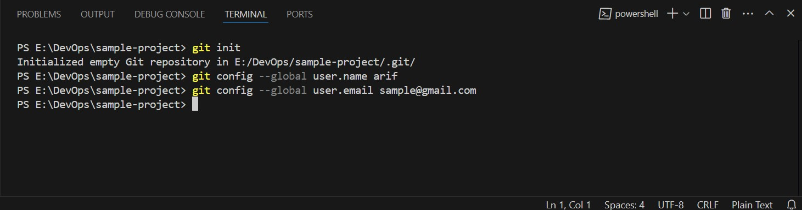
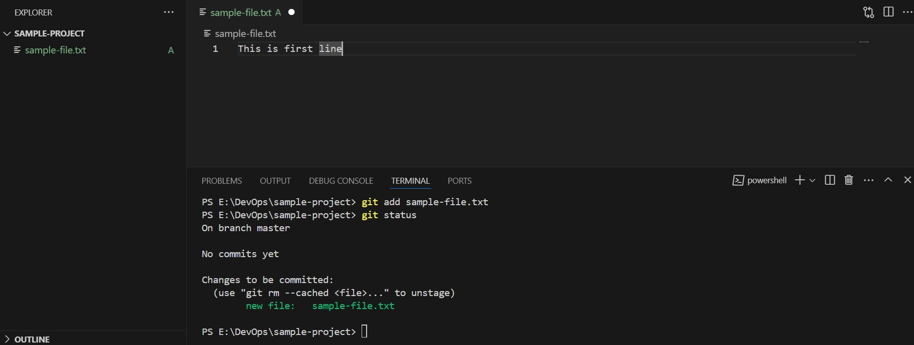
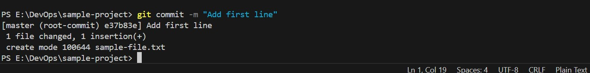
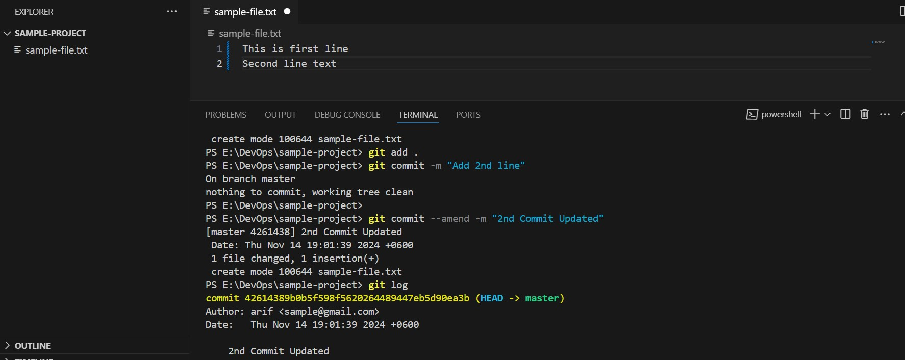

# Git Commands

## Basic git commands

Followings are the basic commands of git

# Git initialization

```bash
git init
git config --global user.name "arif" 
git config --global user.email "samplemail@gmail.com"
```
here are the screenshots of the following commands


# Git Status

Check git current status. 
```bash
$git status
```

# File staging and commit

```bash
$git add <file-name>
or git add .

$git commit -m "Commit message"
```
here are the screenshots of the following commands


# Git Amend

git amend is used to modify the most recent commit

```bash
$git commit --amend 
or
$git commit --amend -m "3rd Commit Updated"
```
here are the screenshots of the following commands


# Git Reset
reset is used to move the repository back to a previous commit, discarding any changes made after that commit.


1. Mixed Reset: file stay at untracked condition and remove last n commit
```bash
$git reset HEAD~1
```

2. Soft Reset: file stay at tracked condition and remove last n commit
```bash
$git reset --soft HEAD~1 
```
3. Hard Reset: remove commit with changes data
```bash
$git reset --hard HEAD~1 
```
here are the screenshots of the following commands


# Rebase

rebase will simply drop merge commits from the todo list, and put the rebased commits into a single, linear branch
```bash
$git rebase -i HEAD~2    select specific commit
$git add .		         After edit file track file
$git commit --amend	     Modify commit
$git rebase --continue	 Continue and finish rebasing
$git rebase --abort       undo the git rebase
```

# Change master branch name
```bash
$git branch -m main
```
# create new branch

```bash
$git checkout -b branch-name
```

# checkout branch
```bash
git checkout branch-name
```
# git clone
```bash
git clone ssh/https
```
# SSH Connection
```bash
$ssh-keygen
$ssh -T git@github.com
$git remote -v
```
# Git remote connection
```bash
$git remote add origin git@github.com:githubarif/sample-project.git
```
# Git pull and push
```bash
$git pull origin main 
$git push origin main
```

# Git Log
Git log is use to show all log 
```bash
$git log
```