# GIT CHEAT SHEET

 Git is the free and open source distributed version control system that's responsible for everything GitHub related that happens locally on our computer. This cheat sheet features the most important and commonly used Git commands for easy reference. 

## Git install and Setup

<em> $ sudo apt install git </em>
 - For install git

<em> $ git --version </em>
 -  Check git version

### Configure user name & Address by using the git config command

<em> $ git config --global user.name "Your Name" </em>
 -  Configure user name

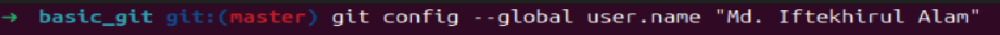

<em> $ git config --global user.email "youremail@domain.com" </em>
 -  Configure user email

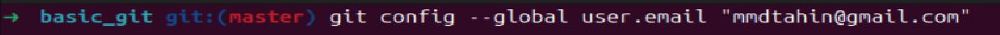

<em> $ git config --list </em>
  -  display all configuration items

Output:

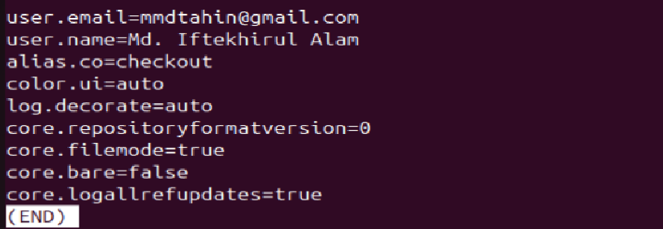

 1.System: These variables are available for every user in the system and stored in [path]/etc/gitconfig.  
Example: C:/Program Files/Git/etc/gitconfig  
You can make git read and write from System by passing --system as option. It also requires you to have administration permissions. 

 2. Global: Global configurations are available for the current user for all the projects and stored in 
~/.gitconfig or ~/.config/git/config  
Example: C:/Users/Username/.gitconfig  
You can make git to read and write from Global by passing --global option. 

 3. Local: Local configs are available for the current repository only and stored in
[gitrepo]/.git/config  
Example: C:/Users/MyProject/.git/config  
You can make git read and write from Local by passing --local option. 

## Initialize, Stage & Snapshot

<em> $ git init </em>
 -  initialize an existing directory as a Git repository

Output:

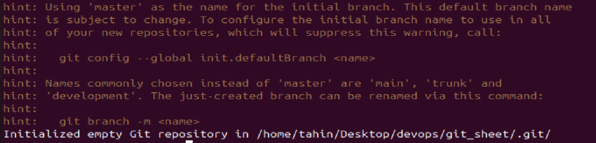

<em> $ git status </em>
 - show modified files in the working directory, staged for your next commit

Output:

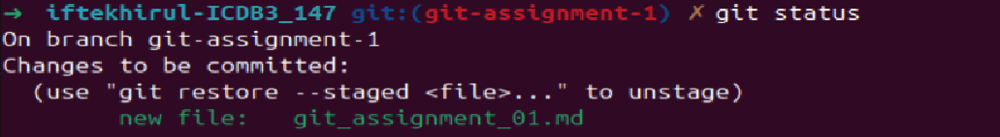

<em> $ git add “file name” </em>
 -  add a file as it looks now to your next commit (stage)

<em> $ git commit -m “[descriptive message]” </em>
 - commit your staged content as a new commit snapshot

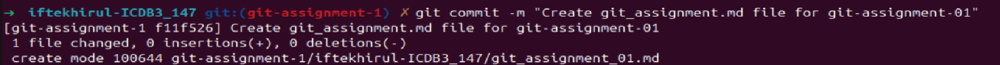

<em> $ git diff </em>
 -  diff of what is changed but not staged

<em> $ git diff --staged </em>
 -  diff of what is staged but not yet committed

<em> $git log </em>
 -  show all commits in the current branch’s history

Output:

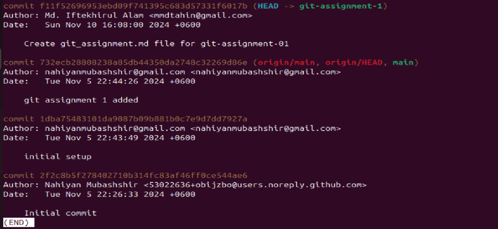

<em> $ git commit -amend </em>
 - add changes to the last commit snapshot

Output:

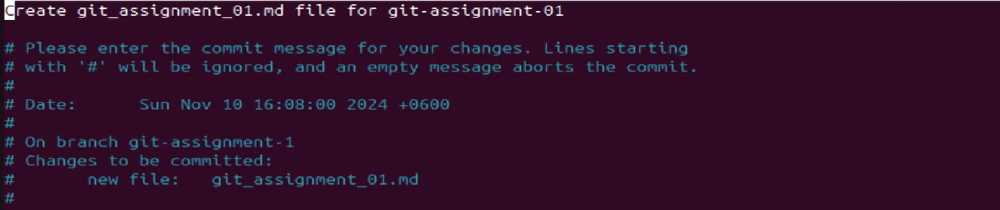

## BRANCH & MERGE

<em> $ git branch </em>
 - list your branches. a * will appear next to the currently active branch

Output: 

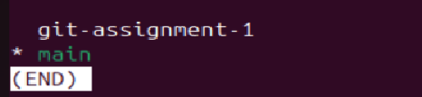

<em> git branch [new-branch-name] </em>
 - create a new branch at the current commit

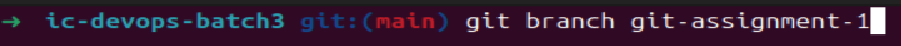

<em> git checkout [branch-name] </em>
 - switch to another branch and check it out into your working directory

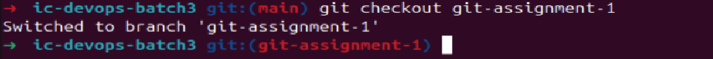

<em> git merge [branch] </em>
 - merge the specified branch’s history into the current one

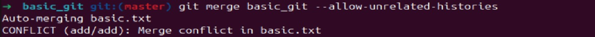

<em> git log </em>
 - show all commits in the current branch’s history

# Rewrite History

 ## Git Reset

<em> $ git reset HEAD~”Number of commit want to reset” </em>
<em> $ git reset –mixed HEAD~”Number of commit want to reset” </em>
 -  retaining the changes in the working directory (Delete commits and keep file changes as unstage)

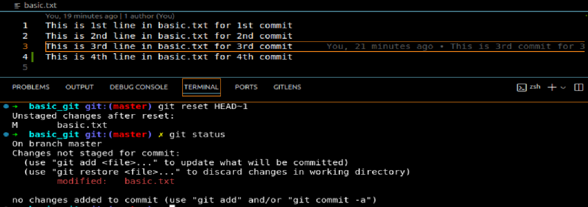

<em> $ git reset –soft HEAD~”Number of commit want to reset” </em>
 -  Delete commits and keep file changes as stage

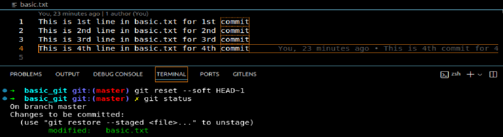

<em> $ git reset –hard HEAD~”Number of commit want to reset” </em>
 -  Delete commits and also delete file changes as stage

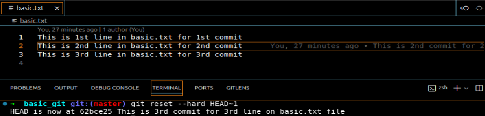

<em> $ git reset  HEAD@{”which number HEAD to back”} </em>
 -if want to go back to a previous stage

<em> $ git rebase -i HEAD~”Number of commit want to see for rebase” </em>
 - Interactive rebasing for edit previous commits

Output:

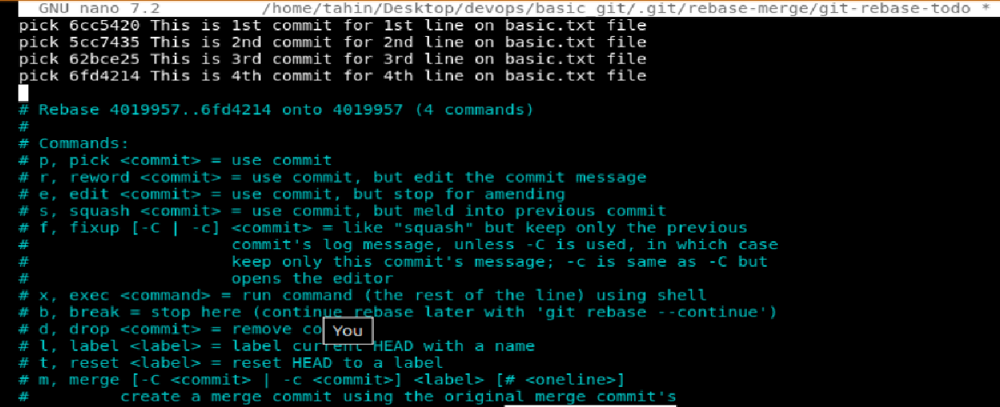

If we want to edit any commit we can write <b> edit </b> in that commit instant of <b> pick </b>

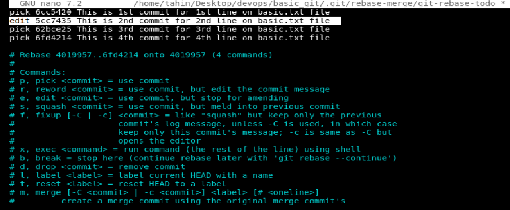

We can amend the selected commit now, with
<em> $ git rebase –amend </em>   
Ones we are satisfied with our changes we can exit/run
<em> $ git rebase –continue  </em>

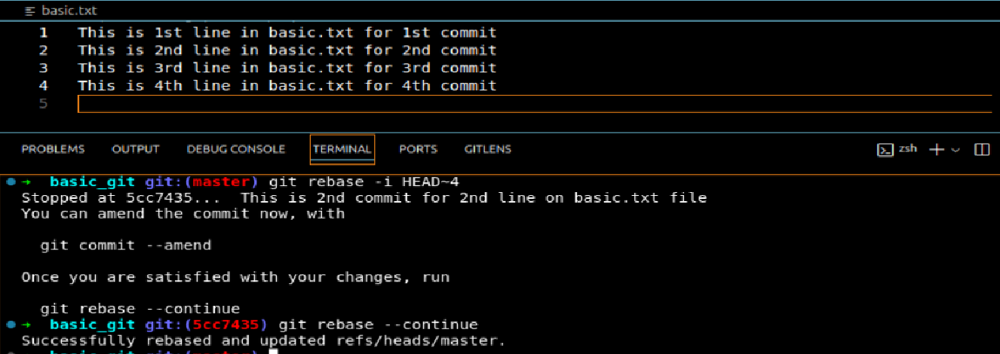

## Git Remote secsion 

<em> $ git clone git@github.com:User/UserRepo.git </em>
 - clone any git repository from github with ssh url

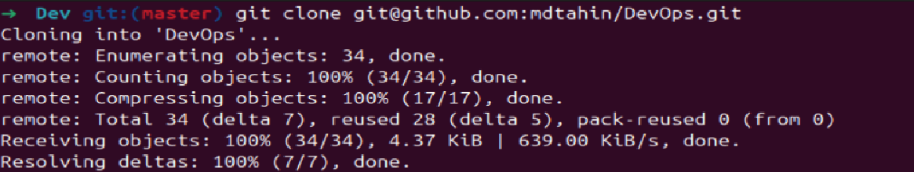

<em> $ git remote add [remote_name] git@github.com:User/UserRepo.git </em>
 -   is used to add a new remote

<em> $ git remote set-url "origin" git@github.com:User/UserRepo.git </em>
 -  is used to change the url of an existing remote repository

<em> $ git remote -v </em>
 - View git remote configurations 

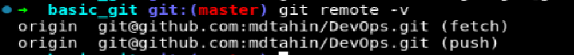

<em> $ git pull 'remote_name' 'branch_name' </em>
 -  pull changes from a remote/target repository

 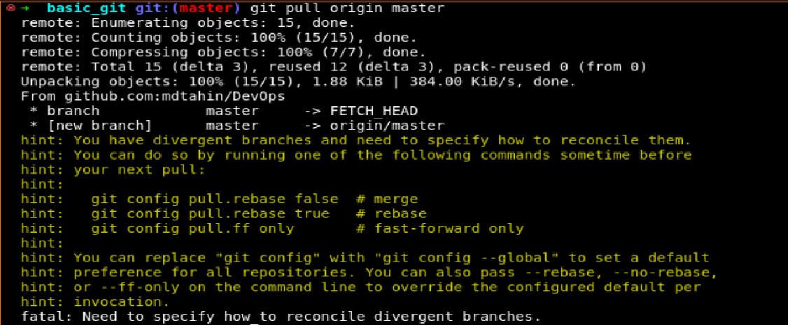

<em> $ git push 'remote_name' 'branch_name' </em>
 -  push changes made on local repository to remote repository

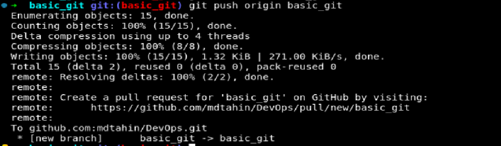
 
<em> $ git reflog show HEAD </em>
 - reflogs track when Git refs were updated in the local repository

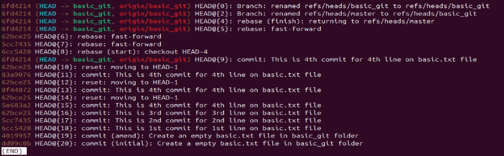

<em> $ git fetch </em>
 - download objects and refs/changes from another repository

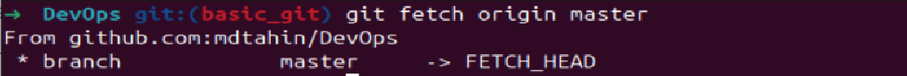

<em> $ git revert </em>
 - revert the changes that the related patches introduce, and record some new commits that record them

