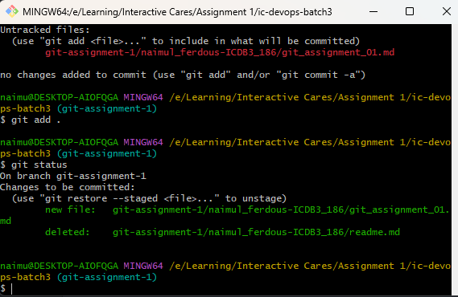
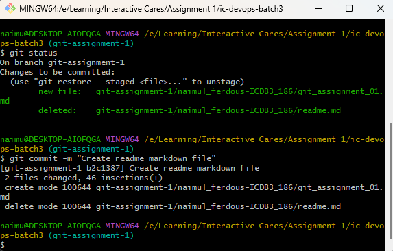
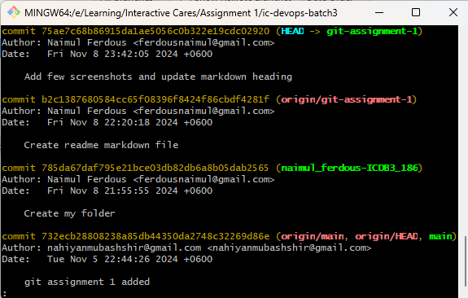

# Git Assignment 1

This is git assignment 1 by Naimul Ferdous

## Basic Commands

- `git init`: Initialize a new Git repository in the current directory.
- `git clone <repository-url>`: Clone an existing Git repository from a remote URL.
- `git add <file>`: Stage changes in the specified file for the next commit.
- `git add .`: Stage all changes in the current directory for the next commit.

    

- `git commit -m "commit message"`: Create a new commit with the staged changes and the provided commit message.

    

- `git push`: Upload the local repository changes to the remote repository.

    

- `git pull`: Download the latest changes from the remote repository and merge them into the local repository.

## Branching and Merging

- `git branch`: List all local branches.
- `git branch <branch-name>`: Create a new branch with the specified name.
- `git checkout <branch-name>`: Switch to the specified branch.
- `git merge <branch-name>`: Merge the specified branch into the current branch.
- `git branch -d <branch-name>`: Delete the specified local branch.
- `git push origin :<branch-name>`: Delete the specified remote branch.

## Inspection and Comparison

- `git status`: Show the current status of the repository, including unstaged and untracked files.
- `git log`: Show the commit history of the current branch.

    

- `git diff`: Show the differences between the working directory and the staging area.
- `git diff <branch1> <branch2>`: Show the differences between two branches.

## Undoing Changes
- `git reset <file>`: Unstage the specified file.
- `git reset --hard`: Discard all changes in the working directory and staging area.
- `git revert <commit-hash>`: Create a new commit that undoes the changes introduced by the specified commit.
- `git checkout -- <file>`: Discard changes in the working directory for the specified file.

## Rebasing and Resetting
- `git rebase <branch>`: Move the current branch's commits to the tip of the specified branch.
- `git rebase -i <commit-hash>`: Start an interactive rebase session starting from the specified commit.
- `git reset <commit-hash>`: Move the current branch's tip to the specified commit, discarding changes.
- `git reflog`: Show the history of all your repository's previous states.
- `git cherry-pick <commit-hash>`: Apply the changes introduced by a specific commit to the current branch.

## Stashing
- `git stash`: Save the current state of the working directory and the index, to be restored later.
- `git stash list`: List the current stashes.
- `git stash apply`: Restore the most recent stash.
- `git stash pop`: Restore the most recent stash and remove it from the stash list.
- `git stash drop`: Remove the most recent stash.
This covers t

## Remote Repositories

- `git remote add origin <repository-url>`: Add a new remote repository with the name "origin".
- `git remote -v`: Show the configured remote repositories.

    

- `git push -u origin <branch-name>`: Push the specified branch to the remote repository and set it as the upstream branch.
- `git fetch`: Download objects and refs from the remote repository without merging them into the local repository.
- `git remote prune origin`: Remove references to remote branches that no longer exist.

Remember, these are just the most common Git commands. Git has many more features and commands that you can explore as you become more familiar with the tool.