# Git Commands Guide

This is where the story about git will go...

---

### Table of Contents

1. [Configuration](#configuration)

---

## Configuration

#### 1. Set Username and Email

```bash
git config --global user.name "Your Name"

git config --global user.email "your_email@somedomain.com"
```

Sets your name and email for all repositories. You can also set this for a specific repository by omitting the `--global` flag.

#### 2. Create Aliases

```bash
git config --global alias.<shortcut_name> <command_name>
```

Define custom shortcuts for frequently used Git commands.

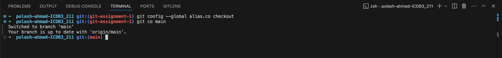

## Basic Commands

#### 1. Initialize a new repository.

```bash
git init
```

Creates an empty git repository in the current directory.

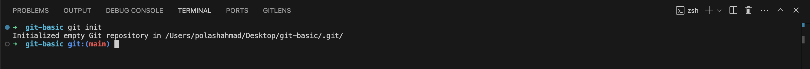

#### 2. Add files to staging

```bash
git add <file_name>
git add .
```

Adds files to the staging area. `git add .` stages all changes in the current directory.

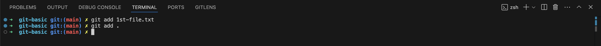

#### 3. Commit changes

```bash
git commit -m "meaningful commit message"
git commit -m "1st commit message" -m "2nd commit message" -m "3rd commit message"
```

Records changes in the repository with a message. Multiple messages can be added for more detailed descriptions.


#### 4. Amend a commit

```bash
git commit --amend
```

Amends the last commit, useful for modifying the previous commit message or adding new changes to it.

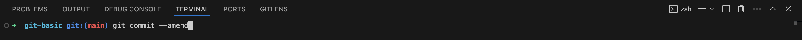
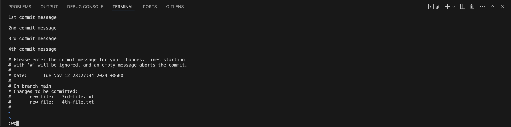
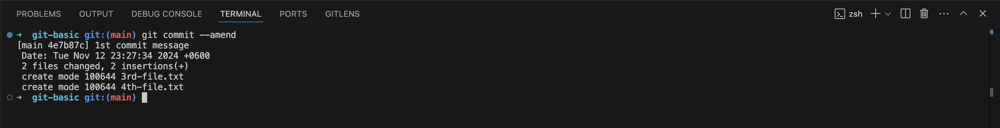

#### 5. View status and log

```bash
git status
```

Show the current status of the repository.

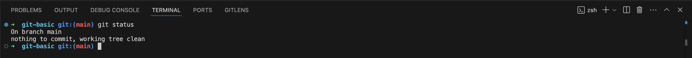

```bash
git log
```

Displays the commit history.

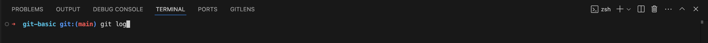
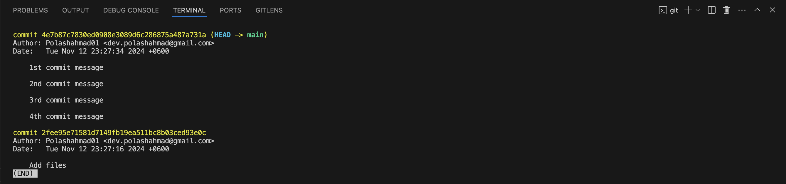

```bash
git reflog
```

Logs all references (e.g HEAD positions) for easy navigation of past commits.

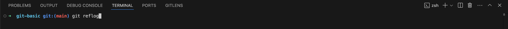
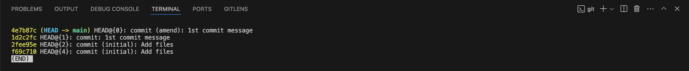
