# Git Commands Guide

In the bustling world of Codeville, developers were constantly losing track of their code changes, creating Code Chaos. Then, a wise coder named Linus introduced a magical tool Git.

Git let developers save "snapshots" of their work using git commit, making it easy to revisit past versions. They could also work on different parts of a project in separate branches with git branch, merging changes together later with git merge.

Sometimes, merging caused conflicts, but Git made it easy to resolve them and continue. Developers also learned to use powerful commands like git stash to save work temporarily, and git revert to undo mistakes safely.

With Git, Codeville thrived. Teams collaborated, code stayed organized, and projects grew without fear. Thanks to Git, Codeville found peace, and developers knew their code was safe, one git push away.

---

### Table of Contents

1. [Configuration](#configuration)
2. [Basic Commands](#basic-commands)
3. [Branching](#branching)
4. [Resetting Commits](#resetting-commits)
5. [Remote Repositories](#remote-repositories)
6. [Rebasing and Cherry-picking](#rebasing-and-cherry-picking)
7. [Stashing](#stashing)
8. [Squashing and Merging](#squashing-and-merging)

---

## Configuration

#### 1. Set Username and Email

```bash
git config --global user.name "Your Name"

git config --global user.email "your_email@somedomain.com"
```

Sets your name and email for all repositories. You can also set this for a specific repository by omitting the `--global` flag.

#### 2. Create Aliases

```bash
git config --global alias.<shortcut_name> <command_name>
```

Define custom shortcuts for frequently used Git commands.


## Basic Commands

#### 1. Initialize a new repository.

```bash
git init
```

Creates an empty git repository in the current directory.


#### 2. Add files to staging

```bash
git add <file_name>
git add .
```

Adds files to the staging area. `git add .` stages all changes in the current directory.


#### 3. Commit changes

```bash
git commit -m "meaningful commit message"
git commit -m "1st commit message" -m "2nd commit message" -m "3rd commit message"
```

Records changes in the repository with a message. Multiple messages can be added for more detailed descriptions.


#### 4. Amend a commit

```bash
git commit --amend
```

Amends the last commit, useful for modifying the previous commit message or adding new changes to it.


#### 5. View status and log

```bash
git status
```

Show the current status of the repository.


```bash
git log
```

Displays the commit history.


```bash
git reflog
```

Logs all references (e.g HEAD positions) for easy navigation of past commits.


## Branching

#### 1. List and create branches

```bash
git branch
```

Show all branches in the repository.


```bash
git checkout <branch_name>
```

Switches to the specified branch.


```bash
git checkout -b <branch_name>
```

Creates and switches to a new branch.


## Resetting Commits

#### 1. Resetting commits

```bash
git reset
```

Unstages files without deleting changes.


```bash
git reset HEAD~<int>
```

Moves HEAD backwards by the specified number of commits.


```bash
git reset --soft <commit-hash>
```

Keeps changes in the working directory.


```bash
git reset --hard <commit-sha>
```

Discards changes in the working directory.


## Remote Repositories

#### 1. Clone, Remote and Push

```bash
git clone <remote_url>
```

Creates a copy of a remote repository.


```bash
git remote
```

Manages repository connections.


```bash
git remote -v
```

Displays remote names and remote urls.


```bash
git remote add <remote_name> <remote_url>
```

Add remote url to the repository.

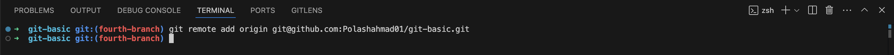

```bash
git remote remove <remote_name>
```

Remove a remote name and url from the repository.

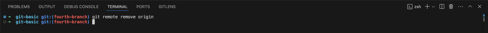

```bash
git push <remote_name> <branch_name>
```

Sends local changes to a remote branch.

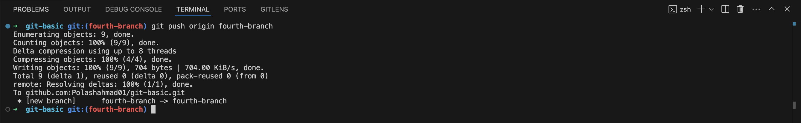

```bash
git fetch <remote_name> <branch_name>
```

Retrieves changes but does not merge.

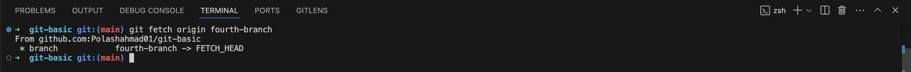

```bash
git pull <remote_name> <branch_name>
```

Fetches changes from a remote branch and merges them.

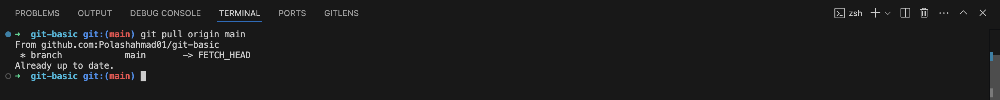

## Rebasing and Cherry-picking

#### 1. Rebase

```bash
git rebase <branch_name>

git rebase --continue
```

Reapply commits on top of another base. Use `--continue` to contiune after resolving conflicts.

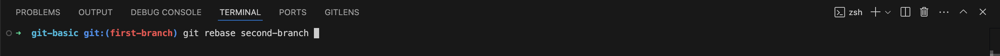
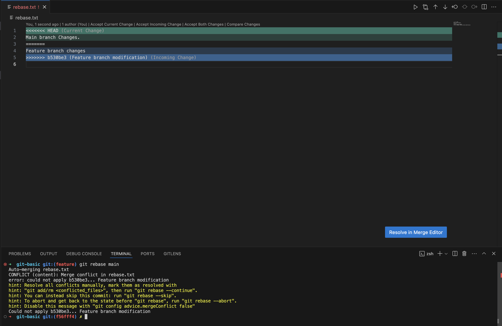
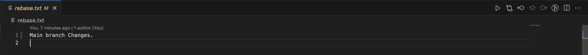
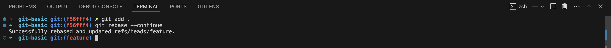

#### 2. Cherry pick

```bash
git cherry-pick <commit-sha>
```

Selectively apply a commit from one branch to another.

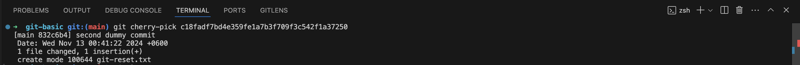

## Stashing

#### 1. Stash changes

```bash
git add <file_name> or git add .

git stash
```

Temporarily stores changes without commiting them.

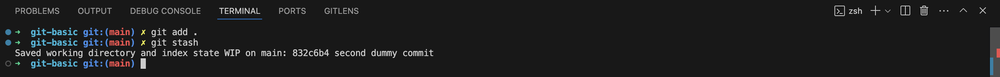

```bash
git stash pop
```

Re-applies the latest stash.

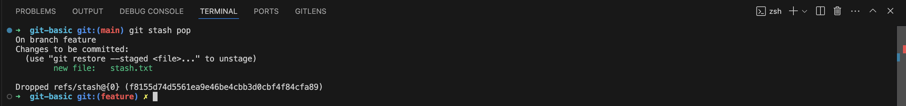

```bash
git stash list
```

Shows all the stashes.

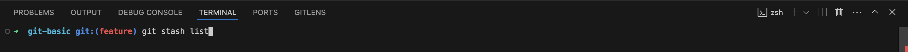
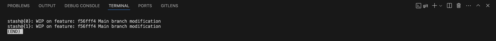

## Squashing and Merging

#### 1. Squash and Merge

```bash
git rebase -i HEAD~[int]
```

Combines multiple commits into one.

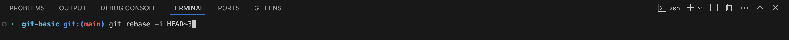
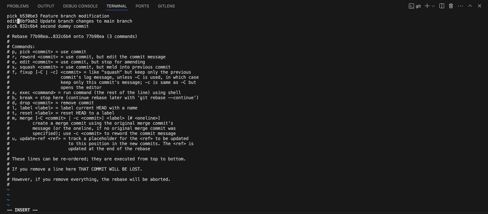
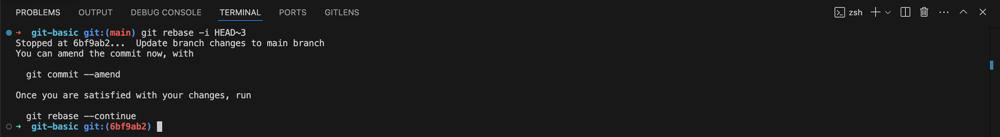


```bash
git merge <branch_name>
```

Integrates changes from another branch.

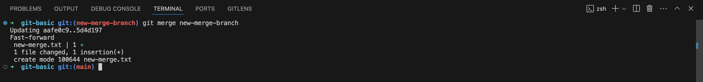
