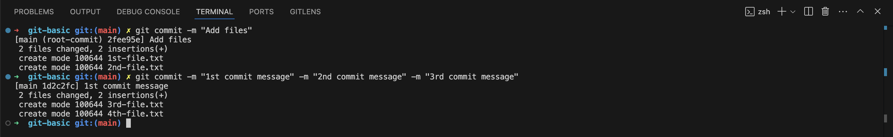

# Git Commands Guide

This is where the story about git will go...

---

### Table of Contents

1. [Configuration](#configuration)
2. [Basic Commands](#basic-commands)
3. [Branching](#branching)
4. [Resetting Commits](#resetting-commits)

---

## Configuration

#### 1. Set Username and Email

```bash
git config --global user.name "Your Name"

git config --global user.email "your_email@somedomain.com"
```

Sets your name and email for all repositories. You can also set this for a specific repository by omitting the `--global` flag.

#### 2. Create Aliases

```bash
git config --global alias.<shortcut_name> <command_name>
```

Define custom shortcuts for frequently used Git commands.


## Basic Commands

#### 1. Initialize a new repository.

```bash
git init
```

Creates an empty git repository in the current directory.


#### 2. Add files to staging

```bash
git add <file_name>
git add .
```

Adds files to the staging area. `git add .` stages all changes in the current directory.


#### 3. Commit changes

```bash
git commit -m "meaningful commit message"
git commit -m "1st commit message" -m "2nd commit message" -m "3rd commit message"
```

Records changes in the repository with a message. Multiple messages can be added for more detailed descriptions.



#### 4. Amend a commit

```bash
git commit --amend
```

Amends the last commit, useful for modifying the previous commit message or adding new changes to it.


#### 5. View status and log

```bash
git status
```

Show the current status of the repository.


```bash
git log
```

Displays the commit history.


```bash
git reflog
```

Logs all references (e.g HEAD positions) for easy navigation of past commits.


## Branching

#### 1. List and create branches

```bash
git branch
```

Show all branches in the repository.


```bash
git checkout <branch_name>
```

Switches to the specified branch.


```bash
git checkout -b <branch_name>
```

Creates and switches to a new branch.


## Resetting Commits

#### 1. Resetting commits

```bash
git reset
```

Unstages files without deleting changes.


```bash
git reset HEAD~<int>
```

Moves HEAD backwards by the specified number of commits.


```bash
git reset --soft <commit-hash>
```

Keeps changes in the working directory.


```bash
git reset --hard <commit-hash>
```

Discards changes in the working directory.


## Remote Repositories

#### 1. Clone, Remote and Push

```bash
git clone <remote_url>
```

Creates a copy of a remote repository.


```bash
git remote
```

Manages repository connections.


```bash
git remote -v
```

Displays remote names and remote urls.


