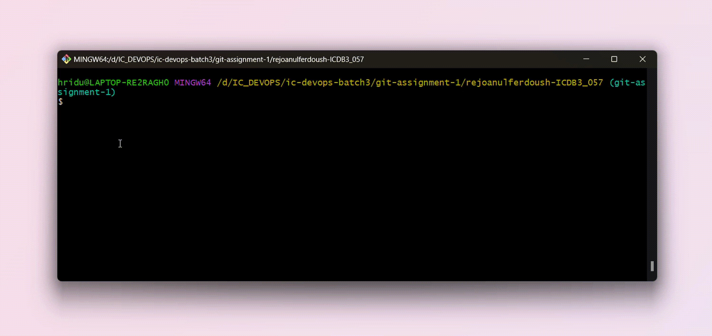
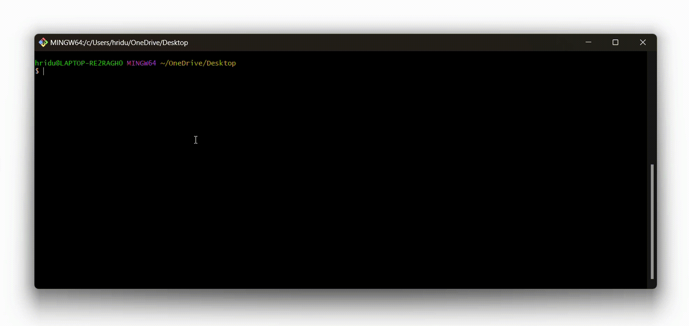

<!-- HERO SECTION -->


<!-- Table of Content -->
## __TABLE OF CONTENT__
---
#### 01. WHAT IS GIT ?  .......................................  ( [VIEW](#what-is-git) )

#### 02. GIT INSTALLATION  ................................  ( [VIEW](#git-installation) )

#### 03. GIT CONFIGURATION AND SETUP  .........................  ( [VIEW](#git-configuration-and-setup) )

#### 04. GIT STAGING AND LOCALIZATION .........................  ( [VIEW](#git-staging-and-localization) )

<!-- Sub-Table of content -->
- #### GIT INITIALIZATION  ...............................................  ( [VIEW](#git-initialization) )

- #### GIT ADD  ...............................................  ( [VIEW](#git-add) )

- #### GIT COMMIT  ............................................  ( [VIEW](#git-commit) )

#### 05. GIT BRANCH ...........................................  ( [VIEW](#git-branch) )

<!-- Sub-Table of content -->

- #### GIT MERGE  ...............................................  ( [VIEW](#git-merge) )

- #### GIT REBASE  .................................................  ( [VIEW](#git-rebase) )

#### 06. VIEW AND COMPARE .....................................  ( [VIEW](#view-and-compare) )

#### 07. GIT REBASE ( CHANGING COMMITS ) ......................  ( [VIEW](#git-rebase) )

#### 08. GIT STASH ............................................  ( [VIEW](#git-stash) )

#### 09. CHERRY-PICK ..........................................  ( [VIEW](#cherry-pick) )

#### 10. GIT PUSH AND PULL ....................................  ( [VIEW](#git-push-pull) )

#### 11. GIT REMOTE ...........................................  ( [VIEW](#git-remote) )

#### 12. FORKING ..............................................  ( [VIEW](#forking) )

<br>

<!-- Divider IMAGE -->


<!-- What is GIT -->
### __WHAT IS GIT__
<p>Git is a version control system that tracks changes in your code, helping teams collaborate and manage project history.</p>

__Example__
<p>Think of building a website with a team. Each person is responsible for different sections like the homepage, contact form, or navigation menu. With Git, each time someone makes an update, a snapshot is saved. If an error appears, you can quickly return to a previous version without losing the rest of the team's work. This way, Git helps you manage changes and easily coordinate updates.</p>

<!-- GIT Installation and GUI -->
### __GIT INSTALLATION__

__Windows__
1. Go to __[GIT-FOR-WINDOWS]__ Git for Windows and download the installer.

[GIT-FOR-WINDOWS]: https://git-scm.com/

2. Run the installer. Keep the default settings.
3. After installation, open "Git Bash" to confirm by typing :

    ~~~
    git --version
    ~~~
    <p> If it shows a version number, Git is installed successfully. </p>

    

__Linux__

1. Open the Terminal.
2. Install Git using :

    ~~~
    sudo apt install git   # For Debian/Ubuntu-based
    sudo yum install git   # For CentOS/RHEL-based
    ~~~
3. Confirm by checking the version :
    ~~~
    git --version
    ~~~

<!-- GIT configuration and setup  -->
### __GIT CONFIGURATION AND SETUP__

<p>After installing Git, you need to tell Git who you are. This helps Git keep track of who made which changes.</p>

__<p> Open a Terminal or Git Bash and type the following commands: </p>__

1. Set User Name :

    ```
    git config --global user.name "Your Name"
    ```
    <p>Replace "Your Name" with github user name.</p>

2. Setting up Email :

    ```
    git config --global user.email "you@example.com"
    ```
    <p>Replace "you@example.com" with github email.</p>

3. Setting up default branch name.

    ```
    git config --global init.defaultBranch main
    ```
4. Checking Configuration.

    ```
    git config --global --list
    ```
    

<!-- GIT staging and localization -->

### __GIT STAGING AND LOCALIZATION__

__GIT INITIALIZATION__

<p>Before initializing Git, we have to start by creating a project folder (if we’re beginning with a fresh new project).</p>

- First, have to make a new folder for the project. we can name it according to the project.

    ```
    mkdir <folder-name>
    ```

<p> git init command is used to initialize a new Git repository in the current directory. It sets up the necessary Git structure to track project and its changes. </p>

<p> git init, creates a hidden folder called .git in your project directory. This folder contains all the files and configurations Git needs to manage your version control </p>

```
git init
```

