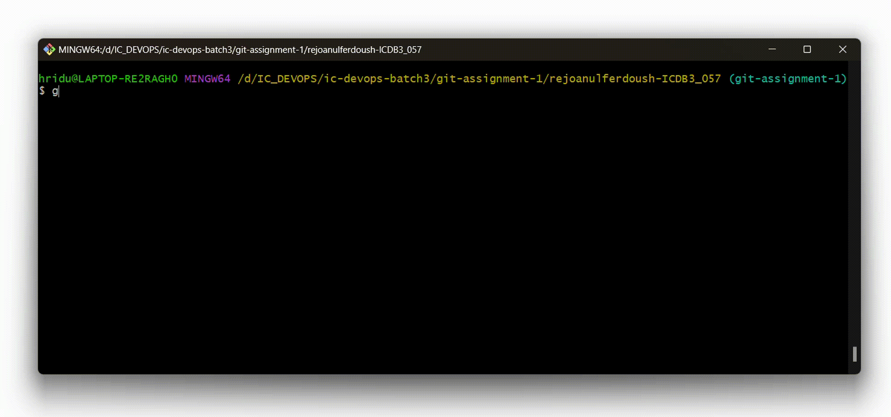

<!-- HERO SECTION -->


<!-- Table of Content -->
## __TABLE OF CONTENT__
---
#### 01. WHAT IS GIT ?  .......................................  ( [VIEW](#what-is-git) )

#### 02. GIT INSTALLATION  ................................  ( [VIEW](#git-installation) )

#### 03. GIT CONFIGURATION AND SETUP  .........................  ( [VIEW](#git-configuration-and-setup) )

#### 04. GIT STAGING AND LOCALIZATION .........................  ( [VIEW](#git-staging-and-localization) )

<!-- Sub-Table of content -->
- #### GIT INITIALIZATION  ...............................................  ( [VIEW](#git-initialization) )

- #### GIT ADD  ...............................................  ( [VIEW](#git-add) )

- #### GIT COMMIT  ............................................  ( [VIEW](#git-commit) )

    - #### COMMIT CHECK   ............................................  ( [VIEW](#commit-check) )

    - #### COMMIT RESET   ............................................  ( [VIEW](#commit-reset) )

- #### GIT ADD AND COMMIT TOGETHER__  ............................................  ( [VIEW](#git-add-and-commit-together) )

- #### FILE UNSTAGE DELETE RESTORE   ............................................  ( [VIEW](#file-unstage-delete-restore) )

    - #### UNSTAGE   ............................................  ( [VIEW](#unstage) )

    - #### DELETE   ............................................  ( [VIEW](#delete) )

    - #### RESTORE   ............................................  ( [VIEW](#restore) )

#### 05. GIT BRANCH ...........................................  ( [VIEW](#git-branch) )

- #### GIT MERGE AND REBASE   ............................................  ( [VIEW](#git-merge-and-rebase) )

#### 06. GIT AMEND AND REBASE ......................  ( [VIEW](#git-amend-and-rebase) )

#### 07. GIT STASH ............................................  ( [VIEW](#git-stash) )

#### 08. CHERRY-PICK ..........................................  ( [VIEW](#cherry-pick) )

#### 09. GIT LOCAL TO REMOTE CONNECTION BUILD AND PUSH PULL CLONE   ...........................................  ( [VIEW](#git-local-to-remote-connection-build-and-push-pull-clone) )

#### 10. FORKING ..............................................  ( [VIEW](#forking) )

<br>

<!-- Divider IMAGE -->


<!-- What is GIT -->
### __WHAT IS GIT__
<p>Git is a version control system that tracks changes in your code, helping teams collaborate and manage project history.</p>

__EXAMPLE__
<p>Think of building a website with a team. Each person is responsible for different sections like the homepage, contact form, or navigation menu. With Git, each time someone makes an update, a snapshot is saved. If an error appears, you can quickly return to a previous version without losing the rest of the team's work. This way, Git helps you manage changes and easily coordinate updates.</p>

<!-- GIT Installation and GUI -->
### __GIT INSTALLATION__

__WINDOWS__
1. Go to __[GIT-FOR-WINDOWS]__ Git for Windows and download the installer.

[GIT-FOR-WINDOWS]: https://git-scm.com/

2. Run the installer. Keep the default settings.
3. After installation, open "Git Bash" to confirm by typing :

    ~~~
    git --version
    ~~~
    <p> If it shows a version number, Git is installed successfully. </p>

    

__LINUX__

1. Open the Terminal.
2. Install Git using :

    ~~~
    sudo apt install git   # For Debian/Ubuntu-based
    sudo yum install git   # For CentOS/RHEL-based
    ~~~
3. Confirm by checking the version :
    ~~~
    git --version
    ~~~

<!-- GIT configuration and setup  -->
### __GIT CONFIGURATION AND SETUP__

<p>After installing Git, you need to tell Git who you are. This helps Git keep track of who made which changes.</p>

__<p> Open a Terminal or Git Bash and type the following commands: </p>__

1. Set User Name :

    ```
    git config --global user.name "Your Name"
    ```
    <p>Replace "Your Name" with github user name.</p>

2. Setting up Email :

    ```
    git config --global user.email "you@example.com"
    ```
    <p>Replace "you@example.com" with github email.</p>

3. Setting up default branch name.

    ```
    git config --global init.defaultBranch main
    ```
4. Checking Configuration.

    ```
    git config --global --list
    ```
    

<!-- GIT staging and localization -->

### __GIT STAGING AND LOCALIZATION__

#### __GIT INITIALIZATION__

<p>Before initializing Git, we have to start by creating a project folder (if we’re beginning with a fresh new project).</p>

- First, have to make a new folder for the project. we can name it according to the project.

    ```
    mkdir <folder-name>
    ```

<p> git init command is used to initialize a new Git repository in the current directory. It sets up the necessary Git structure to track project and its changes. </p>

<p> git init, creates a hidden folder called .git in your project directory. This folder contains all the files and configurations Git needs to manage your version control </p>

```
git init
```


#### __GIT ADD__
<p>Before using git add, need to create a file because Git can only track files that already exist. The git add command stages the changes in your working directory (like new or modified files) so that Git knows which files to include in the next commit. If the file doesn't exist yet, there’s nothing for Git to track or add. So, creating the file first gives Git something to track and prepare for future commits.</p>

- Creates an empty file with the given name.

    ```
    touch <file-name>
    ```

- Or, to create and edit a file using nano.

    ```
    nano myfile.txt
    ```

<p>The git add command is used to stage changes (files and modifications) for the next commit. Here are different ways to use git add :</p>

1. Add All Changes in the Repository

    ```
    git add .
    ```
    <p> Stages all changes in the current directory and its subdirectories. </P>

2. Add Specific Types of Files

    ```
    git add *.txt
    ```
    <p> Stages all files with a .txt extension in the current directory. </P>

3. Add Specific Files by Name

    ```
    git add <file-name>
    ```
    <p> Stages a specific file for commit. </P>

4. Stage All Changes and New Files.

    ```
    git add -A
    ```
    <p> Stage All Changes and New Files Recursively </P>

5. Stage All Changes and New Files.

    ```
    git add -u
    ```
    <p> Stages changes to files that are already being tracked, excluding new files. </P>

    

<!-- GIT Commit -->

#### __GIT COMMIT__

<p>After using git add to stage changes, the next step is to save these changes in the project’s history using git commit.</p>

<p>git commit creates a snapshot of the current state of the code and stores it in Git history. This helps to track specific changes and, if needed, go back to this point later.</p>

```
git commit -m "Commit message here"
```

<p>The -m flag is for adding a short message describing what changes we made</p>


<!-- Commit check -->

#### __COMMIT CHECK__

```
git log
```

<p>Shows the complete commit history of the repository</p>

```
git log --oneline
```

<p>Show each commit in a single line, showing just the short commit ID and commit message.</p>

```
git log --since="yyyy-mm-dd" and --until="yyyy-mm-dd"
```

<p>Lists commits from a specific date range. Replace yyyy-mm-dd with the desired date</p>

```
git show <commit ID>
```

<p>Shows the details of a specific commit, including what changed in that commit. Replace commit ID with the actual ID from git log.</p>

```
git diff <commit1 ID> <commit2 ID>
```

<p>Compares changes between two commits.</p>

```
git checkout <commit ID>
```

<p>To check out a specific commit, we can use the git checkout command along with the commit ID. </p>


<!-- commit reset -->
#### __COMMIT RESET__

__SOFT RESET__

<p>Soft reset moves HEAD back, keeps changes in the staging area. And use to undo a commit but keep changes ready for another commit.</p>

```
git reset --soft <commit-hash> or HEAD^/ HEAD~1
```

__HARD RESET__

<p>Hard reset moves HEAD back, deletes all changes in working directory and staging. And use to remove commits and all related changes permanently.</p>

```
git reset --hard <commit-hash> or HEAD^/ HEAD~1
```

__DEFAULT/MIXED RESET__

<p>Default/Mixed Moves HEAD back, unstages changes, but keeps them in working directory. And use to undo a commit and edit changes before restaging.</p>

```
git reset --hard <commit-hash> or HEAD^/ HEAD~1
```


<!-- GIT add and commit together -->

<br>

#### __GIT ADD AND COMMIT TOGETHER__

__METHOD ONE__

```
git commit -am "Commit message here"
```

- -a adds all changed files (skips untracked files).
- -m enables to add a message.

__METHOD TWO__

```
git add . && git commit -m "Commit message here"
```

- git add . stages all files
- && runs git commit right after adding.

__METHOD THREE__

```
git add -A && git commit -m "Commit message here"
```

- -A stages everything, including new, modified, and deleted files.

__METHOD FOUR__

```
git add . && git commit -m "Your message here" -m " - Commit message here"
```


<!-- File unstage, restage and file delete, restore -->
### __FILE UNSTAGE DELETE RESTORE__

#### __UNSTAGE__

```
git reset test.txt
```
<p> Removes file from the staging area, so changes won't be included in the next commit, but keeps them in working directory. </p>

```
git restore --staged test.txt
```
<p> Removes file from the staging area, but keeps the current working directory version unchanged. It "unstages" the file without altering its content. </p>

```
git rm --cached test.txt
```
<p> Deletes files from the repository but keeps it in local working directory, marking it as an untracked file. </p>

#### __DELETE__

<p>Use git rm <filename> to delete the file both from Git and local folder.</p>

```
git rm file-name
```

<p>For directories, use git rm -r <directory-name> to delete the entire directory from Git and local</p>

```
git rm -r directory-name
```
#### __RESTORE__

<p>The command git restore test.txt is used to discard changes made to test.txt in working directory. </p>

<p>If we made edits to file but haven't staged or committed them yet, running this command will revert files changes back to its last committed state. Also use to restore the deleted file </p>

```
git restore file-name
```


<!-- GIT Branch -->

### __GIT BRANCH__

<p>Git branches allow to work on different parts of a project independently. Each branch represents a separate line of development, making it easier to work on new features, fix bugs, or try out ideas without affecting the main code. Branches can be created, switched, merged, or deleted, helping keep your workflow organized and efficient. Here’s a quick guide to the most useful git branch commands for creating, managing, and navigating branches.</p>

#### __LISTING BRANCHES__

```
git branch
```

<p>Lists all local branches.</p>


```
git branch -a
```

<p>Lists all branches, including remote branches.</p>

#### __CREATING BRANCHES__

```
git branch <branch_name>
```

<p>Creates a new branch without switching to it.</p>


```
git checkout -b <branch_name> or git switch -c <branch_name>
```

<p>Creates and switches to a new branch in one command.</p>

#### __SWITCHING BRANCHES__

```
git checkout <branch_name> or git switch <branch_name>
```

<p>Switches to the specified branch.</p>

#### __RENAME BRANCHES__

```
git branch -m <new_branch_name>
```

<p>Renames the current branch to new_branch_name.</p>


```
git branch -m <old_branch_name> <new_branch_name>
```

<p>Renames a specific branch.</p>

#### __DELETING BRANCHES__

```
git branch -d <branch_name>
```

<p>Deletes a branch that has already been merged.</p>


```
git branch -D <branch_name>
```

<p>Forcibly deletes a branch, even if it hasn’t been merged.</p>

#### __COMPARING BRANCHES__

```
git diff <branch_name1> <branch_name2>
```

<p>Shows the differences between two branches.</p>

#### __GIT MERGE AND REBASE__

```
git merge <branch_name>
```

<p>Merge keeps all the branch history and combines it.</p>

```
git rebase <branch_name>
```

<p>Rebase cleans up history by rewriting it in a straight line, making it look like a single sequence of changes.</p>

#### __BRANCH STATUS CHECK__

```
git branch -v
```

<p>Shows the last commit for each branch.</p>

```
git branch --merged
```

<p>Lists branches that have been merged into the current branch.</p>

```
git branch --no-merged
```

<p>Lists branches that haven’t been merged.</p>

#### __RESTORE DELETED BRANCH__

```
git branch branch-name commit-hash
```

<p>If we need to restore a deleted branch, above command creates a new branch that points to the same commit where the deleted branch was last located.</p>

#### __COPY FILES FROM ONE BRANCH TO ANOTHER__

```
git checkout branch_name file_name
```

<p>If we need to copy a file from one branch to another, firstly have to switch to the target branch, the branch where we want the file to be copied</p>


<!-- Git rebase (Changing commits) -->

### __GIT AMEND AND REBASE__

#### __GIT AMEND__

```
git commit --amend "New commit message" or git commit --amend -m "New commit message"
```
<p>Change only the last commit message, don't do any changes in file</p>

```
git commit --amend --no-edit
```
<p>To skip the editor when no message change is needed, just stage files and run:</p>

#### __GIT REBASE__

1. rebase -i (interactive rebase) with the option to "__reword__"

    <p>Rebase reword lets you edit commit messages from previous commits without changing the actual code in those commits. </p>

    ```
    git rebase -i HEAD~n
    ```
    - Run git rebase -i HEAD~n, where "n" is the number of commits you want to go back.
    - In the list that appears, change pick to reword next to the commit(s) you want to edit.
    - Save and close the editor, and Git will prompt you to rewrite the commit message(s) you marked. Before press __i__ from keyboard for inset access.
    - Once editing is done, press __ESC__, and then :wq to exit edit mode.

2. rebase -i (interactive rebase) with the option to "__edit__"

    <p>Rebase edit lets you modify the content of past commits (not just their messages). </p>

    ```
    git rebase -i HEAD~n
    ```
    - Run git rebase -i HEAD~n, where "n" is the number of commits you want to go back.
    - In the list that appears, change pick to edit next to the commit(s) you want to edit.
    - Save and close the editor, and Git will prompt you to rewrite the commit message(s) you marked. Before press __i__ from keyboard for inset access.
    - Once editing is done, press __ESC__, and then :wq to exit edit mode.
    - then stage them with git add.
    - Run git commit --amend to update the commit with your changes.
    - Continue the rebase with git rebase --continue.

3. rebase -i (interactive rebase) with the option to "__squash__"

    <p>Rebase squash combines multiple commits into a single commit, which can help keep your commit history clean. </p>

    ```
    git rebase -i HEAD~n
    ```
    - Run git rebase -i HEAD~n, where "n" is the number of commits you want to go back.
    - In the list that appears, keep pick on the first commit and change pick to squash (or s) for the commits you want to merge into the first one.
    - Save and close the editor. Git will then let you edit the combined commit message for the squashed commits.

4. rebase -i (interactive rebase) with the option to "__fixup__"

    <p>Rebase fixup used during an interactive rebase to squash (merge) a commit with a previous one, without keeping its commit message. </p>

    ```
    git rebase -i HEAD~n
    ```
    - In the list, change pick to fixup (or simply f) next to the commit(s) you want to combine with the previous commit.
    - Save and close the editor, and Git will squash the selected commit(s) into the one right above it, discarding the commit message of the fixup.

#### __REBASE ROOT AND INDIVIDUAL COMMIT ACCESS__

```
git rebase -i --root
```
<p>This command give access to interactively rebase starting from the very first commit (the "root" commit) of the repository. </p>

```
git rebase -i <commit_ID>^
```
<p>It allows you to rewrite or edit the history starting from a specific point, rather than going back to the very beginning. </p>


<!-- GIT STASH -->
### __GIT STASH__

<p>Git stash command temporarily saves changes in your working directory without committing them, allowing you to work on something else and come back to these changes later.</p>

```
git stash
```
<p>This command saves all changes (tracked and untracked files) in a "stash" and restores the working directory to a clean state.</p>

```
git stash push -m "message"
```
<p>Saves the changes with a custom message to easily identify them later.</p>


```
git stash list
```
<p>Applies the most recent stash to your current working directory, keeping the stash for future use.</p>

```
git stash pop
```

<p>Lists all the stashes you have saved with unique identifiers</p>

```
git stash apply
```

<p>Applies the most recent stash and removes it from the stash list.</p>

```
git stash drop stash@{0}
```

<p>Deletes a specific stash.</p>

```
git stash clear
```

<p>Deletes all stashes at once.</p>


<!-- CHERRY-PICK -->
### __CHERRY-PICK__

```
git cherry-pick <commit-hash>
```
<p>Cherry-pick command apply a specific commit from one branch to another branch. You use it when you want to "pick" just one or a few changes from a series of commits without merging the entire branch.</p>

```
git cherry-pick -n <commit-hash>
```
<p>The -n or --no-commit option applies the changes from a commit but does not automatically create a new commit. This is useful when you want to make adjustments before committing.</p>

```
git cherry-pick --continue
```
<p>If a conflict occurs during cherry-pick, this command continues the cherry-pick process after you've resolved the conflicts.</p>

```
git cherry-pick --abort
```
<p>If something goes wrong, or you decide not to proceed with the cherry-pick, --abort cancels the operation and restores your branch to its original state.</p>

```
git cherry-pick --skip
```
<p>Use to skip current patch</p>

```
git commit --allow-empty
```
<p>This is useful when need to add a commit to mark a specific point in history like starting a new feature or adding a note without actually modifying any files.</p>


<!-- GIT LOCAL TO REMOTE CONNECTION BUILD AND PUSH PULL -->
### __GIT LOCAL TO REMOTE CONNECTION BUILD AND PUSH PULL CLONE__

#### __REMOTE REPOSITORY CREATE__

<p>TO CREATE A REMOTE REPOSITORY ON GITHUB : </p>

1. Go to [github.com](https://github.com) and log in.
2. Click the + icon at the top-right corner, then select New repository.
3. Enter a name for your repository and an optional description.
4. Choose visibility: Public (anyone can see it) or Private (only you and invited users can see it).
5. Click Create repository.

<p>Now, GitHub will give you a URL to connect your local Git repository to this remote one. You can use that URL to push your code to GitHub.</p>


#### __LOCAL TO REMOTE CONNECTION BUILD AND PUSH__

```
git branch -M main
```
<p>This command git branch -M main renames the current branch to main.</p>

- The -M option forces the rename, even if a branch named main already exists.


```
git remote add origin https://github.com/rejoanulferdoushADN/test.git
```
<p>This command connects local Git repository to a remote GitHub repository.</p>

- remote add origin: Adds a remote named "origin" (a default name for the main remote).
- URL: Links your local repo to the remote repo at the specified URL.

```
git push -u origin main
```
<p>This command git push -u origin main pushes your local main branch to the origin remote repository and sets it as the default tracking branch.</p>

- Pushes: Sends your commits from main to origin.
- -u (upstream): Sets origin/main as the default branch to push to, so in future you can just run git push without specifying the branch.

#### __GIT CLONE__

```
git clone
```
- This command is used to copy an entire repository from a remote source (like GitHub) to your local machine for the first time.
- It creates a new directory with all the repository files, commits, and branches.

#### __GIT PULL__

```
git pull <remote> <branch> or git pull origin main
```
- This command updates your existing local repository by pulling in new changes from the remote repository.
- It fetches and merges changes from the remote to keep your local copy up to date.


<!-- FORKING -->
### __FORKING__

<p>Forking is a way to make a copy of someone else's repository on your own GitHub account.</p>

__GIT FORKING PROCESS__

1. FORK THE REPOSITORY

    - Go to the GitHub repository you want to fork.
    - Click on the "Fork" button (usually in the top right corner).
    - This will create a copy of the repository in your GitHub account.

2. CLONE THE FORKED REPOSITORY

    - Once the fork is complete, go to your GitHub profile and find the forked repo.
    - Copy the repository URL (look for the "Code" button).
    - Open your terminal and run:

3. CREATE A PULL REQUEST (PR)

    - Once modification is done and new update in queue, go back to your GitHub forked repository.
    - You’ll see a prompt to "Compare & pull request." Click it.
    - Add details about your changes and submit the pull request.
    - Your PR will then go to the original repository for review.

<br>

