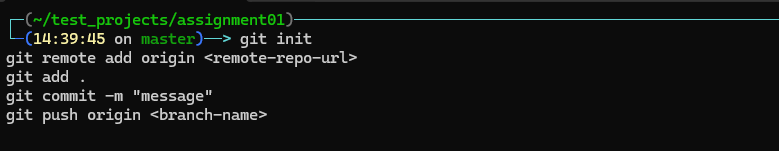
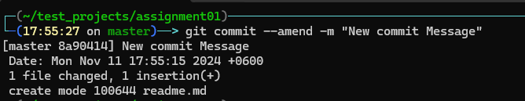
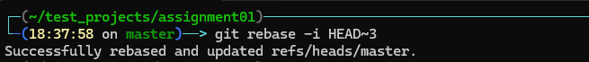
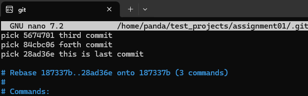

# GitHub Essentials: Quick Guide

This document is a beginner’s guide to using Git and GitHub, covering essential setup steps, basic commands for managing repositories, making commits, handling branches, and merging changes. It also outlines a common branching strategy to organize development workflows and manage code for production and testing environments.

### Basic Git Commands
```bash
git init                                  # Initialize a Repository
git remote add origin <remote-repo-url>   # Connect to a Remote Repository
git add .                                 # Stage changes
git commit -m "message"                   # Commit changes
git push origin <branch-name>             # Push changes
git pull origin <branch-name>             # Pull changes
```


### Managing Commits

For rewriting the last commit message we have to use ```--amend``` 
```bash
git commit --amend -m "Add New commit message"
```


For rewriting older commit messages we have to use ```rebase``` and need to mention the ```HEAD``` where the commit located,
```bash
git rebase -i HEAD~n
```


It will show like this,

