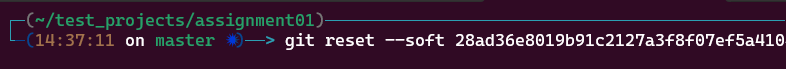
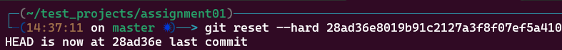
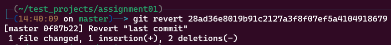

# GitHub Essentials: Quick Guide

This document is a beginner’s guide to using Git and GitHub, covering essential setup steps, basic commands for managing repositories, making commits, handling branches, and merging changes. It also outlines a common branching strategy to organize development workflows and manage code for production and testing environments.

### Basic Git Commands
```bash
git init                                  # Initialize a Repository
git remote add origin <remote-repo-url>   # Connect to a Remote Repository
git add .                                 # Stage changes
git commit -m "message"                   # Commit changes
git push origin <branch-name>             # Push changes
git pull origin <branch-name>             # Pull changes
```


### Managing Commits

For rewriting the last commit message we have to use ```--amend``` 
```bash
git commit --amend -m "Add New commit message"
```


For rewriting older commit messages we have to use ```rebase``` and need to mention the ```HEAD``` where the commit located,
```bash
git rebase -i HEAD~n
```


It will show like this,


### commit removing
We have to use ```reset``` for removing the commit. When using the git reset command, the developer must decide if they want their local files and the Git staging index to be reset back to their state when the previous commit happened, or if the files on the filesystem and the index should remain untouched.

If we want to purge commit history but keep the index and filesystem unchanged.
```bash
git reset --soft <commit-hash>
```

If we want to clear the index and revert all tracked files to their state at the reset commit.
```bash
git reset --hard <commit-hash>
```


##### Again if, mistakenly deleted any commit we can undo that using ```revert```. 
Example,


```bash
git revert <commit-hash>
```



## Thank you!
##### Shahiduzzaman Tauhid
Developer and DevOps Learner.

 [](https://www.linkedin.com/in/shahiduzzamantauhid/) [](@shahiduzzamantauhid) [](https://www.facebook.com/mdshahrier.tauhid)
