# 🌐Project/Assignment Submission: Fork, Branch, Add, PR in Ubunutu on top of WSL 

## Check wsl status

```sh
    wsl --list --verbose
```

## start the Ubuntu 20.04 distribution

```sh
    wsl -d Ubuntu-20.04   
```
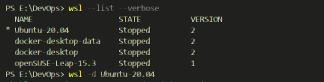


## Run Global Config

```sh
    git config --global user.name "Shibli-Nomani"
```
```sh
    git config --global user.email "nomaniaiub@gmail.com"
```
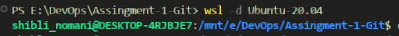

## Git initialization
```sh
    git init
```

# 🔀 Git Forking

Forking a Git repository creates a copy of a project on your GitHub account, allowing you to make changes independently without affecting the original repository.

## Clone the Forked Repository:

### Fork the Repository on GitHub
- Go to the original repository on GitHub: https://github.com/IC-DevOps-Career-Path/ic-devops-batch3.git.
- Click on the Fork button at the top right to create a copy of this repository in your GitHub account.

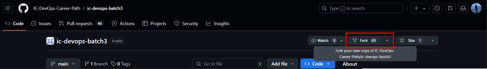

- Go to Forked Repo, Click Code and copy the HTTPS or SSH link.

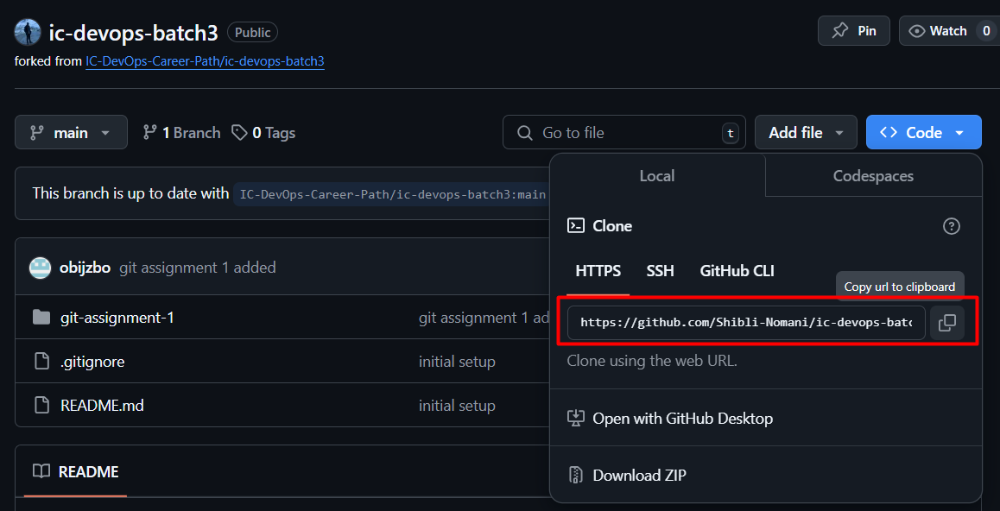

- In your terminal, run:
  ```sh
  git clone https://github.com/Shibli-Nomani/ic-devops-batch3.git
  ```
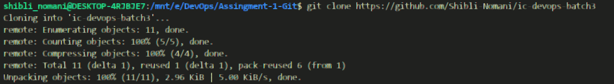


## Change Directory

`cd <directory-name>`
```sh
    cd ic-devops-batch3
```
 
# 🌳 Create Branch
- ✨ Isolate Your Work: Keep changes separate from the main branch to avoid conflicts.

- 🤝 Collaborate Seamlessly: Work independently while your teammates do the same on other branches.

- 🔄 Track & Review: Submit a pull request to review and merge changes smoothly into the main codebase.


 `git checkout -b <branch_name>`

 ```sh
    git checkout -b git-assignment-1
```

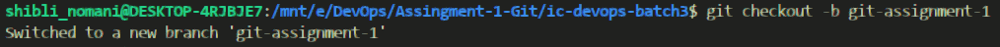

## Check Git Status
```sh
    git status
```
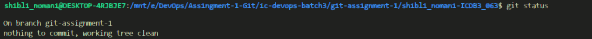

## Create Your Directory
In the designated assignment/project folder, create a directory:

```sh
    cd git-assignment-1
```

```sh
    mkdir shibli_nomani-ICDB3_063
```
```sh
    cd shibli_nomani-ICDB3_063
```

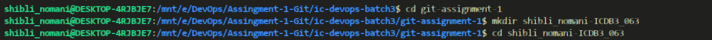


```sh
    git init
```

# 📕  Create and Add Files

Add a readme.md file to my directory and include my assignment content:

## add single specific file

We do `git add` after `touch` to start tracking the new file immediately.
```sh
    touch git_assignment_01.md
```
```sh
    touch .gitignore
```


```sh
    git add git_assignment_01.md
```

## Create Directory for Screenshoots
```sh
    mkdir screenshoots
```

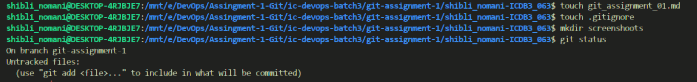

## add multiple files
```sh
    git add .
```
```sh
    git status
```
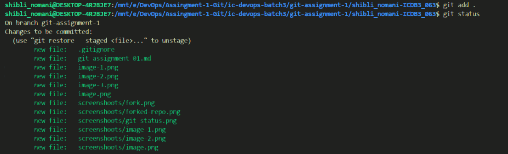

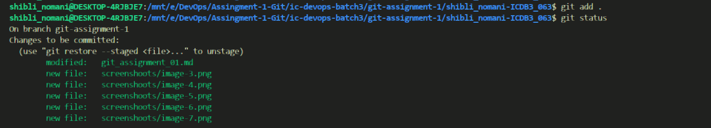

## To perform commit
After using `git add`, the changes you selected are staged, but they are not yet recorded in the repository's history. `git commit` finalizes and saves these changes as a single entry in the commit history.

```sh
    git commit -m "create git_assignment_01.md, .gitignore file, Screenshoots"
```

## Check log status
```sh
    git log
```

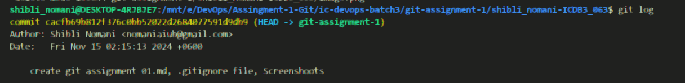


*📌 note:* To come out from git  log state: press (Shift + Q)

# 🔼 Git Push Request

This command pushes your local changes to the remote repository on the specified branch
```sh
git push origin git-assignment-1

```


# 📄 Pull Request Description:

*💡 Interesting Git Concept:*

One interesting Git concept is how Git calculates unique SHA-1 hashes for commits. Git combines commit details such as the author, timestamp, commit message, and the tree structure into a unique string. It then runs this data through the SHA-1 cryptographic hash function, resulting in a 40-character hash that identifies the commit. Any change in the content or commit metadata results in a completely different hash, ensuring each commit is uniquely tracked and verified.

# 🚩 how git pull works under the hood or how git calculated the SHA

🔐 Git calculates unique SHA-1 hashes for each commit by combining specific commit details into a unique string. Here’s how it works:

- 📝 Collect Commit Information: Git gathers essential commit data—such as the author, timestamp, commit message, and tree structure.

- 🔢 Create a Unique Hash: This data is processed through the SHA-1 cryptographic hash function, generating a 40-character hash (e.g., a3c4f5...) unique to that commit.

- 🔍 Content-Based Identification: Since the hash depends on the content, any change (minor/major) in files or commit metadata will create a completely new hash, ensuring each commit is uniquely identified.

# 🧑Overview 

- 🌐 Set Ubuntu Distribution System on top of WSL
- 🧑‍💻 Set Git Username and Email Globally to apply across all repositories
- 🍴 Fork the Git Repo in my Git Repo
- 📥 Cloning the Repo
- 📂 Change Directory
- 🌿 Create Branch
- 📁 Add Subfolder
- 📄 Add .md, .gitignore, and screenshots folder
- 💾 Commit all
- 🚀 Push to my forked Repo
- 🔄 Pull it to main/original Git Repo

