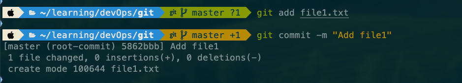

# Git Commands - Visual Guide

This documentation provides real-world examples of Git commands with screenshots from amy local development environment.

## File Structure
```
project-root/
├── README.md
├── git-assignment_01.md
└── screenshots/
    ├── git-init.png
    ├── git-clone.png
    ├── git-add.png
    └── ...
```

# Git Commands with Screenshots

This document contains practical examples of Git commands with screenshots demonstrating their usage in a local environment.

### git status
Shows the current state 


### git init
Initialize a new Git repository


### git clone
Clone a remote repository & clone a remote repository into a specific directory


### git remote
Manage remote repositories


### git add
Add single files


Add multiple files


Add all changes


### git commit
Commit staged changes



### git push
Push changes to remote repository


### git branch
Create and manage branches


### git checkout
Switch between branches & commits


### git merge
Merge branches & also abort brnch merge


### git fetch
Fetch changes from remote


### git pull
Pull changes from remote & Pull changes from remote by rebasing


### git stash
Stash changes temporarily


### git restore
Restore working tree files


### git reset
Reset current HEAD state


### git revert
Revert changes


### git rebase
Rebase commits


### git cherry-pick
Apply specific commits

