# Git Assignment 01 - Git Commands Documentation

## 1. Initial Setup Commands

### `git config`
- **Description**: Configures user information like name and email, so your commits are associated with your identity.
- **Example**:
  ```bash
  git config --global user.name "your-username"
  git config --global user.email "your-email@example.com"
  ```
- **Screenshot**: 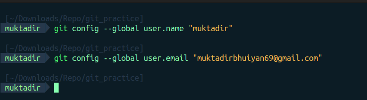

### `ssh-keygen` and `ssh -T`
- **Description**: Generates an SSH key for authentication with GitHub. Use `ssh -T` to test SSH connection.
- **Example**:
  ```bash
  ssh-keygen -t rsa -b 4096 -C "your-email@example.com"
  ssh -T git@github.com
  ```
- **Screenshot**: 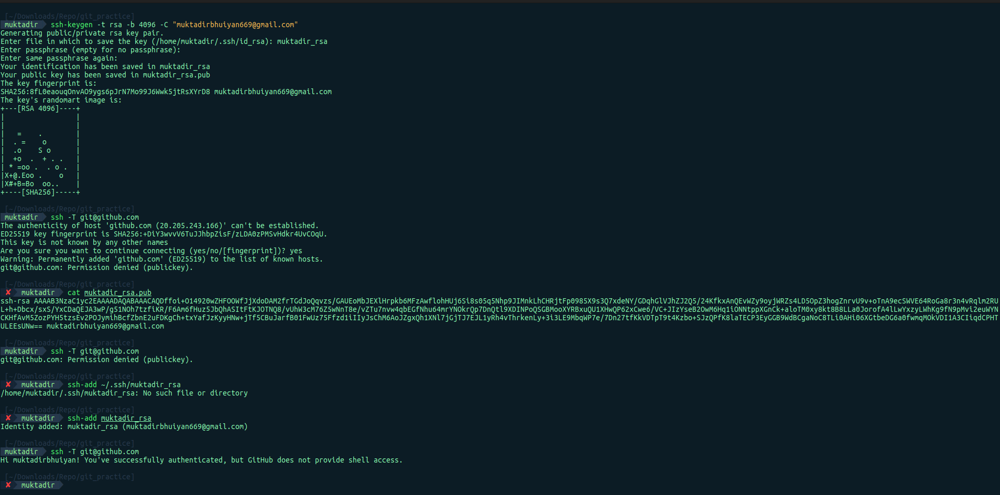

## 2. Repository Initialization and Basic Commands

### `git init`
- **Description**: Initializes a new Git repository in the current directory.
- **Example**:
  ```bash
  git init
  ```
- **Screenshot**: 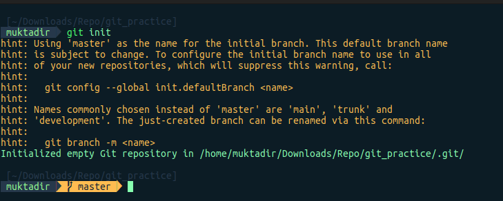

### `git clone`
- **Description**: Clones an existing repository from a remote source to your local machine.
- **Example**:
  ```bash
  git clone https://github.com/username/repository.git
  ```
- **Screenshot**: 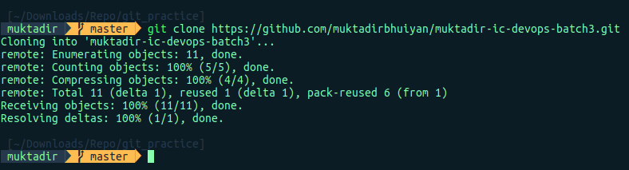

## 3. Adding, Committing, and Pushing Changes

### `git add`
- **Description**: Adds changes in the working directory to the staging area.
- **Example**:
  ```bash
  git add .
  ```
- **Screenshot**: 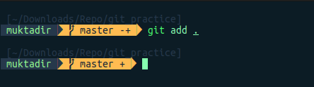

### `git commit`
- **Description**: Commits staged changes to the repository with a descriptive message.
- **Example**:
  ```bash
  git commit -m "Initial commit"
  ```
- **Screenshot**: 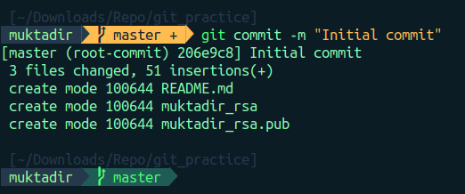

### `git push`
- **Description**: Pushes your commits from the local repository to the remote repository.
- **Example**:
  ```bash
  git push origin main
  ```
- **Screenshot**: 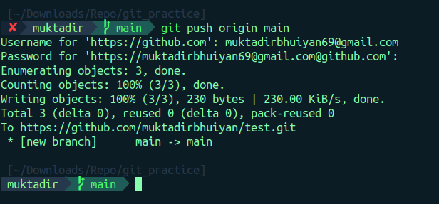

## 4. Branching and Merging

### `git branch`
- **Description**: Lists all branches or creates a new branch.
- **Example**:
  ```bash
  git branch
  git branch feature-branch
  ```
- **Screenshot**: 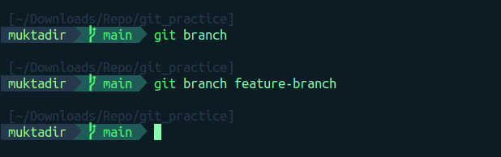

### `git checkout`
- **Description**: Switches to a different branch.
- **Example**:
  ```bash
  git checkout feature-branch
  ```
- **Screenshot**: 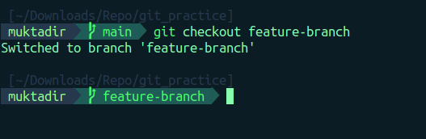

### `git merge`
- **Description**: Merges changes from one branch into the current branch.
- **Example**:
  ```bash
  git checkout main
  git merge feature-branch
  ```
- **Screenshot**: 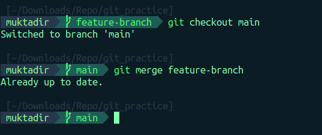

## 5. Resetting and Reverting

### `git reset`
- **Description**: Moves the current branch's HEAD backward to a specified commit, modifying or discarding recent commits.
- **Example**:
  ```bash
  git reset --hard <commit-hash>
  ```
- **Screenshot**: 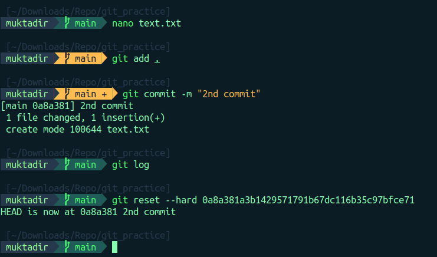

### `git revert`
- **Description**: Creates a new commit that undoes the changes from a previous commit.
- **Example**:
  ```bash
  git revert <commit-hash>
  ```
- **Screenshot**: 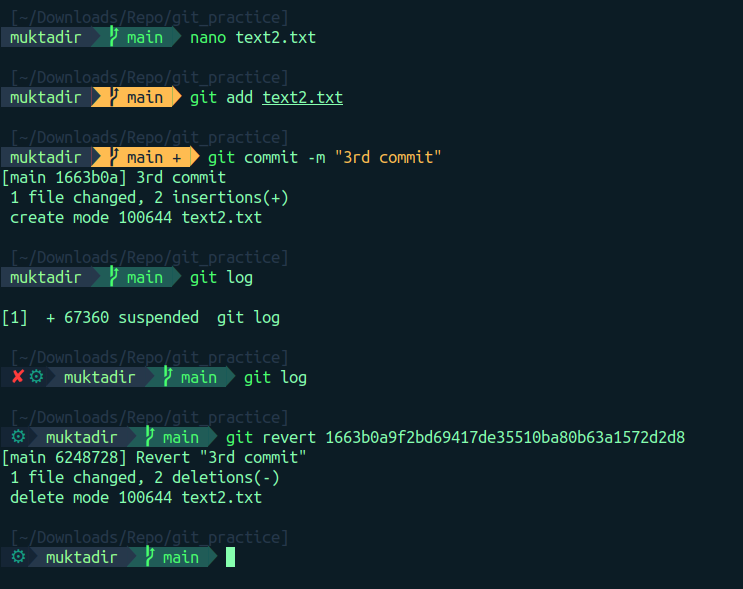

## 6. Interactive Commands

### `git rebase`
- **Description**: Reorders, combines, or edits commits by moving them to a new base commit.
- **Example**:
  ```bash
  git rebase -i HEAD~3
  ```
- **Screenshot**: 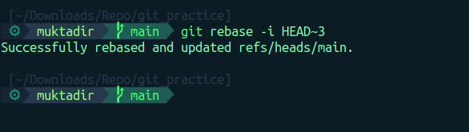

### `git cherry-pick`
- **Description**: Applies a specific commit from one branch onto the current branch.
- **Example**:
  ```bash
  git cherry-pick <commit-hash>
  ```
- **Screenshot**: 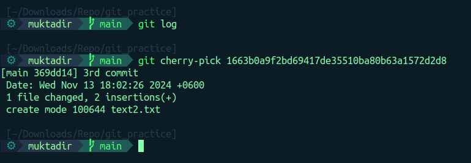