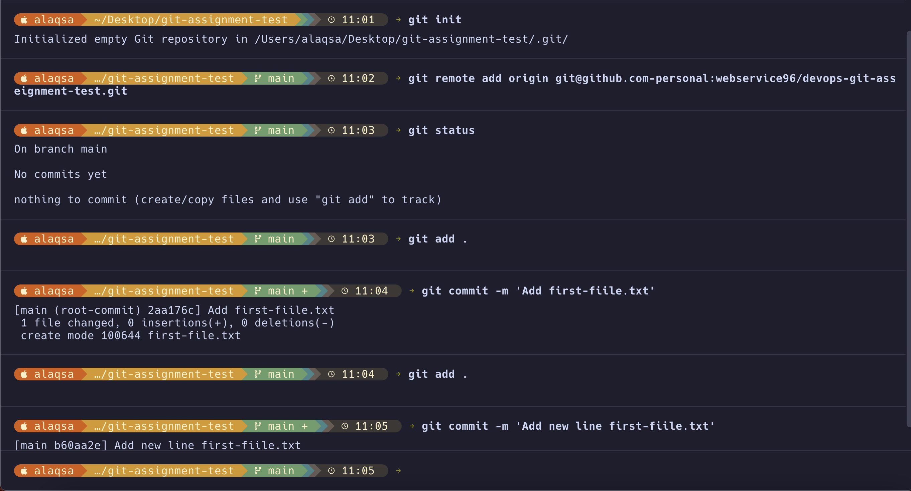
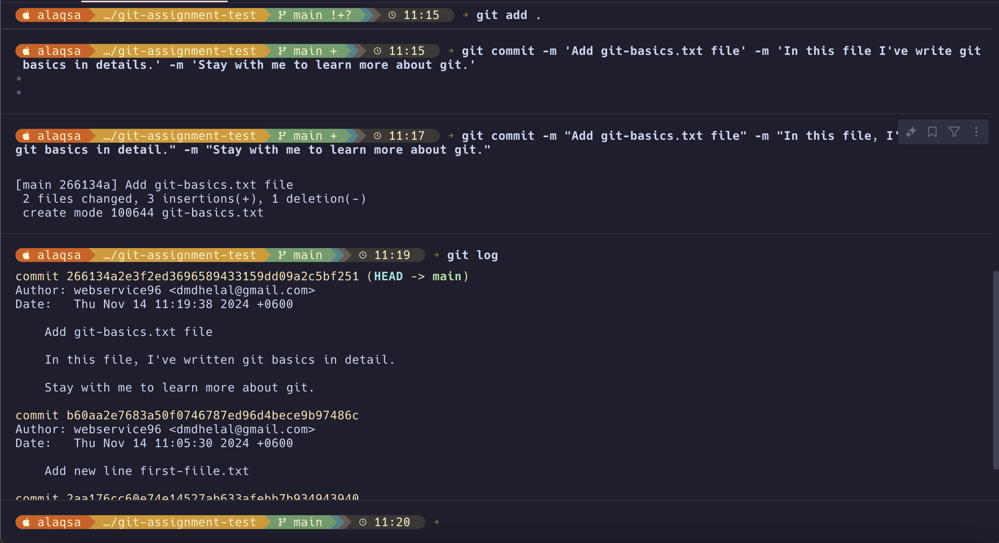
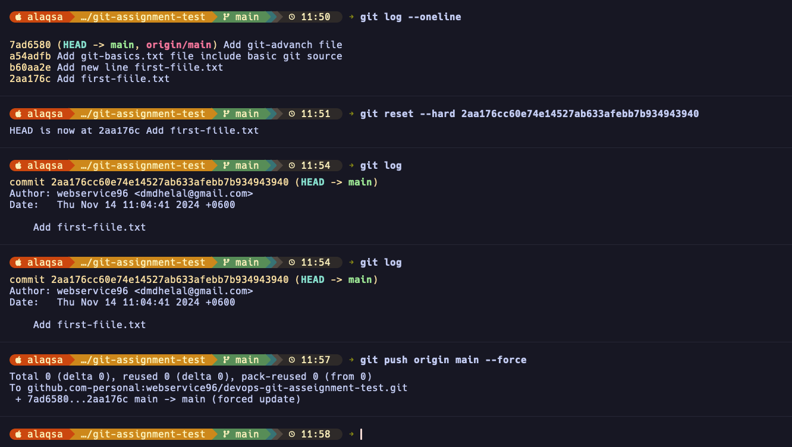
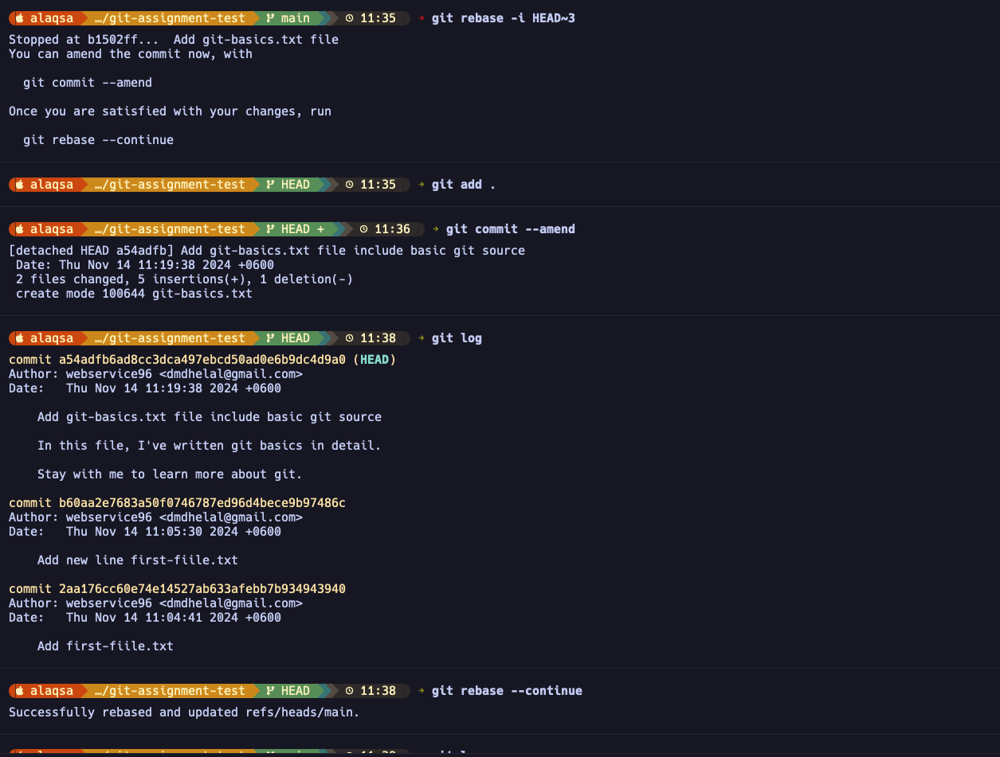
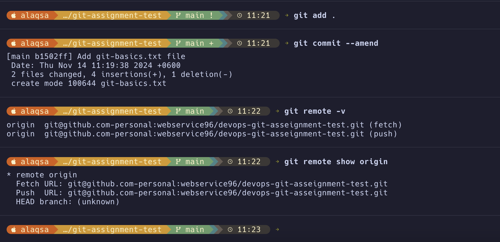

# Git Commands Documentation

# How do you set up git on your machine?

Two way you can set up git in your machine.

1. Using `git-username` and `password`
   Example: `git config --global user.name "git-username"` | `git config --global user.email "git-email"`
2. Using `ssh-keygen` Setup `setup ssh key in your github account`

# Test authentication `ssh -T git@github.com`

## How to initialize a git repository?

Run `git init` command in your working directory.

The `git init` command initializes a new Git repository in the current directory, creating a `.git` folder to start tracking changes. It’s the first step to set up version control in a project.

# Add changes to git

Run `git add` Command

The `git add` command stages changes in your working directory, preparing them for the next commit. It adds modified or new files to the "staging area," a preview of what will be committed. This is a crucial step before using `git commit`, as only staged changes are included in commits.

# Git commit

The `git commit` command saves staged changes to the repository, creating a new version with a unique commit ID. Each commit represents a snapshot of the project at a specific point, allowing you to track and manage changes over time.

## See all the commands in table. I have explan with description.

| Command                                      | Description                                                                  |
| -------------------------------------------- | ---------------------------------------------------------------------------- |
| `git init`                                   | Initializes a new Git repository in the current directory.                   |
| `git branch -m <branch-name>`                | Renames the current branch to `<branch-name>`.                               |
| `git remote add origin <remote-repository>`  | Links the local repository to a remote one named `origin`.                   |
| `git clone <remote-repository>`              | Creates a local copy of the repository from the specified remote URL.        |
| `git add .`                                  | Stages all modified and new files for the next commit.                       |
| `git add <file-name>`                        | Stages the specified file for the next commit.                               |
| `git commit -m "<commit message>"`           | Records the staged changes with a descriptive message.                       |
| `git push origin <branch-name>`              | Uploads commits from the local branch to the remote branch on `origin`.      |
| `git pull origin <branch-name>`              | Fetches and merges changes from the remote branch into the current branch.   |
| `git remote`                                 | Lists all remote repositories linked to the local repository.                |
| `git remote -v`                              | Shows URLs for all remotes associated with the local repository.             |
| `git remote show <remote-name>`              | Displays detailed information about the specified remote.                    |
| `git commit --amend -m "New commit message"` | Modifies the last commit with a new message or updated changes.              |
| `git rebase -i HEAD~n`                       | Interactively rebases the last `n` commits, allowing modifications to each.  |
| `git reset --soft <commit-hash>`             | Moves back to a specific commit, keeping changes staged.                     |
| `git reset --hard <commit-hash>`             | Resets the repository to a specific commit, discarding all changes after it. |
| `git push origin <branch-name> --force`      | Pushes to the remote branch, overwriting its history with local changes.     |
| `git revert <commit-hash>`                   | Creates a new commit that undoes the specified commit, preserving history.   |
| `git checkout <target-branch>`               | Switches to the specified branch, updating the working directory.            |
| `git log <source-branch>`                    | Displays the commit history of the specified branch.                         |
| `git cherry-pick <commit-hash>`              | Applies the changes from a specific commit onto the current branch.          |

### See the Preview Image of how the command works.

