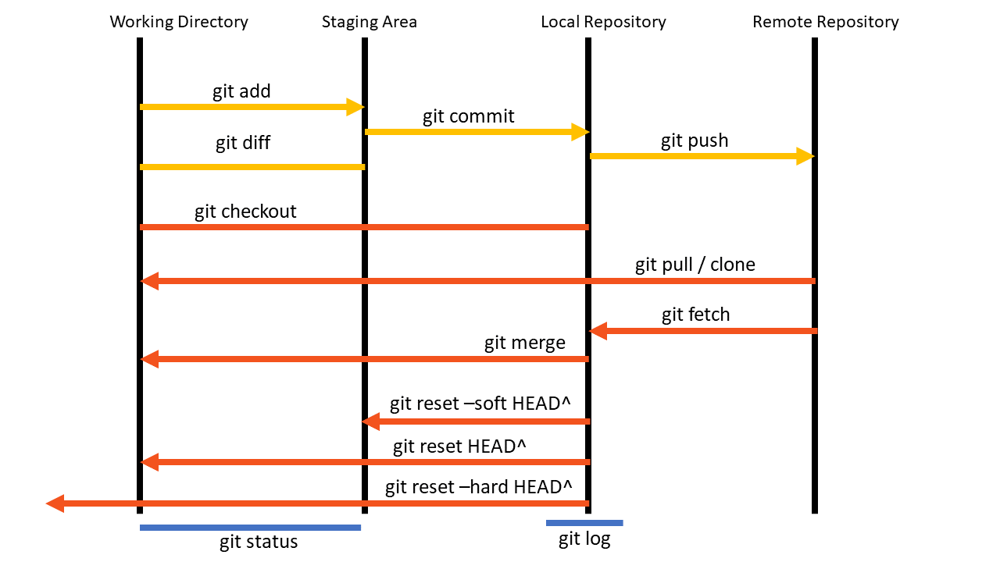

<h1 align="center"> GIT and GitHub Documentation</h1>
<h3 align="center"> by USAMA RASHEAD</h>

### Git
Git is a free, open source version control tool that developers install locally on their personal computers
##### Why do we need Git? 
-	Change tracking
-	Version tracking
-	Collaboration on project among developers

### GitHub 
GitHub is an online repository, where codes are stored. In GitHub, backend technology is VCS. The key difference between Git and GitHub is that Git is a free, open source version control tool that developers install locally on their personal computers, while GitHub is a pay-for-use online service built to run Git in the cloud. Git is a piece of software. GitHub is an online SaaS service

#### Some other VCS: 
- Gitlab 
- Beanstalk 
- Perforce 
- Bitbucket


<p align="center">Comparison between Git and GitHub</p>
 
### Difference between Git and GitHub:
| GitHub |	Git |
|---|---|
| Service	| Tool/Software |
| Host git repository/folder/source code | Change control, version control |
| Provides GUI Interface |	Provides CLI |
| Maintained on cloud/ web |	Installed and maintained locally |

# Some other features of GitHub and Git:  
a)	GitHub: 
- More than 56 million users
- Founded in 2008
- Owned by Microsoft 
b)	 Git:
- Released: April 7, 2005
- Python, C, C++, Perl, Tcl
- Linus Torvalds (developer of Linux kernel) and Junio C Hamano

## Git setup and configuration:

#### To check the installed version of Git (Linux):
```
$ git --version 
git version 2.43.0
```
#### To check the installed version of Git (Windows):
```
C:\Users\usama>git -v
git version 2.47.0.windows.1
```
#### Configure global user name and email:
```
$ git config --global user.name "usamarashead"
$ git config --global user.email "usamarashead@gmail.com"
```
#### Check the configuration:
```
$ git config --list
user.name=usamarashead
user.email=usamarashead@gmail.com
```

#### We can configure 3 levels in Git:
1. Local- When we work with a specipic folder/ repository.
2. Global- When we work with all folder/ repository. 
3. System- When there are multiple users and we have to apply any configuration to all users. 


#### To get list of all configuration on Git: 
```
$ git config --list
```
#### To get list of local configuration on Git: 
```
usamarashead@usama-rashead-ubuntu:~$ git config --local --list
```
#### To get list of global configuration on Git: 
```
usamarashead@usama-rashead-ubuntu:~/Git_Learn_Anis$ git config --global --list
```
#### To get list of system configuration on Git: 
```
usamarashead@usama-rashead-ubuntu:~/Git_Learn_Anis$ git config --system  --list
```
#### To remove any configuration --unset attribute is used: 
```
$ git config --global --unset user.name
```
#### To get information of Global configuration, we have to read .gitconfig file in home directory (Linux):
```
$ cat .gitconfig 
[user]
	email = usamarashead@gmail.com
	name = usamarashead
usamarashead@usama-rashead-ubuntu:~$
```
#### There are 4 stages: 
1) Working directory/ workspace 
2) Stagging area/ index 
3) Local repository
4) Remote repository [GitHub] 


<p align="center">Different stages of Git</p>

#### Initialise a directory as a working directory: 
```
$ git init 
```
#### To check status of git (with output)
```
$ git status 
On branch master

No commits yet

Untracked files:
  (use "git add <file>..." to include in what will be committed)
	day1.txt

nothing added to commit but untracked files present (use "git add" to track
```
#### To add single file into staging:
```
$ git add day1.txt
```
#### To add all the file within the directory: 
```
$ git add .
```
#### Restore previous version from editing by git restore command:
```
$ git restore day2.txt
```

#### To Unstage a file:
```
$ git rm --cached day2.txt
```
#### After modifying the file, to display the differences: (with output)
```
$ git diff
diff --git a/day1.txt b/day1.txt
index 5b3fdea..ad9ac99 100644
--- a/day1.txt
+++ b/day1.txt
@@ -1,2 +1,3 @@
 My name is Usama Rashead
 Edit version-- 0.0.1
+Edit version-- 0.0.2

```
#### Add and commit within the same command: 
```
$ git add . && git commit -m "day 3 data is added"
```
<ins>Undo commit or reset in git</ins>
#### To undo commit in git, there are 3 possible job: 
- If all you want to do is undo the act of committing, leaving everything else intact, use: 
```
git reset --soft HEAD^
```
- If all.you want to do is undo the act of committing, and also removing from the stagging area: 
```
git reset HEAD^
``` 
- And if you actually want to completely undo it, throwing away all uncommitted changes, resetting everything to the previous commit (as the original question asked): 
```
git reset --hard HEAD^ 
```
##### By using --soft attribute we can delete recent commit but it is still in the staging area that we can recomit it. In the case of --hard attribute it deletes from working directory. In case of --soft attribute we can recomit, from staging area.

#### To see the committing log: (with output)
```
$ git log

commit bb02e5c5c840c8f79f16693accb2cb725d109076 (HEAD -> master)
Author: usamarashead <usamarashead@gmail.com>
Date:   Thu Oct 31 22:56:45 2024 +0600

    day 2 data is added again

commit 95ed376b3d5feb0a802ba6589ccbde9b10ec7bc1
Author: usamarashead <usamarashead@gmail.com>
Date:   Wed Oct 30 10:02:59 2024 +0600

    day1 data added
```
#### 
