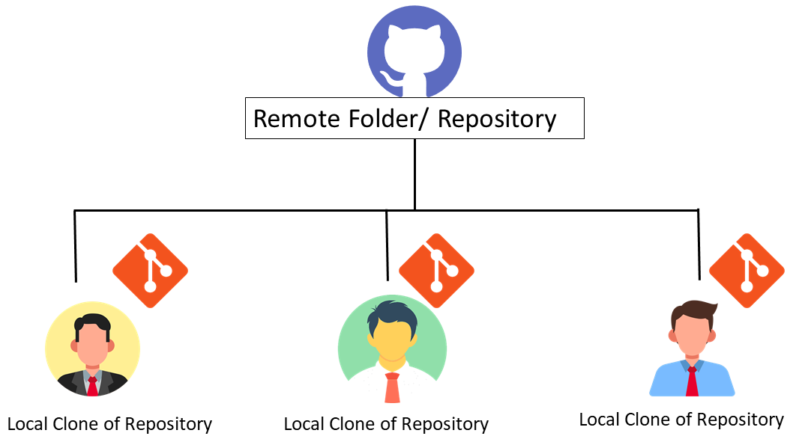

<h1 align="center"> GIT and GitHub Documentation</h1>
<h3 align="center"> by USAMA RASHEAD</h>

### Git
Git is a free, open source version control tool that developers install locally on their personal computers
##### Why do we need Git? 
-	Change tracking
-	Version tracking
-	Collaboration on project among developers

### GitHub 
GitHub is an online repository, where codes are stored. In GitHub, backend technology is VCS. The key difference between Git and GitHub is that Git is a free, open source version control tool that developers install locally on their personal computers, while GitHub is a pay-for-use online service built to run Git in the cloud. Git is a piece of software. GitHub is an online SaaS service

#### Some other VCS: 
- Gitlab 
- Beanstalk 
- Perforce 
- Bitbucket

Comparison between Git and GitHub

 
### Difference between Git and GitHub:
| GitHub |	Git |
|---|---|
| Service	| Tool/Software |
| Host git repository/folder/source code | Change control, version control |
| Provides GUI Interface |	Provides CLI |
| Maintained on cloud/ web |	Installed and maintained locally |

# Some other features of GitHub and Git:  
a)	GitHub: 
- More than 56 million users
- Founded in 2008
- Owned by Microsoft 
b)	 Git:
- Released: April 7, 2005
- Python, C, C++, Perl, Tcl
- Linus Torvalds (developer of Linux kernel) and Junio C Hamano  
